---
## Front matter
lang: ru-RU
title: Лабораторная работа №1
subtitle: Установка ОС Linux
author:
  - Юсупова К. Р.
institute:
  - Российский университет дружбы народов, Москва, Россия

## i18n babel
babel-lang: russian
babel-otherlangs: english

## Formatting pdf
toc: false
toc-title: Содержание
slide_level: 2
aspectratio: 169
section-titles: true
theme: metropolis
header-includes:
 - \metroset{progressbar=frametitle,sectionpage=progressbar,numbering=fraction}
---

# Информация

## Докладчик

:::::::::::::: {.columns align=center}
::: {.column width="70%"}

  * Юсупова Ксения Равилевна
  * Российский университет дружбы народов
  * Номер студенческого билета- 1132247531
  * [1132247531@pfur.ru]

:::
::::::::::::::

# Вводная часть

## Актуальность

-   Установка ОС Linux актуальна по многим причинам: открытось и бесплатность этой опреационной системы делают ее удобной для даже начинающих пользователей , также важны её безопасность и широкое применение.

## Цели и задачи

- Целью данной работы является приобретение практических навыков установки операционной системы на виртуальную машину, настройки минимально необходимых для дальнейшей работы сервисов.
аций

# Основная часть 
 
## Установка операционной системы

- Установили операционную систему

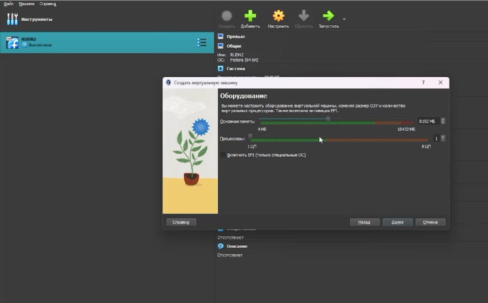{#fig:001 width=70%}

## Обновления

Установите средства разработки.

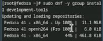{#fig:002 width=70%}

## Обновления

Обновить все пакеты.

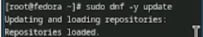{#fig:003 width=70%}

## Повышение комфорта работы

Программы для удобства работы в консоли.

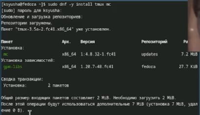{#fig:004 width=70%}

## Автоматическое обновление

Установка программного обеспечения.

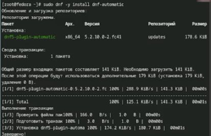{#fig:005 width=70%}

Запустим таймер.

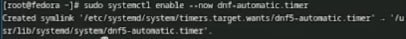{#fig:006 width=70%}

## Отключение SELinux

В файле /etc/selinux/config заменим значение
SELINUX=enforcing
на значение
SELINUX=permissive
Перегрузим виртуальную машину.

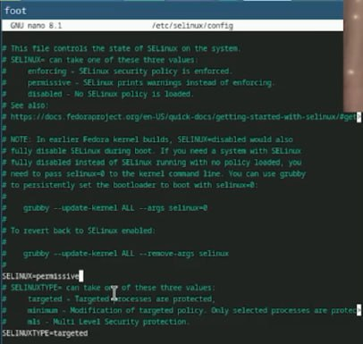{#fig:007 width=70%}

## Настройка раскладки клавиатуры

Создаём конфигурационный файл ~/.config/sway/config.d/95-system-keyboard-config.conf.

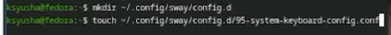{#fig:008 width=70%}

## Настройка раскладки клавиатуры

Отредактируем конфигурационный файл ~/.config/sway/config.d/95-system-keyboard-config.conf.

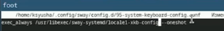{#fig:009 width=70%}

## Настройка раскладки клавиатуры

Отредактируем конфигурационный файл /etc/X11/xorg.conf.d/00-keyboard.conf.

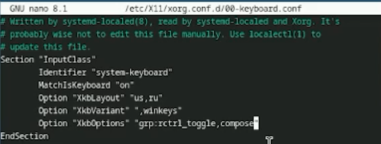{#fig:010 width=70%}

## Установка имени пользователя и названия хоста

Установим имя хоста (вместо username укажите ваш логин в дисплейном классе). Проверим, что имя хоста установлено верно.

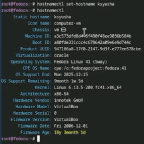{#fig:011 width=70%}

## Работа с языком разметки Markdown

Установка pandoc с помощью менеджера пакетов.

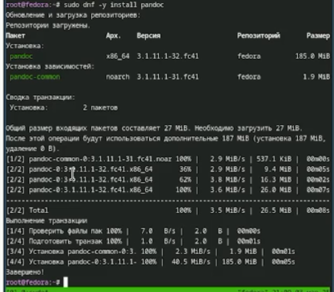{#fig:012 width=70%}

## Работа с языком разметки Markdown

Обе программы собраны в виде статически-линкованных бинарных файлов. Поместим их в каталог /usr/local/bin..

{#fig:013 width=70%}

## texlive

Установим дистрибутив TeXlive.

{#fig:014 width=70%}

## Домашнее задание

Дождитесь загрузки графического окружения и откройте терминал. В окне терминала проанализируйте последовательность загрузки системы, выполнив команду dmesg. Можно просто просмотреть вывод этой команды.

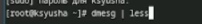{#fig:015 width=70%}

## Домашнее задание

Получаем следующую информацию.

    Версия ядра Linux (Linux version).
    Частота процессора (Detected Mhz processor).
    Модель процессора (CPU0).
    Объём доступной оперативной памяти (Memory available).
    Тип обнаруженного гипервизора (Hypervisor detected).
    Тип файловой системы корневого раздела.
    Последовательность монтирования файловых систем.

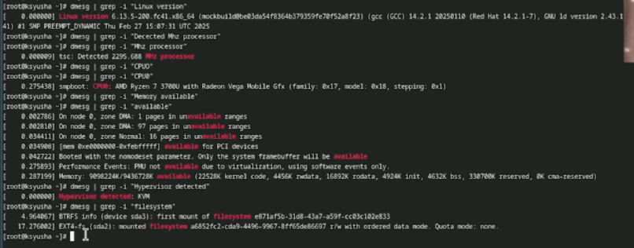{#fig:016 width=70%}

# Выводы

В ходе лабораторной работы мы приобрели практические навыки установки операционной системы на виртуальную машину, настройки минимально необходимых для дальнейшей работы сервисов.

# Ответы на контрольные вопросы 

1. Учетная запись пользователя

Логин, UID, GID, домашний каталог, shell, права, пароль (/etc/shadow).

2. Команды терминала

Справка: man <команда>, <команда> --help
Перемещение: cd <путь>, cd .., cd -
Содержимое каталога: ls, ls -l, ls -a
Размер каталога: du -sh <каталог>, df -h
Создание/удаление: mkdir, rmdir, rm -r, touch, rm
Права: chmod, chown, ls -l
История: history, !<номер>, Ctrl + R

3. Файловая система

Способ хранения данных.

Примеры:
 • ext4 (Linux), NTFS (Windows), FAT32 (универсальная, 4 ГБ макс.), XFS (большие объемы).

## Ответы на контрольные вопросы 

4. Просмотр ФС
 • mount, df -T

5. Удаление процесса
 • kill <PID>, kill -9 <PID>, pkill <имя>, htop

