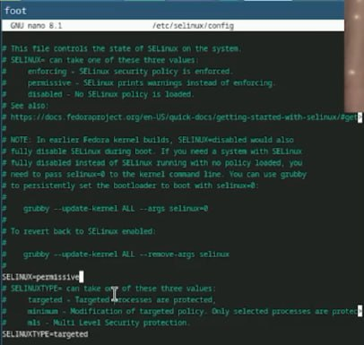

---
## Front matter
title: "Лабораторная работа №1"
subtitle: "Установка ОС Linux"
author: "Юсупова Ксения Равилевна"

## Generic otions
lang: ru-RU
toc-title: "Содержание"

## Bibliography
bibliography: bib/cite.bib
csl: pandoc/csl/gost-r-7-0-5-2008-numeric.csl

## Pdf output format
toc: true # Table of contents
toc-depth: 2
lof: true # List of figures
lot: true # List of tables
fontsize: 12pt
linestretch: 1.5
papersize: a4
documentclass: scrreprt
## I18n polyglossia
polyglossia-lang:
  name: russian
  options:
	- spelling=modern
	- babelshorthands=true
polyglossia-otherlangs:
  name: english
## I18n babel
babel-lang: russian
babel-otherlangs: english
## Fonts
mainfont: IBM Plex Serif
romanfont: IBM Plex Serif
sansfont: IBM Plex Sans
monofont: IBM Plex Mono
mathfont: STIX Two Math
mainfontoptions: Ligatures=Common,Ligatures=TeX,Scale=0.94
romanfontoptions: Ligatures=Common,Ligatures=TeX,Scale=0.94
sansfontoptions: Ligatures=Common,Ligatures=TeX,Scale=MatchLowercase,Scale=0.94
monofontoptions: Scale=MatchLowercase,Scale=0.94,FakeStretch=0.9
mathfontoptions:
## Biblatex
biblatex: true
biblio-style: "gost-numeric"
biblatexoptions:
  - parentracker=true
  - backend=biber
  - hyperref=auto
  - language=auto
  - autolang=other*
  - citestyle=gost-numeric
## Pandoc-crossref LaTeX customization
figureTitle: "Рис."
tableTitle: "Таблица"
listingTitle: "Листинг"
lofTitle: "Список иллюстраций"
lotTitle: "Список таблиц"
lolTitle: "Листинги"
## Misc options
indent: true
header-includes:
  - \usepackage{indentfirst}
  - \usepackage{float} # keep figures where there are in the text
  - \floatplacement{figure}{H} # keep figures where there are in the text
---

# Цель работы

Целью данной работы является приобретение практических навыков установки операционной системы на виртуальную машину, настройки минимально необходимых для дальнейшей работы сервисов.

# Выполнение лабораторной работы

## Установка операционной системы

Установили операционную систему(рис. [-@fig:001]).

{#fig:001 width=70%}

## Обновления

Установите средства разработки(рис. [-@fig:002]).

{#fig:002 width=70%}

Обновить все пакеты(рис. [-@fig:003]).

{#fig:003 width=70%}

## Повышение комфорта работы

Программы для удобства работы в консоли(рис. [-@fig:004]).

{#fig:004 width=70%}

## Автоматическое обновление

Установка программного обеспечения(рис. [-@fig:005]).

{#fig:005 width=70%}

Запустим таймер(рис. [-@fig:006]).

{#fig:006 width=70%}

## Отключение SELinux

В файле /etc/selinux/config заменим значение

SELINUX=enforcing

на значение

SELINUX=permissive

Перегрузим виртуальную машину(рис. [-@fig:007]).

{#fig:007 width=70%}

## Настройка раскладки клавиатуры

Создаём конфигурационный файл ~/.config/sway/config.d/95-system-keyboard-config.conf(рис. [-@fig:008]).

{#fig:008 width=70%}

Отредактируем конфигурационный файл ~/.config/sway/config.d/95-system-keyboard-config.conf(рис. [-@fig:009]).

{#fig:009 width=70%}

Отредактируем конфигурационный файл /etc/X11/xorg.conf.d/00-keyboard.conf(рис. [-@fig:010]).

{#fig:010 width=70%}

## Установка имени пользователя и названия хоста

Установим имя хоста (вместо username укажите ваш логин в дисплейном классе). Проверим, что имя хоста установлено верно(рис. [-@fig:011]).

{#fig:011 width=70%}

## Работа с языком разметки Markdown

Установка pandoc с помощью менеджера пакетов(рис. [-@fig:012]).

{#fig:012 width=70%}

Обе программы собраны в виде статически-линкованных бинарных файлов. Поместим их в каталог /usr/local/bin.(рис. [-@fig:013]).

{#fig:013 width=70%}

## texlive

Установим дистрибутив TeXlive:(рис. [-@fig:014]).

{#fig:014 width=70%}

## Домашнее задание

Дождитесь загрузки графического окружения и откройте терминал. В окне терминала проанализируйте последовательность загрузки системы, выполнив команду dmesg. Можно просто просмотреть вывод этой команды(рис. [-@fig:015]).

{#fig:015 width=70%}

Получаем следующую информацию.

    Версия ядра Linux (Linux version).
    Частота процессора (Detected Mhz processor).
    Модель процессора (CPU0).
    Объём доступной оперативной памяти (Memory available).
    Тип обнаруженного гипервизора (Hypervisor detected).
    Тип файловой системы корневого раздела.
    Последовательность монтирования файловых систем(рис. [-@fig:016]).

{#fig:016 width=70%}

# Выводы

В ходе лабораторной работы мы приобрели практические навыки установки операционной системы на виртуальную машину, настройки минимально необходимых для дальнейшей работы сервисов.

# Ответы на контрольные вопросы 

1. Учетная запись пользователя

Логин, UID, GID, домашний каталог, shell, права, пароль (/etc/shadow).

2. Команды терминала

Справка: man <команда>, <команда> --help
Перемещение: cd <путь>, cd .., cd -
Содержимое каталога: ls, ls -l, ls -a
Размер каталога: du -sh <каталог>, df -h
Создание/удаление: mkdir, rmdir, rm -r, touch, rm
Права: chmod, chown, ls -l
История: history, !<номер>, Ctrl + R

3. Файловая система

Способ хранения данных.

Примеры:
 • ext4 (Linux), NTFS (Windows), FAT32 (универсальная, 4 ГБ макс.), XFS (большие объемы).

4. Просмотр ФС
 • mount, df -T

5. Удаление процесса
 • kill <PID>, kill -9 <PID>, pkill <имя>, htop

