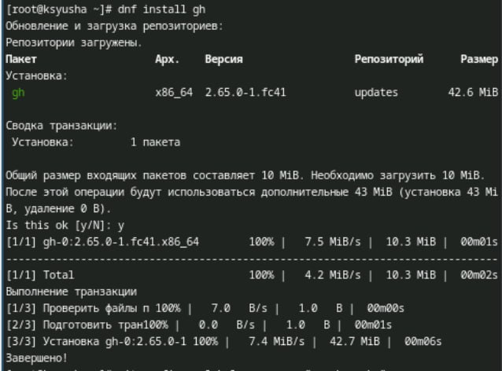

---
## Front matter
lang: ru-RU
title: Лабораторная работа №2
subtitle: Первоначальная настройка git
author:
  - Юсупова К. Р.
institute:
  - Российский университет дружбы народов, Москва, Россия

## i18n babel
babel-lang: russian
babel-otherlangs: english

## Formatting pdf
toc: false
toc-title: Содержание
slide_level: 2
aspectratio: 169
section-titles: true
theme: metropolis
header-includes:
 - \metroset{progressbar=frametitle,sectionpage=progressbar,numbering=fraction}
---

# Информация

## Докладчик

:::::::::::::: {.columns align=center}
::: {.column width="70%"}

  * Юсупова Ксения Равилевна
  * Российский университет дружбы народов
  * Номер студенческого билета- 1132247531
  * [1132247531@pfur.ru]

:::
::::::::::::::

# Вводная часть

## Актуальность

Лабораторная работа по первоначальной настройке Git важна по следующим причинам:
- Контроль версий: Git — популярная система контроля версий, необходимая для управления изменениями в коде.
- Совместная работа: Упрощает работу нескольких разработчиков над проектом.
- История изменений: Позволяет отслеживать и анализировать изменения в коде.
- Ветвление и слияние: Обеспечивает изолированную работу над функциями и исправлениями.
- Разрешение конфликтов: Учит управлять конфликтами при совместной работе.
- Интеграция с инструментами: Работает с платформами, такими как GitHub и GitLab, расширяя возможности управления проектами.
- Подготовка к реальным проектам: Необходимый навык для работодателей в IT.
- Развитие навыков программирования: Способствует пониманию структуры проекта и процесса разработки.
Эти аспекты делают обучение Git важным для будущих разработчиков.

## Цель работы

Изучить идеологию и применение средств контроля версий, и освоить умения по работе с git.

# Выполнение лабораторной работы

## Установка программного обеспечения

Установка git.

{#fig:001 width=70%}

## Установка программного обеспечения

Установка gh.

{#fig:002 width=70%}

## Базовая настройка git

Зададим имя и email владельца репозитория.

{#fig:003 width=70%}

## Базовая настройка git

Настроим utf-8 в выводе сообщений git и зададим имя начальной ветки (будем называть её master).

{#fig:004 width=70%}

## Базовая настройка git

Настроим параметр autocrlf и параметр safecrlf.

{#fig:005 width=70%}

## Создание ключей ssh

Создаём ключи ssh по алгоритму rsa с ключём размером 4096 бит и по алгоритму ed25519.

{#fig:006 width=70%}

## Создание ключей pgp

Генерируем ключ pgp с учетом необхомых опций.

{#fig:007 width=70%}

## Настройка github

Создаём учётную запись и заполнили основные данные на https://github.com..

{#fig:008 width=70%}

## Добавление PGP ключа в GitHub

Выводим список ключей и копируем отпечаток приватного ключа.

{#fig:009 width=70%}

## Добавление PGP ключа в GitHub

Cкопировали наш сгенерированный PGP ключ в буфер обмена. Перешли в настройки GitHub, нажали на кнопку New GPG key и вставили полученный ключ в поле ввода.

{#fig:010 width=70%}

## Настройка автоматических подписей коммитов git

Используя введёный email, указали Git применять его при подписи коммитов.

{#fig:011 width=70%}

## Настройка gh

Для начала авторизируемся.

{#fig:012 width=70%}

## Создание репозитория курса на основе шаблона

Создаём репозиторий курса на основе шаблона для 2024–2025 учебного года и предмета «Операционные системы» .

{#fig:013 width=70%}

## Настройка каталога курса

Переходим в каталог курса .

{#fig:014 width=70%}

## Настройка каталога курса

Удаляем лишние файлы, создаём необходимые каталоги и отправляем файлы на сервер.

{#fig:015 width=70%}

## Настройка каталога курса

Отправляем файлы на сервер.

{#fig:016 width=70%}

# Выводы

В ходе лабораторной работы мы изучили идеологию и применение средств контроля версий, а также освоили умения по работе с git.

# Ответы на контрольные вопросы.

1. Системы контроля версий (VCS)- это инструменты, которые позволяют отслеживать изменения в файлах и координировать работу нескольких людей над этим проектом. Они предназначаются для отслеживания изменений в коде и файлах, удобно для использования в совместной работе над проектами для нескольких разработчиков.

2. Хранилище - это репозиторий, в котором хранятся все версии проекта и его файлы
Commit - это операция, которая сохраняет текущее состояние фвйлов в хранилища с комментарием, описывающим эти изменения.
История- это последовательность всех коммитов репозитория.
Рабочая копия- копия, сделанная из версий репозтория, с которй непосредственно работает сам разработчик.

## Ответы на контрольные вопросы.

3. Централизованные VCS представляют собой все изменения, которые хранятся на одном центральном сервере, с ним работают все разработчики. В пример можно привести CVS.

Децентрализованные VCS представляют собой системы, в которых используется множество репозиториев одного проекта у каждого из разработчиков. Пример: Git, Mercurial.

4. Порядок работы с хранилищем при единоличной работе:
Создание репозитория, разработка проекта и при внесении изменений в файлы отправляются на сервер 

## Ответы на контрольные вопросы.

5. Порядок работы с общим хранилищем VCS.
Клонирование репозитория,создание новой ветки, внесение изменений: Изменение файлов в рабочей копии. Добавление и коммит изменений, синхронизация и отправка изменений.

6. Основные задачи Git.
 Отслеживание изменений: Git отслеживает все изменения в файлах проекта.
Ведение истории: Git сохраняет историю всех коммитов, что позволяет видеть, кто и когда вносил изменения.
правление ветвями и слияниями: Git позволяет легко создавать ветки для новых функций и сливать их обратно в основную ветку после завершения работы.
Поддержка совместной работы: Git упрощает работу нескольких разработчиков над одним проектом, позволяя им синхронизировать свои изменения.

## Ответы на контрольные вопросы.

7. Команды git.
 git init: Инициализация нового репозитория.
 git clone <url>: Клонирование удалённого репозитория.
 git add <file>: Добавление изменённых файлов в индекс.
 git commit -m "message": Фиксация изменений с сообщением.
 git status: Проверка статуса рабочей копии.
 git log: Просмотр истории коммитов.
 git branch: Управление ветками.
 git checkout <branch-name>: Переключение между ветками.
 git merge <branch-name>: Слияние указанной ветки с текущей.
 git pull: Получение обновлений из удалённого репозитория.
 git push origin <branch-name>: Отправка изменений в удалённый репозиторий.

## Ответы на контрольные вопросы.

8. Примеры работы с локальным и удалённым репозиториями.
Локальный репозиторий:
Инициализация нового репозитория
git init

Создание файла и добавление текста
echo "Hello World" > hello.txt

Добавление файла в индекс
git add hello.txt

Фиксация изменений
git commit -m "Initial commit"

Удалённый репозиторий:
Клонирование удалённого репозитория
git clone https://github.com/user/repo.git

## Ответы на контрольные вопросы.

Переход в директорию клонированного репозитория
cd repo

Создание нового файла
echo "New feature" >> feature.txt

Добавление нового файла в индекс
git add feature.txt

Фиксация изменений
git commit -m "Add new feature"

Отправка изменений в удалённый репозиторий
git push origin main

## Ответы на контрольные вопросы.

9. Ветви (branches).

Ветви в Git позволяют разработчикам работать над новыми функциями или исправлениями ошибок, не затрагивая основную (обычно это ветка main или master). Это позволяет изолировать изменения до тех пор, пока они не будут готовы к интеграции.

10. Игнорирование файлов при commit.

Файл .gitignore используется для указания файлов и директорий, которые не должны отслеживаться системой контроля версий. Это полезно для исключения временных файлов, конфиденциальной информации или других данных, которые не должны попадать в репозиторий.

