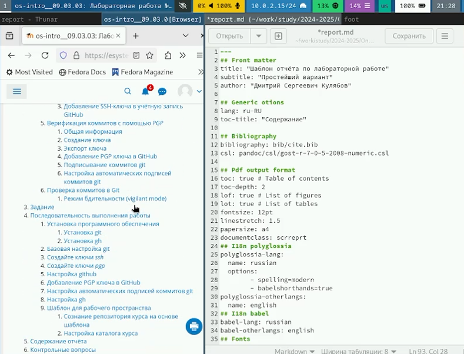
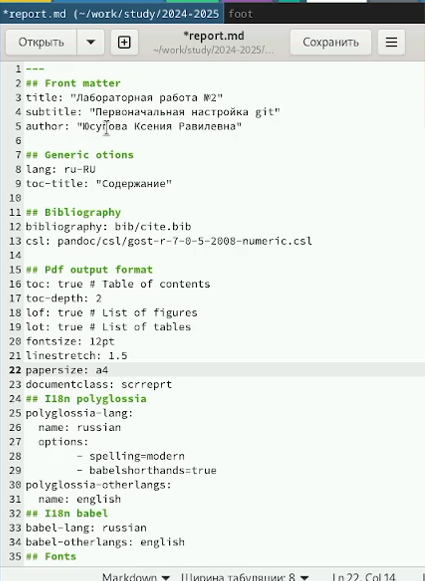
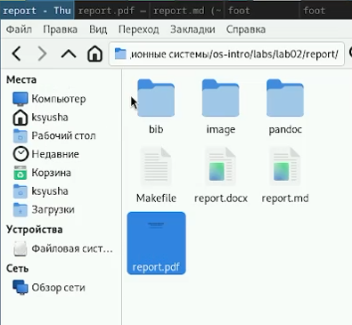

---
## Front matter
lang: ru-RU
title: Лабораторная работа №3
subtitle: Markdown
author:
  - Юсупова К. Р.
institute:
  - Российский университет дружбы народов, Москва, Россия

## i18n babel
babel-lang: russian
babel-otherlangs: english

## Formatting pdf
toc: false
toc-title: Содержание
slide_level: 2
aspectratio: 169
section-titles: true
theme: metropolis
header-includes:
 - \metroset{progressbar=frametitle,sectionpage=progressbar,numbering=fraction}
---

# Информация

## Докладчик

:::::::::::::: {.columns align=center}
::: {.column width="70%"}

  * Юсупова Ксения Равилевна
  * Российский университет дружбы народов
  * Номер студенческого билета- 1132247531
  * [1132247531@pfur.ru]

:::
::::::::::::::

# Вводная часть

## Актуальность

Отчеты в Markdown актуальны благодаря следующим преимуществам:

1. Простота использования: Легкий язык разметки, который легко изучить и быстро форматировать текст.

2. Читаемость: Хорошая читаемость как в исходном виде, так и после конвертации в другие форматы.

3. Кроссплатформенность: Обычные текстовые файлы, которые можно редактировать на любых ОС.

4. Конвертация: Легко преобразуется в HTML, PDF и другие форматы для публикации.

5. Интеграция: Поддерживается многими платформами (GitHub, Jupyter Notebooks).

6. Структурированность: Позволяет создавать заголовки, списки и таблицы для организации информации.

Эти факторы делают Markdown популярным для отчетов и документации в разных областях

## Цели и задачи

Научиться оформлять отчёты с помощью легковесного языка разметки Markdown.

# Выполнение лабораторной работы

Открыли шаблон для отчета.

{#fig:001 width=70%}

## Выполнение лабораторной работы

Оформление отчета .

{#fig:002 width=70%}

## Выполнение лабораторной работы

Сформировали отчеты в трех форматах: pdf, docx и md .

{#fig:003 width=70%}

# Выводы

В ходе лабораторной работы мы научились оформлять отчёты с помощью легковесного языка разметки Markdown.

