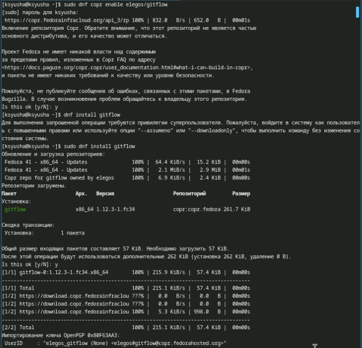
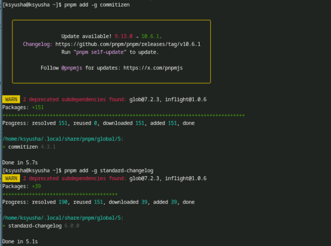
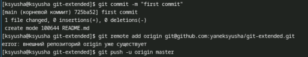
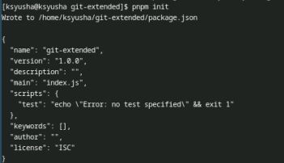
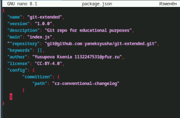
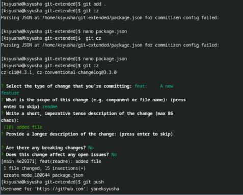

---
## Front matter
lang: ru-RU
title: Лабораторная работа №4
subtitle: Продвинутое использование git
author:
  - Юсупова К. Р.
institute:
  - Российский университет дружбы народов, Москва, Россия

## i18n babel
babel-lang: russian
babel-otherlangs: english

## Formatting pdf
toc: false
toc-title: Содержание
slide_level: 2
aspectratio: 169
section-titles: true
theme: metropolis
header-includes:
 - \metroset{progressbar=frametitle,sectionpage=progressbar,numbering=fraction}
---

# Информация

## Докладчик

:::::::::::::: {.columns align=center}
::: {.column width="70%"}

  * Юсупова Ксения Равилевна
  * Российский университет дружбы народов
  * Номер студенческого билета- 1132247531
  * [1132247531@pfur.ru]

:::
::::::::::::::

# Вводная часть

## Актуальность

Продвинутое использование Git актуально по нескольким причинам:

1. Управление версиями: Позволяет отслеживать изменения и откатываться к предыдущим версиям.

2. Совместная работа: Упрощает работу в команде через ветвление и слияние.

3. Ветвление: Изолирует новые функции до их завершения.

4. Анализ изменений: Позволяет понять, кто и почему внес изменения.

5. Безопасность: Распределенные данные обеспечивают защиту и резервное копирование.

6. Сообщество: Обширная экосистема инструментов и библиотек.

## Цель работы

Получение навыков правильной работы с репозиториями git.

# Выполнение лабораторной работы

## Установка git-flow

Установка из коллекции репозиториев Copr.

{#fig:001 width=70%}

## Настройка Node.js

Установили Node.js. Для работы с Node.js добавим каталог с исполняемыми файлами, устанавливаемыми yarn, в переменную PATH.

Запукаем и перелогинимся.

{#fig:002 width=70%}

## Общепринятые коммиты

commitizen. Данная программа используется для помощи в форматировании коммитов.       standard-changelog. Данная программа используется для помощи в создании логов.

{#fig:003 width=70%}

## Создание репозитория git

Подключение репозитория к github. Создайте репозиторий на GitHub. Для примера назовём его git-extended. Делаем первый коммит и выкладываем на github .

{#fig:004 width=70%}

## Создание репозитория git

Конфигурация общепринятых коммитов.

{#fig:005 width=70%}

## Создание репозитория git

Необходимо заполнить несколько параметров пакета: Название пакета, лицензия пакета, список лицензий для npm. Предлагается выбирать лицензию CC-BY-4.0. Таким образом, файл package.json приобретает вид.

{#fig:006 width=70%}

## Создание репозитория git

Добавим новые файлы, выполним коммит и отправим на github.

{#fig:007 width=70%}

# Выводы

В ходе выполнения лабораторной работы были получены навыки правильной работы с репозиториями git.

