---
## Front matter
lang: ru-RU
title: Лабораторная работа №5
subtitle: Настройка рабочей среды
author:
  - Юсупова К. Р.
institute:
  - Российский университет дружбы народов, Москва, Россия

## i18n babel
babel-lang: russian
babel-otherlangs: english

## Formatting pdf
toc: false
toc-title: Содержание
slide_level: 2
aspectratio: 169
section-titles: true
theme: metropolis
header-includes:
 - \metroset{progressbar=frametitle,sectionpage=progressbar,numbering=fraction}
---

# Информация

## Докладчик

:::::::::::::: {.columns align=center}
::: {.column width="70%"}

  * Юсупова Ксения Равилевна
  * Российский университет дружбы народов
  * Номер студенческого билета- 1132247531
  * [1132247531@pfur.ru]

:::
::::::::::::::

# Вводная часть

## Цели и задачи

Изучить методы работы с менеджером работы pass и обучиться использованию chezmoi для управления файлами конфигурации домашнего каталога пользователя.

# Выполнение лабораторной работы

## Менеджер паролей pass

Установка менеджера паролей pass.

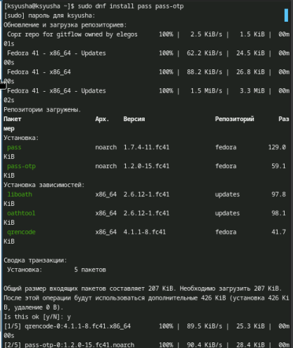{#fig:001 width=70%}

Установка gopass.

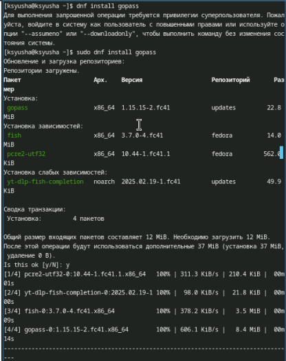{#fig:002 width=70%}

## Настройка

Просмотр списка ключей gpg.

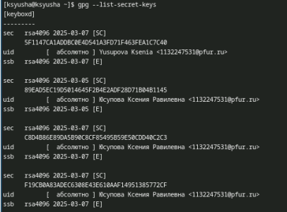{#fig:003 width=70%}

## Настройка

Инициализация хранилища и создание структуры git.

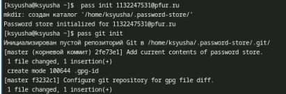{#fig:004 width=70%}

## Настройка

Задаём адрес репозитория на хостинге.

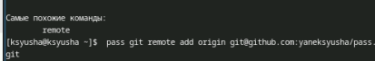{#fig:005 width=70%}

## Настройка

Для синхронизации выполняется следующие команды.

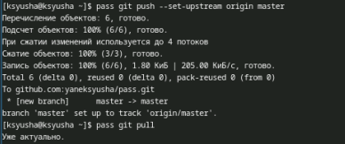{#fig:006 width=70%}

## Настройка

Следует заметить, что отслеживаются только изменения, сделанные через сам gopass (или pass). Если изменения сделаны непосредственно на файловой системе, необходимо вручную закоммитить и выложить изменения. Проверяем статус синхронизации.

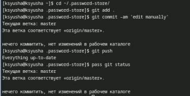{#fig:007 width=70%}

## Настройка интерфейса с броузером

Интерфейс для взаимодействия с броузером (native messaging) .

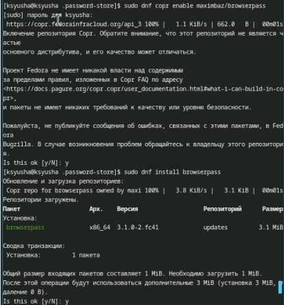{#fig:008 width=70%}

## Настройка интерфейса с броузером

Кроме плагина к броузеру устанавливается программа, обеспечивающая интерфейс native messaging.

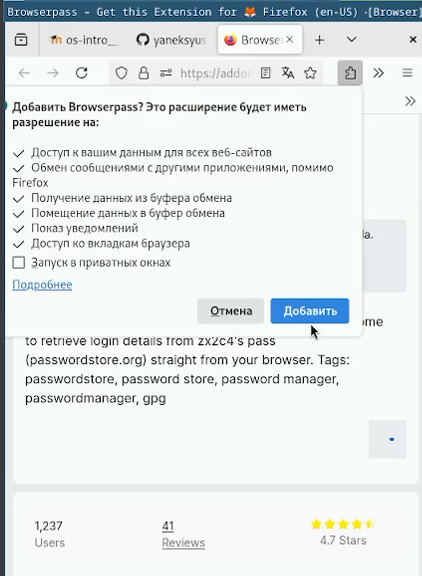{#fig:009 width=70%}

## Сохранение пароля

Добавляем новый пароль, отображаем пароль для указанного имени файла и меняем существующий пароль.

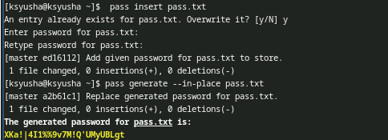{#fig:010 width=70%}

## Дополнительное программное обеспечение

Установите дополнительное программное обеспечение.

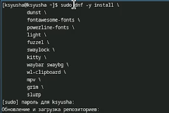{#fig:011 width=70%}

## Дополнительное программное обеспечение

Установите шрифты.

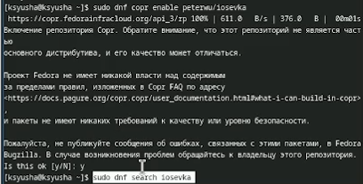{#fig:012 width=70%}

## Дополнительное программное обеспечение

Установка шрифтов.

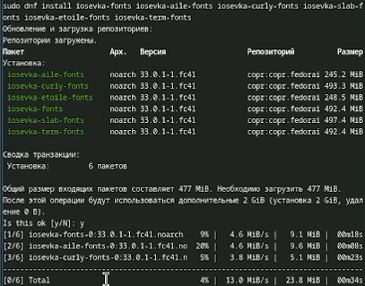{#fig:013 width=70%}

## Установка

Установка бинарного файла. Скрипт определяет архитектуру процессора и операционную систему и скачивает необходимый файл.

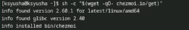{#fig:014 width=70%}

## Создание собственного репозитория с помощью утилит

Будем использовать утилиты командной строки для работы с github.Создадим свой репозиторий для конфигурационных файлов на основе шаблона:

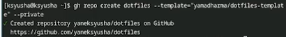{#fig:015 width=70%}

## Подключение репозитория к своей системе

Инициализируем chezmoi с вашим репозиторием dotfiles и проверим, какие изменения внесёт chezmoi в домашний каталог, запустив.

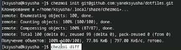{#fig:016 width=70%}

## Подключение репозитория к своей системе

Так как нас устраивают изменения, внесённые chezmoi, запустим:

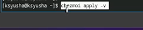{#fig:017 width=70%}

## Использование chezmoi на нескольких машинах

На второй машине инициализируйте chezmoi с вашим репозиторием dotfiles через ssh. Проверим, какие изменения внесёт chezmoi в домашний каталог, запустив chezmoi diff. Так как нас устраивают изменения, внесённые chezmoi, запустим chezmoi apply -v.

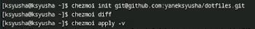{#fig:018 width=70%}

## Настройка новой машины с помощью одной команды

Можно установить свои dotfiles на новый компьютер с помощью одной команды через ssh .

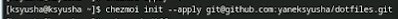{#fig:019 width=70%}

## Ежедневные операции c chezmoi

Извлеките последние изменения из своего репозитория и посмотрите, что изменится, фактически не применяя изменения.

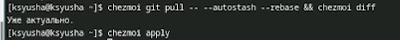{#fig:020 width=70%}

## Ежедневные операции c chezmoi

Автоматически фиксируйте и отправляйте изменения в репозиторий. Эта функция отключена по умолчанию. Чтобы включить её, добавьте в файл конфигурации ~/.config/chezmoi/chezmoi.toml следующее:

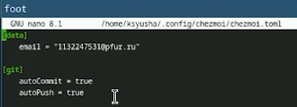{#fig:021 width=70%}

# Выводы

В ходе лабораторной работы мы изучили методы работы с менеджером работы pass и обучились использованию chezmoi для управления файлами конфигурации домашнего каталога пользователя.

