---
## Front matter
title: "Лабораторная работа № 5"
subtitle: "Настройка рабочей среды"
author: "Юсупова Ксения Равилевна"

## Generic otions
lang: ru-RU
toc-title: "Содержание"

## Bibliography
bibliography: bib/cite.bib
csl: pandoc/csl/gost-r-7-0-5-2008-numeric.csl

## Pdf output format
toc: true # Table of contents
toc-depth: 2
lof: true # List of figures
lot: true # List of tables
fontsize: 12pt
linestretch: 1.5
papersize: a4
documentclass: scrreprt
## I18n polyglossia
polyglossia-lang:
  name: russian
  options:
	- spelling=modern
	- babelshorthands=true
polyglossia-otherlangs:
  name: english
## I18n babel
babel-lang: russian
babel-otherlangs: english
## Fonts
mainfont: IBM Plex Serif
romanfont: IBM Plex Serif
sansfont: IBM Plex Sans
monofont: IBM Plex Mono
mathfont: STIX Two Math
mainfontoptions: Ligatures=Common,Ligatures=TeX,Scale=0.94
romanfontoptions: Ligatures=Common,Ligatures=TeX,Scale=0.94
sansfontoptions: Ligatures=Common,Ligatures=TeX,Scale=MatchLowercase,Scale=0.94
monofontoptions: Scale=MatchLowercase,Scale=0.94,FakeStretch=0.9
mathfontoptions:
## Biblatex
biblatex: true
biblio-style: "gost-numeric"
biblatexoptions:
  - parentracker=true
  - backend=biber
  - hyperref=auto
  - language=auto
  - autolang=other*
  - citestyle=gost-numeric
## Pandoc-crossref LaTeX customization
figureTitle: "Рис."
tableTitle: "Таблица"
listingTitle: "Листинг"
lofTitle: "Список иллюстраций"
lotTitle: "Список таблиц"
lolTitle: "Листинги"
## Misc options
indent: true
header-includes:
  - \usepackage{indentfirst}
  - \usepackage{float} # keep figures where there are in the text
  - \floatplacement{figure}{H} # keep figures where there are in the text
---

# Цель работы

Изучить методы работы с менеджером работы pass и обучиться использованию chezmoi для управления файлами конфигурации домашнего каталога пользователя.

# Выполнение лабораторной работы

## Менеджер паролей pass

Установка менеджера паролей pass(рис. [-@fig:001]).

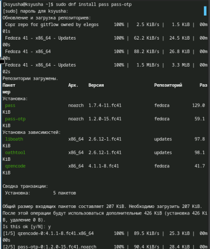{#fig:001 width=70%}

Установка gopass(рис. [-@fig:002]).

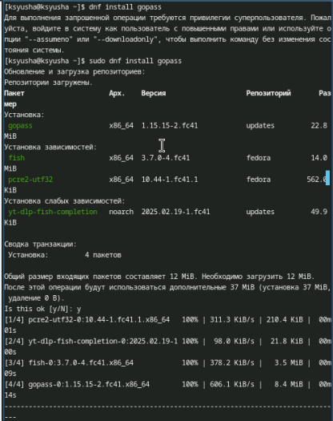{#fig:002 width=70%}

## Настройка

Просмотр списка ключей gpg (рис. [-@fig:003]).

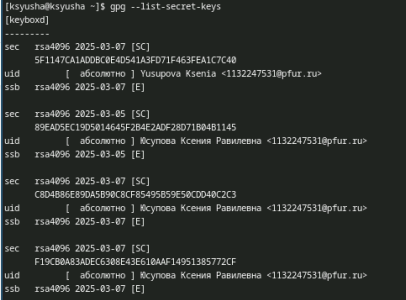{#fig:003 width=70%}

Инициализация хранилища и создание структуры git(рис. [-@fig:004]).

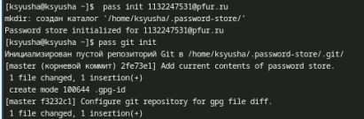{#fig:004 width=70%}

Задаём адрес репозитория на хостинге (рис. [-@fig:005]).

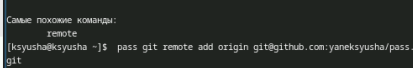{#fig:005 width=70%}

Для синхронизации выполняется следующие команды (рис. [-@fig:006]).

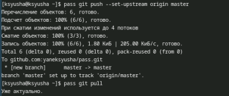{#fig:006 width=70%}

Следует заметить, что отслеживаются только изменения, сделанные через сам gopass (или pass). Если изменения сделаны непосредственно на файловой системе, необходимо вручную закоммитить и выложить изменения. Проверяем статус синхронизации (рис. [-@fig:007]).

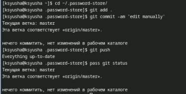{#fig:007 width=70%}

## Настройка интерфейса с броузером

Интерфейс для взаимодействия с броузером (native messaging) (рис. [-@fig:008]).

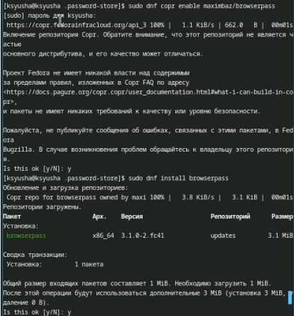{#fig:008 width=70%}

Кроме плагина к броузеру устанавливается программа, обеспечивающая интерфейс native messaging. (рис. [-@fig:009]).

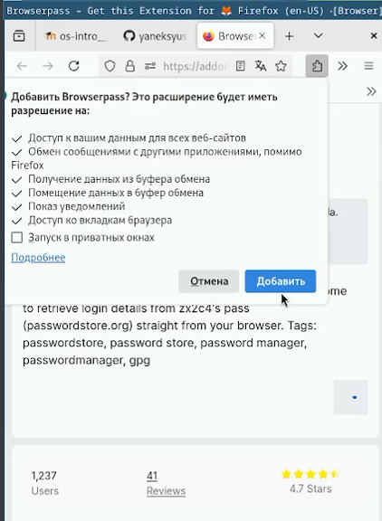{#fig:009 width=70%}

## Сохранение пароля

Добавляем новый пароль, отображаем пароль для указанного имени файла и меняем существующий пароль(рис. [-@fig:010]).

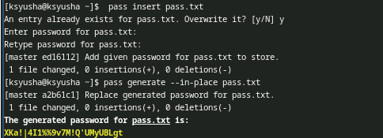{#fig:010 width=70%}

## Дополнительное программное обеспечение

Установите дополнительное программное обеспечение (рис. [-@fig:011]).

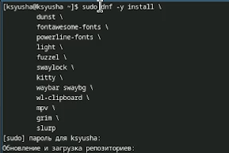{#fig:011 width=70%}

Установите шрифты (рис. [-@fig:012]).

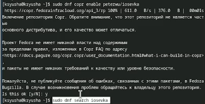{#fig:012 width=70%}

Установка шрифтов (рис. [-@fig:013]).

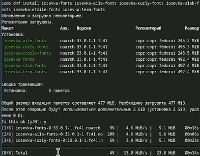{#fig:013 width=70%}

## Установка

Установка бинарного файла. Скрипт определяет архитектуру процессора и операционную систему и скачивает необходимый файл (рис. [-@fig:014]).

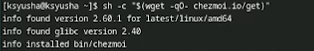{#fig:014 width=70%}

## Создание собственного репозитория с помощью утилит

Будем использовать утилиты командной строки для работы с github.Создадим свой репозиторий для конфигурационных файлов на основе шаблона: (рис. [-@fig:015]).

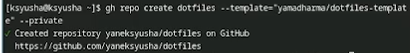{#fig:015 width=70%}

## Подключение репозитория к своей системе

Инициализируем chezmoi с вашим репозиторием dotfiles и проверим, какие изменения внесёт chezmoi в домашний каталог, запустив (рис. [-@fig:016]).

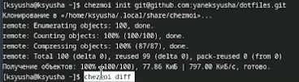{#fig:016 width=70%}

Так как нас устраивают изменения, внесённые chezmoi, запустим: (рис. [-@fig:017]).

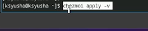{#fig:017 width=70%}

## Использование chezmoi на нескольких машинах

На второй машине инициализируйте chezmoi с вашим репозиторием dotfiles через ssh. Проверим, какие изменения внесёт chezmoi в домашний каталог, запустив chezmoi diff. Так как нас устраивают изменения, внесённые chezmoi, запустим chezmoi apply -v. (рис. [-@fig:018]).

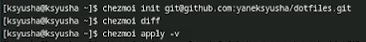{#fig:018 width=70%}

## Настройка новой машины с помощью одной команды

Можно установить свои dotfiles на новый компьютер с помощью одной команды через ssh (рис. [-@fig:019]).

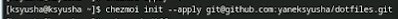{#fig:019 width=70%}

## Ежедневные операции c chezmoi

Извлеките последние изменения из своего репозитория и посмотрите, что изменится, фактически не применяя изменения(рис. [-@fig:020]).

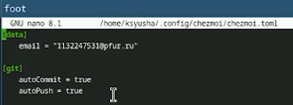{#fig:020 width=70%}

Автоматически фиксируйте и отправляйте изменения в репозиторий. Эта функция отключена по умолчанию. Чтобы включить её, добавьте в файл конфигурации ~/.config/chezmoi/chezmoi.toml следующее: (рис. [-@fig:021]).

{#fig:021 width=70%}

# Выводы

В ходе лабораторной работы мы изучили методы работы с менеджером работы pass и обучились использованию chezmoi для управления файлами конфигурации домашнего каталога пользователя.

