---
## Front matter
lang: ru-RU
title: Лабораторная работа №6
subtitle: Основы интерфейса взаимодействия пользователя с системой Unix на уровне командной строки
author:
  - Юсупова К. Р.
institute:
  - Российский университет дружбы народов, Москва, Россия

## i18n babel
babel-lang: russian
babel-otherlangs: english

## Formatting pdf
toc: false
toc-title: Содержание
slide_level: 2
aspectratio: 169
section-titles: true
theme: metropolis
header-includes:
 - \metroset{progressbar=frametitle,sectionpage=progressbar,numbering=fraction}
---

# Информация

## Докладчик

:::::::::::::: {.columns align=center}
::: {.column width="70%"}

  * Юсупова Ксения Равилевна
  * Российский университет дружбы народов
  * Номер студенческого билета- 1132247531
  * [1132247531@pfur.ru]

:::
::::::::::::::

# Вводная часть

## Цель работы

Приобретение практических навыков взаимодействия пользователя с системой посредством командной строки.

# Выполнение лабораторной работы

Определите полное имя вашего домашнего каталога. Далее относительно этого каталога будут выполняться последующие упражнения.

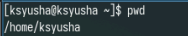{#fig:001 width=70%}

## Выполнение лабораторной работы

Перейдите в каталог /tmp. Выведите на экран содержимое каталога /tmp. Для этого используйте команду ls
с различными опциями. Поясните разницу в выводимой на экран информации.

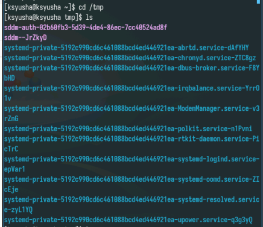{#fig:002 width=70%}

## Выполнение лабораторной работы

С помощью ключа -а вывели дополнительные файлы

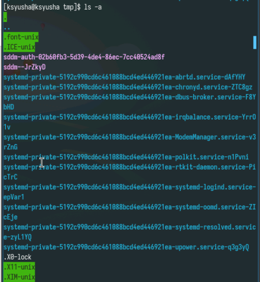{#fig:003 width=70%}

## Выполнение лабораторной работы

Теперь выведем файлы с полной информациеу с помощью ключа -l

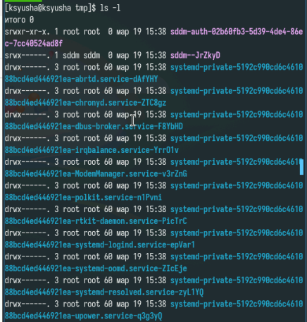{#fig:004 width=70%}

## Выполнение лабораторной работы

Далее выведем типы элементов с помощью ключа -f .

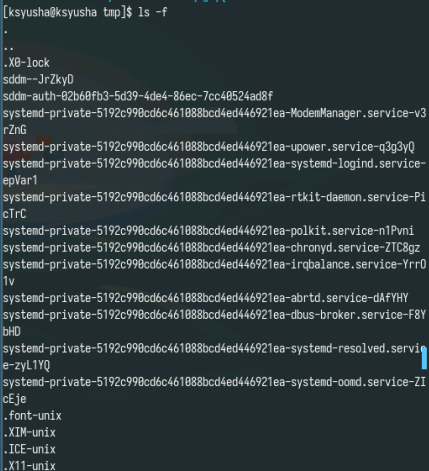{#fig:005 width=70%}

## Выполнение лабораторной работы

Определите,что в каталоге /var/spool есть подкаталог с именем cron. Перешли в домашний каталог и вывели на экран его содержимое. Можем сделать вывод, что файлы и подкатологи принадлежат только моему пользователю.

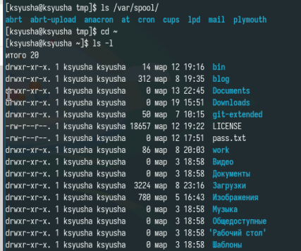{#fig:006 width=70%}

## Выполнение лабораторной работы

В домашнем каталоге создайте новый каталог с именем newdir.В каталоге ~/newdir создайте новый каталог с именем morefun.

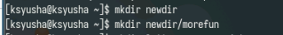{#fig:007 width=70%}

## Выполнение лабораторной работы

В домашнем каталоге создадим одной командой три новых каталога с именами letters, memos, misk. Затем удалим эти каталоги одной командой.

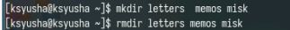{#fig:008 width=70%}

## Выполнение лабораторной работы

Попробуем удалить ранее созданный каталог ~/newdir командой rm. Не удалось выполнить задачу, так как это каталог. Удаляем каталог ~/newdir/morefun из домашнего каталога.

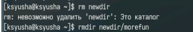{#fig:009 width=70%}

## Выполнение лабораторной работы

С помощью команды man определили, какую опцию команды ls нужно использовать для просмотра содержимое не только указанного каталога, но и подкаталогов, входящих в него.

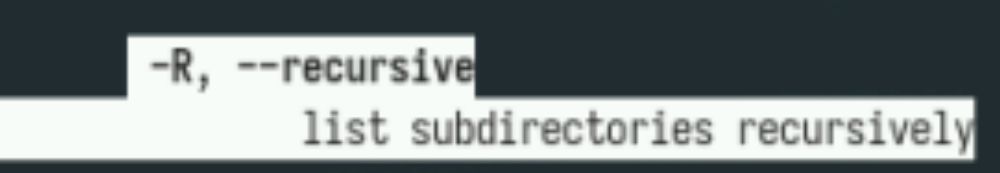{#fig:010 width=70%}

## Выполнение лабораторной работы

С помощью команды man определили набор опций команды ls, позволяющий отсортировать по времени последнего изменения выводимый список содержимого каталога с развёрнутым описанием файлов.

{#fig:011 width=70%}

## Выполнение лабораторной работы

Просмотрим ключи для cd. Основных 3 - p, l и e .

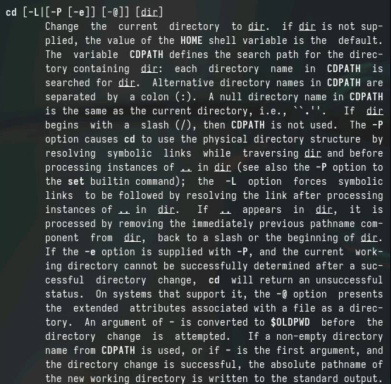{#fig:012 width=70%}

## Выполнение лабораторной работы

Просмотрим ключи для mkdir. Основные - m (Поставить права доступа), p (Создать родительские каталоги), v (Подробно выводить каждое действие) и z (поставить защиту в стандартный режим).

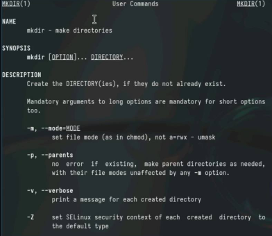{#fig:013 width=70%}

## Выполнение лабораторной работы

Просмотрим ключи для pwd. Основные - l (использовать pwd из окружения), p (избегать символьных ссылок).

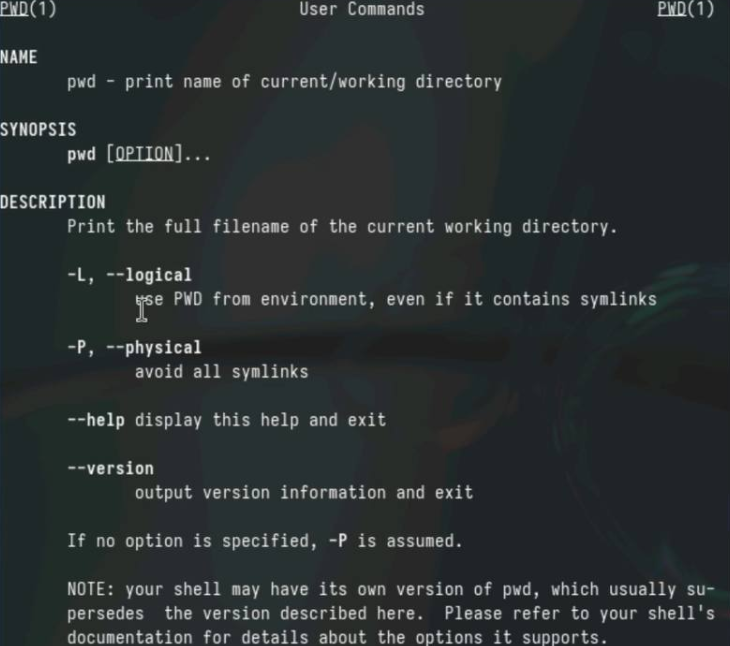{#fig:014 width=70%}

## Выполнение лабораторной работы

Просмотрим ключи для rmdir. Основные - p (Удалить родительские каталоги), v (Подробно выводить каждое действие) .

{#fig:015 width=70%}

## Выполнение лабораторной работы

Просмотрим ключи для rm. Основные - f (принудительно удалять), i (спрашивать подтверждение).

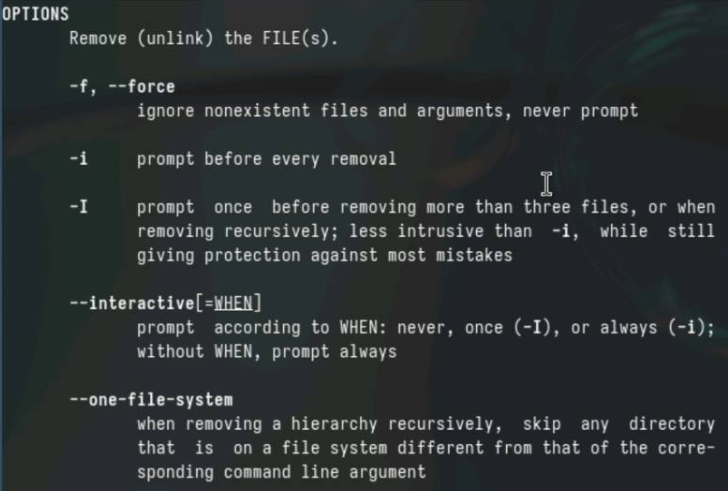{#fig:016 width=70%}

## Выполнение лабораторной работы

Выведем историю команд.

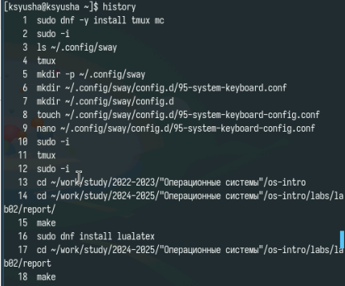{#fig:017 width=70%}

## Выполнение лабораторной работы

Выполнили модификацию и исполнение нескольких команд из буфера команд.

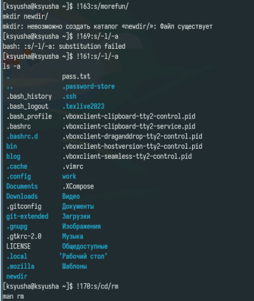{#fig:018 width=70%}

# Выводы

В ходе лабораторной работы мы приобрели практические навыки взаимодействия пользователя с системой посредством командной строки.

# Ответы на контрольные вопосы

1. Строка, в которую мы можем писать команды для исполнения
2. С помощью pwd. Например: pwd Загрузки
3. С помощью ls -F. Например: ls -F /tmp
4. С помощью ls -al. Например: ls -al /var
5. При помощи rm и rmdir соответственно. С помощью rm -R можно удалить как файл, так и каталог. Например: rm -R git-extended
6. С помощью history. Например, history

## Ответы на контрольные вопосы

7. !<номер_команды>:s/<что_меняем>/<на_что_меняем>. Например, !3:s/a/F
8. cd; mkdir newdir; rm file.txt
9. Символы экранирования - специальные символы, которые интерпретируются по другому. Например, !3:s/-a//newdir
10. Выводит также владельца, дату, права доступа и название
11. Относительный путь - путь относительно текущего нахождения. Например, cd tmp и cd /tmp - разные по значению команды
12. С помощью man
13. tab

