---
## Front matter
title: "Лабораторная работа №6"
subtitle: "Основы интерфейса взаимодействия
пользователя с системой Unix на уровне командной строки"
author: "Юсупова Ксения Равилевна"

## Generic otions
lang: ru-RU
toc-title: "Содержание"

## Bibliography
bibliography: bib/cite.bib
csl: pandoc/csl/gost-r-7-0-5-2008-numeric.csl

## Pdf output format
toc: true # Table of contents
toc-depth: 2
lof: true # List of figures
lot: true # List of tables
fontsize: 12pt
linestretch: 1.5
papersize: a4
documentclass: scrreprt
## I18n polyglossia
polyglossia-lang:
  name: russian
  options:
	- spelling=modern
	- babelshorthands=true
polyglossia-otherlangs:
  name: english
## I18n babel
babel-lang: russian
babel-otherlangs: english
## Fonts
mainfont: IBM Plex Serif
romanfont: IBM Plex Serif
sansfont: IBM Plex Sans
monofont: IBM Plex Mono
mathfont: STIX Two Math
mainfontoptions: Ligatures=Common,Ligatures=TeX,Scale=0.94
romanfontoptions: Ligatures=Common,Ligatures=TeX,Scale=0.94
sansfontoptions: Ligatures=Common,Ligatures=TeX,Scale=MatchLowercase,Scale=0.94
monofontoptions: Scale=MatchLowercase,Scale=0.94,FakeStretch=0.9
mathfontoptions:
## Biblatex
biblatex: true
biblio-style: "gost-numeric"
biblatexoptions:
  - parentracker=true
  - backend=biber
  - hyperref=auto
  - language=auto
  - autolang=other*
  - citestyle=gost-numeric
## Pandoc-crossref LaTeX customization
figureTitle: "Рис."
tableTitle: "Таблица"
listingTitle: "Листинг"
lofTitle: "Список иллюстраций"
lotTitle: "Список таблиц"
lolTitle: "Листинги"
## Misc options
indent: true
header-includes:
  - \usepackage{indentfirst}
  - \usepackage{float} # keep figures where there are in the text
  - \floatplacement{figure}{H} # keep figures where there are in the text
---

# Цель работы

Приобретение практических навыков взаимодействия пользователя с системой посредством командной строки.

# Выполнение лабораторной работы

Определите полное имя вашего домашнего каталога. Далее относительно этого каталога будут выполняться последующие упражнения (рис. [-@fig:001]).

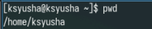{#fig:001 width=70%}

Перейдите в каталог /tmp. Выведите на экран содержимое каталога /tmp. Для этого используйте команду ls
с различными опциями. Поясните разницу в выводимой на экран информации.(рис. [-@fig:002]).

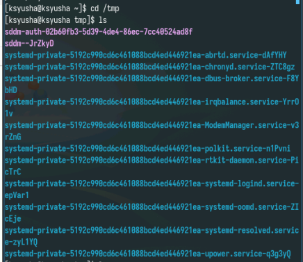{#fig:002 width=70%}

С помощью ключа -а вывели дополнительные файлы(рис. [-@fig:003]).

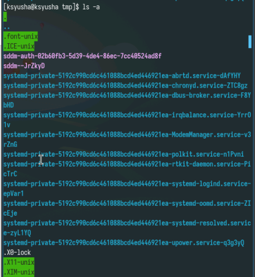{#fig:003 width=70%}

Теперь выведем файлы с полной информациеу с помощью ключа -l(рис. [-@fig:004]).

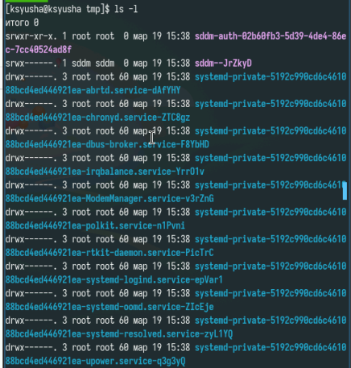{#fig:004 width=70%}

Далее выведем типы элементов с помощью ключа -f (рис. [-@fig:005]).

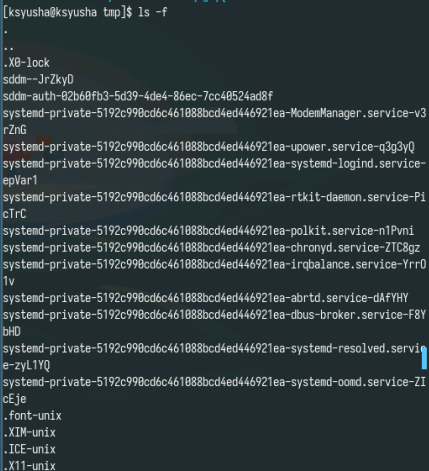{#fig:005 width=70%}

Определите,что в каталоге /var/spool есть подкаталог с именем cron. Перешли в домашний каталог и вывели на экран его содержимое. Можем сделать вывод, что файлы и подкатологи принадлежат только моему пользователю(рис. [-@fig:006]).

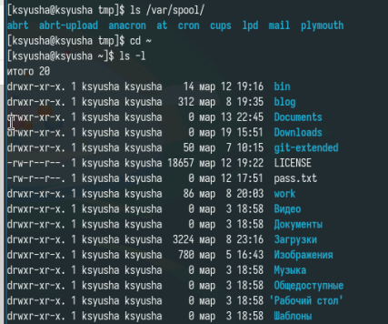{#fig:006 width=70%}

В домашнем каталоге создайте новый каталог с именем newdir.В каталоге ~/newdir создайте новый каталог с именем morefun.(рис. [-@fig:007]).

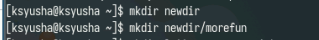{#fig:007 width=70%}

В домашнем каталоге создадим одной командой три новых каталога с именами letters, memos, misk. Затем удалим эти каталоги одной командой(рис. [-@fig:008]).

{#fig:008 width=70%}

Попробуем удалить ранее созданный каталог ~/newdir командой rm. Не удалось выполнить задачу, так как это каталог. Удаляем каталог ~/newdir/morefun из домашнего каталога.(рис. [-@fig:009]).

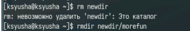{#fig:009 width=70%}

С помощью команды man определили, какую опцию команды ls нужно использовать для просмотра содержимое не только указанного каталога, но и подкаталогов, входящих в него.(рис. [-@fig:010]).

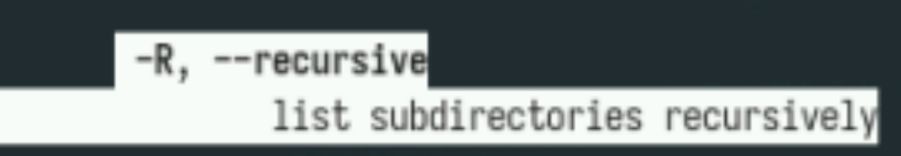{#fig:010 width=70%}

С помощью команды man определили набор опций команды ls, позволяющий отсортировать по времени последнего изменения выводимый список содержимого каталога с развёрнутым описанием файлов.(рис. [-@fig:011]).

{#fig:011 width=70%}

Просмотрим ключи для cd. Основных 3 - p, l и e (рис. [-@fig:012]).

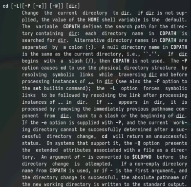{#fig:012 width=70%}

Просмотрим ключи для mkdir. Основные - m (Поставить права доступа), p (Создать родительские каталоги), v (Подробно выводить каждое действие) и z (поставить защиту в стандартный режим)(рис. [-@fig:013]).

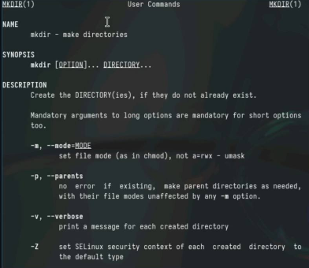{#fig:013 width=70%}

Просмотрим ключи для pwd. Основные - l (использовать pwd из окружения), p (избегать символьных ссылок)(рис. [-@fig:014]).

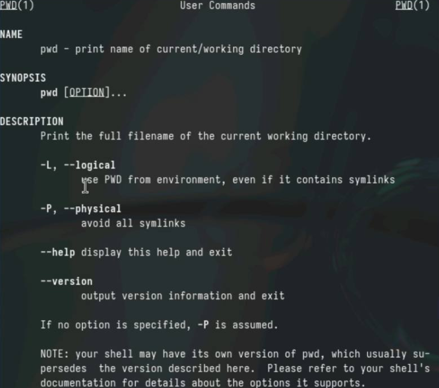{#fig:014 width=70%}

Просмотрим ключи для rmdir. Основные - p (Удалить родительские каталоги), v (Подробно выводить каждое действие) (рис. [-@fig:015]).

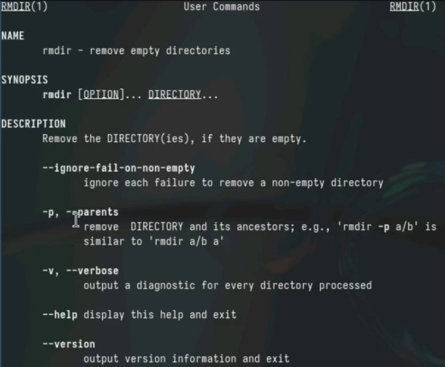{#fig:015 width=70%}

Просмотрим ключи для rm. Основные - f (принудительно удалять), i (спрашивать подтверждение)рис. [-@fig:016]).

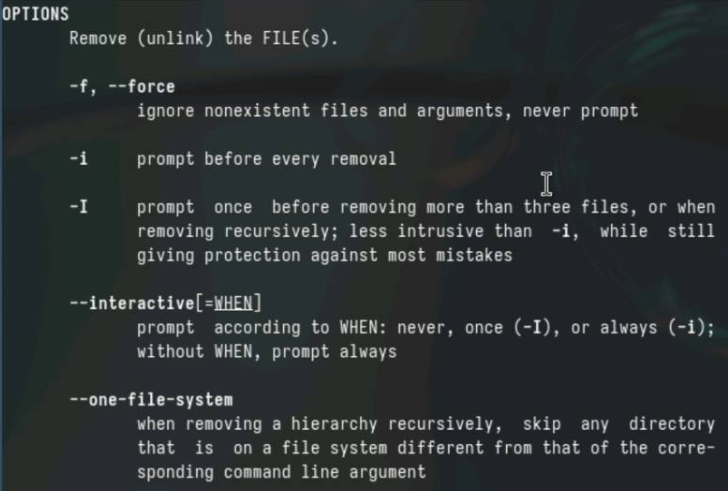{#fig:016 width=70%}

Выведем историю команд(рис. [-@fig:017]).

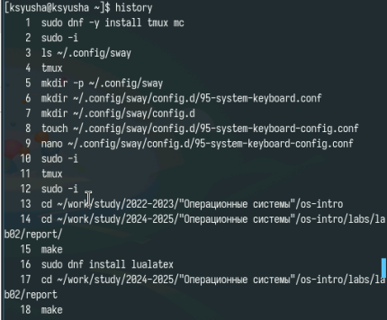{#fig:017 width=70%}

Выполнили модификацию и исполнение нескольких команд из буфера команд.(рис. [-@fig:018]).

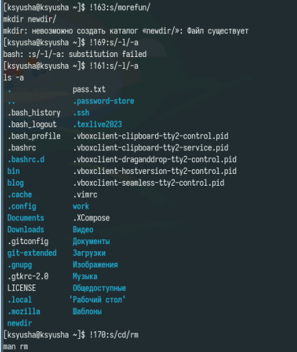{#fig:018 width=70%}

# Выводы

В ходе лабораторной работы мы приобрели практические навыки взаимодействия пользователя с системой посредством командной строки.

# Ответы на контрольные вопосы

1. Строка, в которую мы можем писать команды для исполнения
2. С помощью pwd. Например: pwd Загрузки
3. С помощью ls -F. Например: ls -F /tmp
4. С помощью ls -al. Например: ls -al /var
5. При помощи rm и rmdir соответственно. С помощью rm -R можно удалить как файл, так и каталог. Например: rm -R git-extended
6. С помощью history. Например, history
7. !<номер_команды>:s/<что_меняем>/<на_что_меняем>. Например, !3:s/a/F
8. cd; mkdir newdir; rm file.txt
9. Символы экранирования - специальные символы, которые интерпретируются по другому. Например, !3:s/-a//newdir
10. Выводит также владельца, дату, права доступа и название
11. Относительный путь - путь относительно текущего нахождения. Например, cd tmp и cd /tmp - разные по значению команды
12. С помощью man
13. tab

