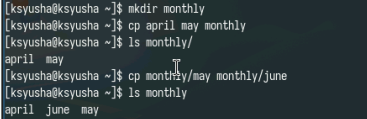
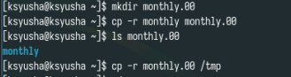
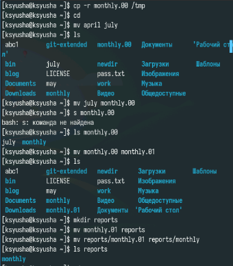
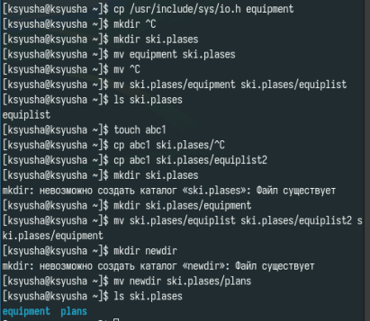
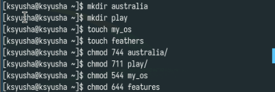
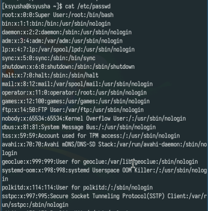
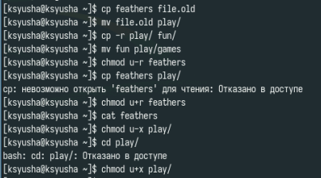
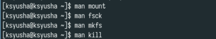

---
## Front matter
lang: ru-RU
title: Лабораторная работа №7
subtitle: Анализ файловой системы Linux. Команды для работы с файлами и каталогами
author:
  - Юсупова К. Р.
institute:
  - Российский университет дружбы народов, Москва, Россия

## i18n babel
babel-lang: russian
babel-otherlangs: english

## Formatting pdf
toc: false
toc-title: Содержание
slide_level: 2
aspectratio: 169
section-titles: true
theme: metropolis
header-includes:
 - \metroset{progressbar=frametitle,sectionpage=progressbar,numbering=fraction}
---

# Информация

## Докладчик

:::::::::::::: {.columns align=center}
::: {.column width="70%"}

  * Юсупова Ксения Равилевна
  * Российский университет дружбы народов
  * Номер студенческого билета- 1132247531
  * [1132247531@pfur.ru]

:::
::::::::::::::

# Вводная часть

## Цель работы

Ознакомление с файловой системой Linux, её структурой, именами и содержанием каталогов. Приобретение практических навыков по применению команд для работы с файлами и каталогами, по управлению процессами (и работами), по проверке использования диска и обслуживанию файловой системы.

# Выполнение лабораторной работы

Выполним задания из первого раздела.

{#fig:001 width=70%}

## Выполнение лабораторной работы

Копируем файлы в другой каталог.

{#fig:002 width=70%}

## Выполнение лабораторной работы

Копируем каталоги .

{#fig:003 width=70%}

## Выполнение лабораторной работы

Пробуем перемещения с помощью mv.

{#fig:004 width=70%}

## Выполнение лабораторной работы

Разбираем как работать с правами доступа, изменение прав осществляется с chmod. Мы как забираем права, так и даём их.

{#fig:005 width=70%}

## Выполнение лабораторной работы

Выполняем второй раздел заданий, разбираемся с работой копирования и перемещения .

{#fig:006 width=70%}

## Выполнение лабораторной работы

Выполняем третий раздел задания. Задаём права доступа для двух файлов и каталогов, устанавливаем права с помощью восьмеричной записи.

{#fig:007 width=70%}

## Выполнение лабораторной работы

Выполняем задания из четвертого радела, и просматриваем содержимое файла passwd с помощью cat.

{#fig:008 width=70%}

## Выполнение лабораторной работы

При выполнении следующих команд мы поняли, что не можем скопировать файл без прав на чтение, и не можем перейти в другой каталог, если не обладаем правами для его запуска.

{#fig:009 width=70%}

## Выполнение лабораторной работы

Прочитали man по командам mount, fsck, mkfs, kill. 

mount используется для монтирования файловых систем 

fsck необходим для проверки файловой системы

mkfs нужен для создания файловой системы Linux

kill заканчивает процесс.

{#fig:010 width=70%}

# Выводы

В ходе лабораторной работы мы ознакомились с файловой системой Linux, её структурой, именами и содержанием каталогов. Приобретели практические навыков по применению команд для работы с файлами и каталогами, по управлению процессами (и работами), по проверке использования диска и обслуживанию файловой системы.

