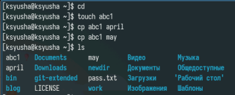
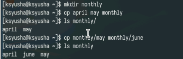
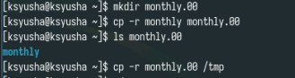
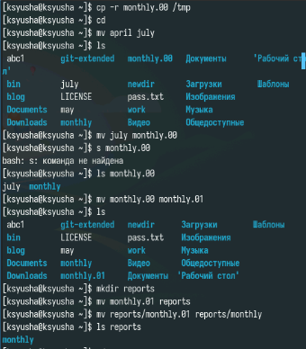
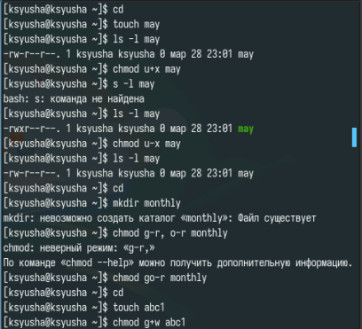
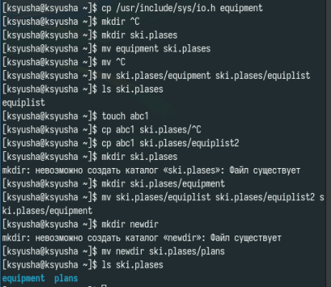
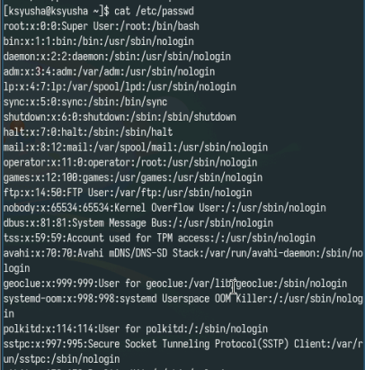
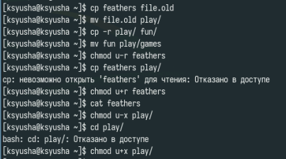
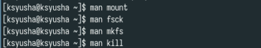

---
## Front matter
title: "Лабораторная работа № 7"
subtitle: "Анализ файловой системы Linux. Команды для работы с файлами и каталогами"
author: "Юсупова Ксения Равилевна"

## Generic otions
lang: ru-RU
toc-title: "Содержание"

## Bibliography
bibliography: bib/cite.bib
csl: pandoc/csl/gost-r-7-0-5-2008-numeric.csl

## Pdf output format
toc: true # Table of contents
toc-depth: 2
lof: true # List of figures
lot: true # List of tables
fontsize: 12pt
linestretch: 1.5
papersize: a4
documentclass: scrreprt
## I18n polyglossia
polyglossia-lang:
  name: russian
  options:
	- spelling=modern
	- babelshorthands=true
polyglossia-otherlangs:
  name: english
## I18n babel
babel-lang: russian
babel-otherlangs: english
## Fonts
mainfont: IBM Plex Serif
romanfont: IBM Plex Serif
sansfont: IBM Plex Sans
monofont: IBM Plex Mono
mathfont: STIX Two Math
mainfontoptions: Ligatures=Common,Ligatures=TeX,Scale=0.94
romanfontoptions: Ligatures=Common,Ligatures=TeX,Scale=0.94
sansfontoptions: Ligatures=Common,Ligatures=TeX,Scale=MatchLowercase,Scale=0.94
monofontoptions: Scale=MatchLowercase,Scale=0.94,FakeStretch=0.9
mathfontoptions:
## Biblatex
biblatex: true
biblio-style: "gost-numeric"
biblatexoptions:
  - parentracker=true
  - backend=biber
  - hyperref=auto
  - language=auto
  - autolang=other*
  - citestyle=gost-numeric
## Pandoc-crossref LaTeX customization
figureTitle: "Рис."
tableTitle: "Таблица"
listingTitle: "Листинг"
lofTitle: "Список иллюстраций"
lotTitle: "Список таблиц"
lolTitle: "Листинги"
## Misc options
indent: true
header-includes:
  - \usepackage{indentfirst}
  - \usepackage{float} # keep figures where there are in the text
  - \floatplacement{figure}{H} # keep figures where there are in the text
---

# Цель работы

Ознакомление с файловой системой Linux, её структурой, именами и содержанием каталогов. Приобретение практических навыков по применению команд для работы с файлами и каталогами, по управлению процессами (и работами), по проверке использования диска и обслуживанию файловой системы.

# Выполнение лабораторной работы

Выполним задания из первого раздела(рис. [-@fig:001]).

{#fig:001 width=70%}

Копируем файлы в другой каталог(рис. [-@fig:002]).

{#fig:002 width=70%}

Копируем каталоги (рис. [-@fig:003]).

{#fig:003 width=70%}

Пробуем перемещения с помощью mv(рис. [-@fig:004]).

{#fig:004 width=70%}

Разбираем как работать с правами доступа, изменение прав осществляется с chmod. Мы как забираем права, так и даём их(рис. [-@fig:005]).

{#fig:005 width=70%}

Выполняем второй раздел заданий, разбираемся с работой копирования и перемещения (рис. [-@fig:006]).

{#fig:006 width=70%}

Выполняем третий раздел задания. Задаём права доступа для двух файлов и каталогов, устанавливаем права с помощью восьмеричной записи.(рис. [-@fig:007]).

{#fig:007 width=70%}

Выполняем задания из четвертого радела, и просматриваем содержимое файла passwd с помощью cat(рис. [-@fig:008]).

{#fig:008 width=70%}

При выполнении следующих команд мы поняли, что не можем скопировать файл без прав на чтение, и не можем перейти в другой каталог, если не обладаем правами для его запуска(рис. [-@fig:009]).

{#fig:009 width=70%}

Прочитали man по командам mount, fsck, mkfs, kill. 

mount используется для монтирования файловых систем 

fsck необходим для проверки файловой системы

mkfs нужен для создания файловой системы Linux

kill заканчивает процесс(рис. [-@fig:010]).

{#fig:010 width=70%}

# Ответы на контрольные вопросы 

1. btrfs - Корневая файловая система, относительно новая, в ней добавили много возможностей. Однако пока не является стандартом, так как всё ещё может быть нестабильной

 ext4 - Файловая система Linux, самая распространённая

2. Файловая система Linux имеет иерархическую структуру, начиная с корневой директории (/).
Характеристика каждой директории первого уровня:
/bin: В этой директории содержатся исполняемые файлы (бинарники), которые необходимы для базового функционирования системы в однопользовательском режиме.
/boot: В этой директории хранятся файлы, необходимые для загрузки операционной системы. Это включает в себя ядро Linux (vmlinuz), файлы инициализации загрузчика и другие необходимые компоненты.
/dev: Здесь содержатся файлы, представляющие устройства в системе.
/etc: Эта директория содержит конфигурационные файлы для различных программ и служб, устанавливаемые в системе.
/home: Здесь располагаются домашние каталоги пользователей. Каждый пользователь имеет свою собственную поддиректорию в этой директории для хранения своих файлов и настроек.
/lib: В этой директории хранятся разделяемые библиотеки, которые используются программами во время выполнения.
/media: Эта директория предназначена для временного монтирования съемных носителей, таких как USB-флешки, CD-ROMы и другие.
/mnt: Здесь монтируются временные файловые системы. Обычно используется для временного монтирования файловых систем извне основной файловой системы, например, сетевых ресурсов.
/opt: В этой директории устанавливаются дополнительные программы, не входящие в стандартную поставку дистрибутива.
/proc: Эта директория представляет виртуальную файловую систему, содержащую информацию о запущенных процессах, настройках ядра и другие системные параметры.

3. mount

4. Отсутствие синхронизации, аварийное завершение работы. Исправляется с помощью утилит для проверки дисков

5. mkfs

6. cat - выводит всё

 tail - выводит последние 10 строк
 
 head - выводит первые 10 строк

7. Копирование, копирование с новым именем, копирование каталогов

8. Перемещение, перемещение с новым именем, перемещение каталогов

9. Право читать, записывать и запускать файл. Меняются с помощью chmod

# Выводы

В ходе лабораторной работы мы ознакомились с файловой системой Linux, её структурой, именами и содержанием каталогов. Приобретели практические навыков по применению команд для работы с файлами и каталогами, по управлению процессами (и работами), по проверке использования диска и обслуживанию файловой системы.

