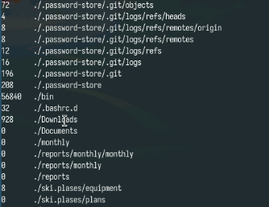

---
## Front matter
lang: ru-RU
title: Лабораторная работа №8
subtitle: Поиск файлов. Перенаправление ввода-вывода. Просмотр запущенных процессов
author:
  - Юсупова К. Р.
institute:
  - Российский университет дружбы народов, Москва, Россия

## i18n babel
babel-lang: russian
babel-otherlangs: english

## Formatting pdf
toc: false
toc-title: Содержание
slide_level: 2
aspectratio: 169
section-titles: true
theme: metropolis
header-includes:
 - \metroset{progressbar=frametitle,sectionpage=progressbar,numbering=fraction}
---

# Информация

## Докладчик

:::::::::::::: {.columns align=center}
::: {.column width="70%"}

  * Юсупова Ксения Равилевна
  * Российский университет дружбы народов
  * Номер студенческого билета- 1132247531
  * [1132247531@pfur.ru]

:::
::::::::::::::

# Вводная часть

## Цели и задачи

Ознакомление с инструментами поиска файлов и фильтрации текстовых данных.Приобретение практических навыков: по управлению процессами (и заданиями), попроверке использования диска и обслуживанию файловых систем.

# Выполнение лабораторной работы

Запишим в файл file.txt названия файлов, содержащихся в каталоге /etc. 

{#fig:001 width=70%}

## Выполнение лабораторной работы

Допишим в этот же файл названия файлов, содержащихся в моём домашнем каталоге.

{#fig:002 width=70%}

## Выполнение лабораторной работы

Выведем имена всех файлов из file.txt, имеющих расширение .conf.

{#fig:003 width=70%}

## Выполнение лабораторной работы

Запишим названия все файлов из file.txt, имеющие расширение .conf в новый текстовой файл conf.txt.

{#fig:004 width=70%}

## Выполнение лабораторной работы

Определим, какие файлы в нашем домашнем каталоге имеют имена, начинавшиеся с символа c. Перый вариант, как это сделать:.

{#fig:005 width=70%}

## Выполнение лабораторной работы

Анализируем вывод.

{#fig:006 width=70%}

## Выполнение лабораторной работы

Второй и третий варианты нахождения файлов с символом с .

{#fig:007 width=70%}

## Выполнение лабораторной работы

Выведием на экран (по странично) имена файлов из каталога /etc, начинающиеся с символа h.

{#fig:008 width=70%}

## Выполнение лабораторной работы

Смотрим на верность вывода.

{#fig:009 width=70%}

## Выполнение лабораторной работы

Запустите в фоновом режиме процесс, который будет записывать в файл ~/logfile файлы, имена которых начинаются с log.

{#fig:010 width=70%}

## Выполнение лабораторной работы

Удаляем файл ~/logfile.

{#fig:011 width=70%}

## Выполнение лабораторной работы

Запустим из консоли в фоновом режиме редактор gedit с помощью gedit & .

{#fig:012 width=70%}

## Выполнение лабораторной работы

Определим идентификатор процесса gedit, используя команду ps, конвейер и фильтр grep.

{#fig:013 width=70%}

## Выполнение лабораторной работы

Убьём процесс по его pid.

{#fig:014 width=70%}

## Выполнение лабораторной работы

С помощью df посмотрим на размер допустимого места в системе .

{#fig:015 width=70%}

## Выполнение лабораторной работы

И смотрим на место с помощью du.

{#fig:016 width=70%}

## Выполнение лабораторной работы

Получим слудующий вывод.

{#fig:017 width=70%}

## Выполнение лабораторной работы

Воспользовавшись справкой команды find, выведем имена всех директорий, имеющихся в вашем домашнем каталоге.

{#fig:018 width=70%}

# Выводы

В ходе лабораторной работы мы ознакомились с инструментами поиска файлов и фильтрации текстовых данных, приобрели практические навыки: по управлению процессами (и заданиями), по проверке использования диска и обслуживанию файловых систем.
