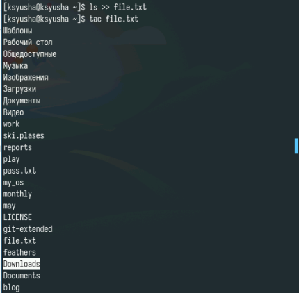
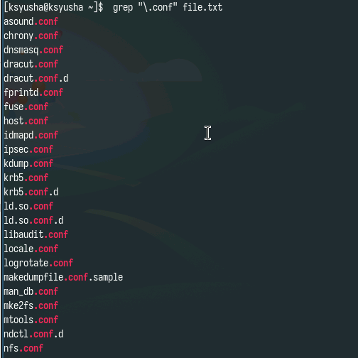
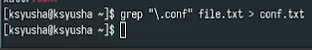
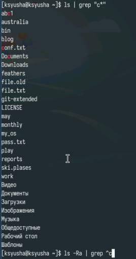
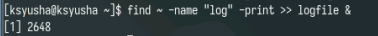
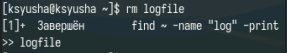
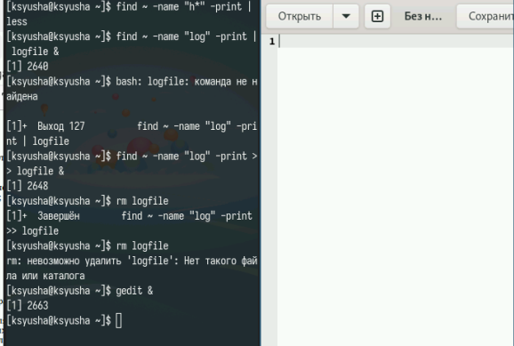
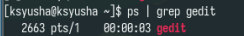
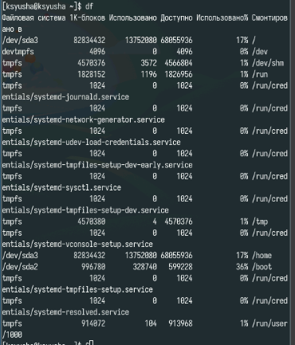
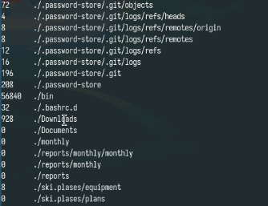

---
## Front matter
title: "Лабораторная работа №8"
subtitle: "Поиск файлов. Перенаправление ввода-вывода. Просмотр запущенных процессов"
author: "Юсупова Ксения Равилевна"

## Generic otions
lang: ru-RU
toc-title: "Содержание"

## Bibliography
bibliography: bib/cite.bib
csl: pandoc/csl/gost-r-7-0-5-2008-numeric.csl

## Pdf output format
toc: true # Table of contents
toc-depth: 2
lof: true # List of figures
lot: true # List of tables
fontsize: 12pt
linestretch: 1.5
papersize: a4
documentclass: scrreprt
## I18n polyglossia
polyglossia-lang:
  name: russian
  options:
	- spelling=modern
	- babelshorthands=true
polyglossia-otherlangs:
  name: english
## I18n babel
babel-lang: russian
babel-otherlangs: english
## Fonts
mainfont: IBM Plex Serif
romanfont: IBM Plex Serif
sansfont: IBM Plex Sans
monofont: IBM Plex Mono
mathfont: STIX Two Math
mainfontoptions: Ligatures=Common,Ligatures=TeX,Scale=0.94
romanfontoptions: Ligatures=Common,Ligatures=TeX,Scale=0.94
sansfontoptions: Ligatures=Common,Ligatures=TeX,Scale=MatchLowercase,Scale=0.94
monofontoptions: Scale=MatchLowercase,Scale=0.94,FakeStretch=0.9
mathfontoptions:
## Biblatex
biblatex: true
biblio-style: "gost-numeric"
biblatexoptions:
  - parentracker=true
  - backend=biber
  - hyperref=auto
  - language=auto
  - autolang=other*
  - citestyle=gost-numeric
## Pandoc-crossref LaTeX customization
figureTitle: "Рис."
tableTitle: "Таблица"
listingTitle: "Листинг"
lofTitle: "Список иллюстраций"
lotTitle: "Список таблиц"
lolTitle: "Листинги"
## Misc options
indent: true
header-includes:
  - \usepackage{indentfirst}
  - \usepackage{float} # keep figures where there are in the text
  - \floatplacement{figure}{H} # keep figures where there are in the text
---

# Цель работы

Ознакомление с инструментами поиска файлов и фильтрации текстовых данных.Приобретение практических навыков: по управлению процессами (и заданиями), попроверке использования диска и обслуживанию файловых систем.

# Выполнение лабораторной работы

Запишим в файл file.txt названия файлов, содержащихся в каталоге /etc. (рис. [-@fig:001]).

{#fig:001 width=70%}

Допишим в этот же файл названия файлов, содержащихся в моём домашнем каталоге.(рис. [-@fig:002]).

{#fig:002 width=70%}

Выведем имена всех файлов из file.txt, имеющих расширение .conf(рис. [-@fig:003]).

{#fig:003 width=70%}

Запишим названия все файлов из file.txt, имеющие расширение .conf в новый текстовой файл conf.txt.(рис. [-@fig:004]).

{#fig:004 width=70%}

Определим, какие файлы в нашем домашнем каталоге имеют имена, начинавшиеся с символа c. Перый вариант, как это сделать: (рис. [-@fig:005]).

{#fig:005 width=70%}

Анализируем вывод (рис. [-@fig:006]).

{#fig:006 width=70%}

Второй и третий варианты нахождения файлов с символом с(рис. [-@fig:007]).

{#fig:007 width=70%}

Выведием на экран (по странично) имена файлов из каталога /etc, начинающиеся с символа h.(рис. [-@fig:008]).

{#fig:008 width=70%}

Смотрим на верность вывода(рис. [-@fig:009]).

{#fig:009 width=70%}

Запустите в фоновом режиме процесс, который будет записывать в файл ~/logfile файлы, имена которых начинаются с log(рис. [-@fig:010]).

{#fig:010 width=70%}

Удаляем файл ~/logfile(рис. [-@fig:011]).

{#fig:011 width=70%}

Запустим из консоли в фоновом режиме редактор gedit с помощью gedit & (рис. [-@fig:012]).

{#fig:012 width=70%}

Определим идентификатор процесса gedit, используя команду ps, конвейер и фильтр grep.(рис. [-@fig:013]).

{#fig:013 width=70%}

Убьём процесс по его pid(рис. [-@fig:014]).

{#fig:014 width=70%}

С помощью df посмотрим на размер допустимого места в системе (рис. [-@fig:015]).

{#fig:015 width=70%}

И смотрим на место с помощью du(рис. [-@fig:016]).

{#fig:016 width=70%}

Воспользовавшись справкой команды find, выведем имена всех директорий, имеющихся в вашем домашнем каталоге.(рис. [-@fig:017]).

{#fig:017 width=70%}

Получим слудующий вывод(рис. [-@fig:018]).

{#fig:018 width=70%}

# Ответы на контрольные вопросы 

1. В системе по умолчанию открыты три особых потока: stdin — это стандартный поток ввода (по умолчанию это клавиатура), его файловый дескриптор равен 0.
stdout — это стандартный поток вывода (по умолчанию это консоль), его файловый дескриптор равен 1.
stderr — это стандартный поток вывода сообщений об ошибках (по умолчанию это консоль), его файловый дескриптор равен 2.

2. Символ > используется для перенаправления ввода/вывода, а символ » используется для перенаправления в режиме добавления.

3. Конвейер (pipe) используется для объединения отдельных команд или утилит в цепочку, в которой вывод одной команды передается на вход следующей команды.

4. Основное различие между программой и процессом заключается в том, что программа представляет собой набор инструкций, предназначенных для выполнения определенной задачи центральным процессором (ЦПУ), в то время как процесс - это экземпляр исполняемой программы, который активно выполняется в операционной системе.

5. PID (Process ID) - это идентификатор процесса, который уникально идентифицирует каждый запущенный процесс в операционной системе.
GID (Group ID) - это идентификатор группы, который определяет принадлежность процесса к определенной группе пользователей в операционной системе.

6. Программы, запущенные в фоновом режиме, действительно называются задачами (jobs). Управлять ими можно с помощью команды jobs, которая выводит список запущенных в данный момент задач.

7. Команда htop и команда top выполняют аналогичные функции, показывая информацию о процессах в реальном времени и отображая данные о потреблении системных ресурсов. Обе команды также предоставляют возможность поиска, остановки и управления процессами.
Однако у них есть различия и преимущества. Например, в htop реализован более удобный поиск и фильтрация процессов, что делает его использование более интуитивно понятным по сравнению с top, где для активации функции поиска требуется знать соответствующую комбинацию клавиш.
С другой стороны, в top можно разделить область окна и настроить отображение информации о процессах согласно различным настройкам, что делает его более гибким в настройке отображения.

8. Команда find является одной из наиболее важных и часто используемых утилит в системе Linux. Она предназначена для поиска файлов и каталогов на основе определенных условий. find можно применять в различных сценариях, таких как поиск файлов по разрешениям, владельцам, группам, типу, размеру и другим подобным критериям.
Утилита find по умолчанию предустановлена во всех дистрибутивах Linux, что обеспечивает готовность к использованию без необходимости установки дополнительных пакетов. Это делает find важным инструментом для эффективной работы в командной строке Linux.
Синтаксис команды find следующий: find путь параметры критерий действие. Например: find /etc -name "p*" -print - это команда, которая ищет файлы, начинающиеся с символа "p" в каталоге /etc и выводит результаты поиска.

9. Да, можно использовать команду find в сочетании с grep для поиска текста в файлах. Пример использования:
find / -type f -exec grep -H 'ТЕКСТ' {};
Эта команда будет рекурсивно искать файлы в корневом каталоге / и его подкаталогах. Затем она передаст каждый найденный файл в качестве аргумента команде grep, которая выполнит поиск строки 'ТЕКСТ' в каждом файле. Результатом будут строки с соответствующим текстом и именами файлов, в которых он найден.

10. С помощью df -h

11. С помощью команды du -s

13. С помощью команды kill PID

# Выводы

В ходе лабораторной работы мы ознакомились с инструментами поиска файлов и фильтрации текстовых данных, приобрели практические навыки: по управлению процессами (и заданиями), по проверке использования диска и обслуживанию файловых систем.
