---
## Front matter
lang: ru-RU
title: Лабораторная работа №9
subtitle: Командная оболочка Midnight Commander
author:
  - Юсупова К. Р.
institute:
  - Российский университет дружбы народов, Москва, Россия

## i18n babel
babel-lang: russian
babel-otherlangs: english

## Formatting pdf
toc: false
toc-title: Содержание
slide_level: 2
aspectratio: 169
section-titles: true
theme: metropolis
header-includes:
 - \metroset{progressbar=frametitle,sectionpage=progressbar,numbering=fraction}
---

# Информация

## Докладчик

:::::::::::::: {.columns align=center}
::: {.column width="70%"}

  * Юсупова Ксения Равилевна
  * Российский университет дружбы народов
  * Номер студенческого билета- 1132247531
  * [1132247531@pfur.ru]

:::
::::::::::::::

# Вводная часть

## Цель работы

Освоение основных возможностей командной оболочки Midnight Commander. Приобретение навыков практической работы по просмотру каталогов и файлов; манипуляций с ними.

# Выполнение лабораторной работы

Изучаем информацию о mc, вызвав в командной строке man mc.

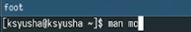{#fig:001 width=70%}

## Выполнение лабораторной работы

Запустим из командной строки mc, изучим его структуру и меню.

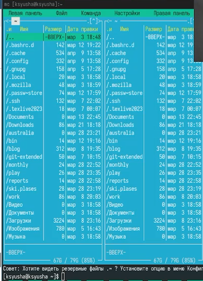{#fig:002 width=70%}

## Выполнение лабораторной работы

Выполним выделение файлов, используя нажатие на шифт .

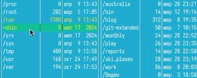{#fig:003 width=70%}

## Выполнение лабораторной работы

Выполним  копирование файлов.

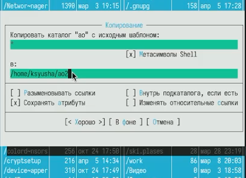{#fig:004 width=70%}

## Выполнение лабораторной работы

Выполним основные команды меню правой панели. Начинаем с изучения информации .

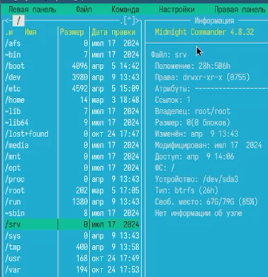{#fig:005 width=70%}

## Выполнение лабораторной работы

Откроем через правую панель дерево каталогов; а также далее рассмотрим дополнительные возможности использования правой панели.

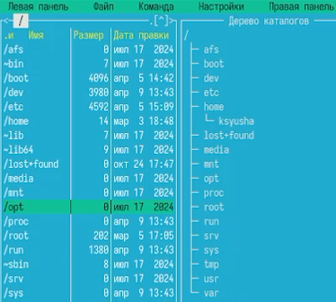{#fig:006 width=70%}

## Выполнение лабораторной работы

Используя возможности подменю Файл, выполним просмотр содержимого текстового файла и редактируем содержимое текстового файла (без сохранения результатов редактирования).

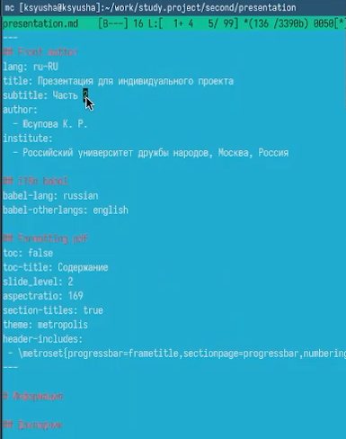{#fig:007 width=70%}

## Выполнение лабораторной работы

Создадим каталог через меню Команда.

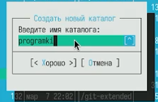{#fig:008 width=70%}

## Выполнение лабораторной работы

Копируем файлы в созданный каталог через меню Команда.

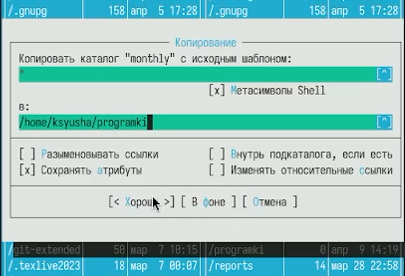{#fig:009 width=70%}

## Выполнение лабораторной работы

С помощью соответствующих средств подменю Команда осуществим поиск в файловой системе файла .txt, содержащий .d .

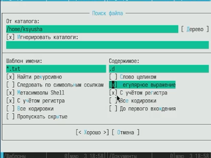{#fig:010 width=70%}

## Выполнение лабораторной работы

Выполняем выбор и повторение одной из предыдущих команд .

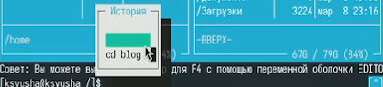{#fig:011 width=70%}

## Выполнение лабораторной работы

С помощью соответствующих средств подменю Команда осуществим переход в домашний каталог.

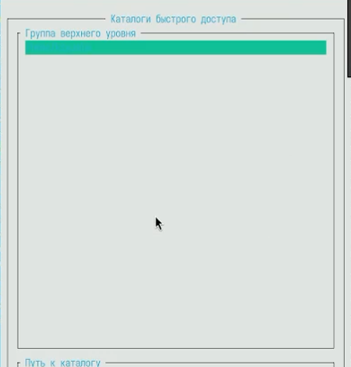{#fig:012 width=70%}

## Выполнение лабораторной работы

Откроем файл расширений .

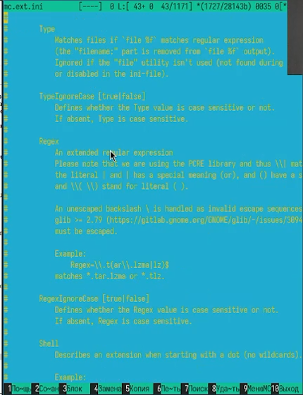{#fig:013 width=70%}

## Выполнение лабораторной работы

Откроем файл меню .

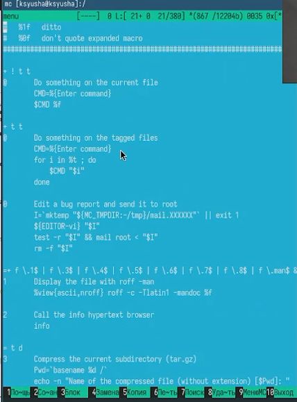{#fig:014 width=70%}

## Выполнение лабораторной работы

Вызовим подменю Настройки и изучим.

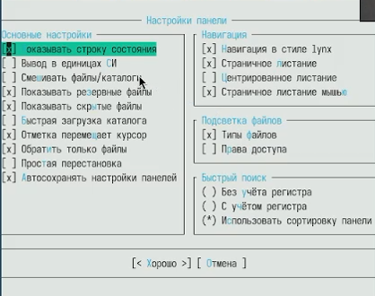{#fig:015 width=70%}

## Выполнение лабораторной работы

Создали текстовой файл text.txt и открыли этот файл с помощью встроенного в mc редактора. Вставили в открытый файл небольшой фрагмент текста, скопированный из Интернета .

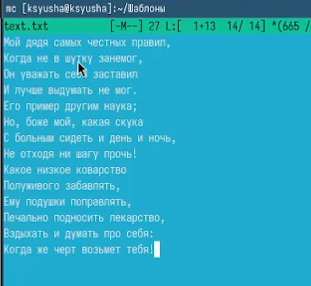{#fig:016 width=70%}

## Выполнение лабораторной работы

Используя горячие клавиши удалили строку текста.

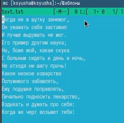{#fig:017 width=70%}

## Выполнение лабораторной работы

Выделили фрагмент текста и перенесли его на новую строку с помощью F6.

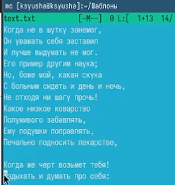{#fig:018 width=70%}

## Выполнение лабораторной работы

Выделили фрагмент текста и скопировали его на новую строку с помощью F5.

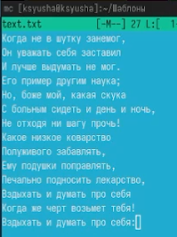{#fig:019 width=70%}

## Выполнение лабораторной работы

Отменили последнее действие .

{#fig:020 width=70%}

## Выполнение лабораторной работы

Перешли в конец файла (нажав комбинацию клавиш) и написали некоторый текст, затем сделали это и в начале .

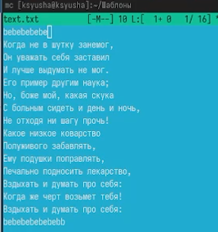{#fig:021 width=70%}

## Выполнение лабораторной работы

Используя меню редактора, включили подсветку синтаксиса .

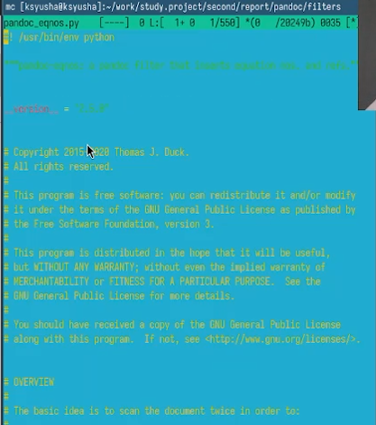{#fig:022 width=70%}

# Выводы

В ходе лабораторной работы мы освоили основные возможности командной оболочки Midnight Commander. Приобрели навыки практической работы по просмотру каталогов и файлов; манипуляций с ними.

