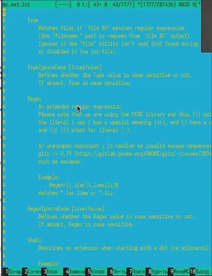
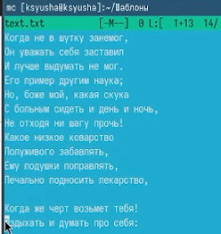

---
## Front matter
title: "Лабораторная работа №9"
subtitle: "Командная оболочка Midnight Commander"
author: "Юсупова Ксения Равилевна"

## Generic otions
lang: ru-RU
toc-title: "Содержание"

## Bibliography
bibliography: bib/cite.bib
csl: pandoc/csl/gost-r-7-0-5-2008-numeric.csl

## Pdf output format
toc: true # Table of contents
toc-depth: 2
lof: true # List of figures
lot: true # List of tables
fontsize: 12pt
linestretch: 1.5
papersize: a4
documentclass: scrreprt
## I18n polyglossia
polyglossia-lang:
  name: russian
  options:
	- spelling=modern
	- babelshorthands=true
polyglossia-otherlangs:
  name: english
## I18n babel
babel-lang: russian
babel-otherlangs: english
## Fonts
mainfont: IBM Plex Serif
romanfont: IBM Plex Serif
sansfont: IBM Plex Sans
monofont: IBM Plex Mono
mathfont: STIX Two Math
mainfontoptions: Ligatures=Common,Ligatures=TeX,Scale=0.94
romanfontoptions: Ligatures=Common,Ligatures=TeX,Scale=0.94
sansfontoptions: Ligatures=Common,Ligatures=TeX,Scale=MatchLowercase,Scale=0.94
monofontoptions: Scale=MatchLowercase,Scale=0.94,FakeStretch=0.9
mathfontoptions:
## Biblatex
biblatex: true
biblio-style: "gost-numeric"
biblatexoptions:
  - parentracker=true
  - backend=biber
  - hyperref=auto
  - language=auto
  - autolang=other*
  - citestyle=gost-numeric
## Pandoc-crossref LaTeX customization
figureTitle: "Рис."
tableTitle: "Таблица"
listingTitle: "Листинг"
lofTitle: "Список иллюстраций"
lotTitle: "Список таблиц"
lolTitle: "Листинги"
## Misc options
indent: true
header-includes:
  - \usepackage{indentfirst}
  - \usepackage{float} # keep figures where there are in the text
  - \floatplacement{figure}{H} # keep figures where there are in the text
---

# Цель работы

Освоение основных возможностей командной оболочки Midnight Commander. Приобретение навыков практической работы по просмотру каталогов и файлов; манипуляций с ними.

# Выполнение лабораторной работы

Изучаем информацию о mc, вызвав в командной строке man mc (рис. [-@fig:001]).

{#fig:001 width=70%}

Запустим из командной строки mc, изучим его структуру и меню.(рис. [-@fig:002]).

{#fig:002 width=70%}

Выполним выделение файлов, используя нажатие на шифт (рис. [-@fig:003]).

{#fig:003 width=70%}

Выполним  копирование файлов(рис. [-@fig:004]).

{#fig:004 width=70%}

Выполним основные команды меню правой панели. Начинаем с изучения информации (рис. [-@fig:005]).

{#fig:005 width=70%}

Откроем через правую панель дерево каталогов; а также далее рассмотрим дополнительные возможности использования правой панели.(рис. [-@fig:006]).

{#fig:006 width=70%}

Используя возможности подменю Файл, выполним просмотр содержимого текстового файла и редактируем содержимое текстового файла (без сохранения результатов редактирования)(рис. [-@fig:007]).

{#fig:007 width=70%}

Создадим каталог через меню Команда(рис. [-@fig:008]).

{#fig:008 width=70%}

Копируем файлы в созданный каталог через меню Команда(рис. [-@fig:009]).

{#fig:009 width=70%}

С помощью соответствующих средств подменю Команда осуществим поиск в файловой системе файла .txt, содержащий .d(рис. [-@fig:010]).

{#fig:010 width=70%}

Выполняем выбор и повторение одной из предыдущих команд (рис. [-@fig:011]).

{#fig:011 width=70%}

С помощью соответствующих средств подменю Команда осуществим переход в домашний каталог(рис. [-@fig:012]).

{#fig:012 width=70%}

Откроем файл расширений (рис. [-@fig:013]).

{#fig:013 width=70%}

Откроем файл меню (рис. [-@fig:014]).

{#fig:014 width=70%}

Вызовим подменю Настройки и изучим.(рис. [-@fig:015]).

{#fig:015 width=70%}

Создали текстовой файл text.txt и открыли этот файл с помощью встроенного в mc редактора. Вставили в открытый файл небольшой фрагмент текста, скопированный из Интернета (рис. [-@fig:016]).

{#fig:016 width=70%}

Используя горячие клавиши удалили строку текста(рис. [-@fig:017]).

{#fig:017 width=70%}

Выделили фрагмент текста и перенесли его на новую строку с помощью F6.(рис. [-@fig:018]).

{#fig:018 width=70%}

Выделили фрагмент текста и скопировали его на новую строку с помощью F5 (рис. [-@fig:019]).

{#fig:019 width=70%}

Отменили последнее действие (рис. [-@fig:020]).

{#fig:020 width=70%}

Перешли в конец файла (нажав комбинацию клавиш) и написали некоторый текст, затем сделали это и в начале (рис. [-@fig:021]).

{#fig:021 width=70%}

Используя меню редактора, включили подсветку синтаксиса (рис. [-@fig:022]).

{#fig:022 width=70%}

# Ответы на контрольные вопросы 

1. Панели также могут быть настроены для отображения информации в одном из двух режимов: "Информация" или "Дерево". В режиме "Информация" на панели отображаются данные о текущем файле и файловой системе, на которой расположены активные панели. В режиме "Дерево", на одной из панелей отображается структура дерева каталогов.

2. Раздел "Командная строка оболочки (Shell)" содержит список команд и сочетаний клавиш, используемых для ввода и редактирования команд в командной строке оболочки. Большинство этих команд предназначены для быстрого ввода имен файлов и/или каталогов в командную строку (чтобы упростить процесс ввода) или для доступа к истории команд. Клавиши редактирования строк ввода применяются как при редактировании командной строки, так и в других полях ввода, которые появляются в различных запросах программы.

3. В меню каждой из панелей (левой или правой) можно выбрать один из следующих форматов списка:
Стандартный: отображает список файлов и каталогов с указанием их размера и времени последнего изменения.
Ускоренный: позволяет задать количество столбцов, на которые разбивается панель при выводе списка имен файлов или каталогов без дополнительной информации.
Расширенный: помимо названия файла или каталога выводит дополнительные сведения о правах доступа, владельце, группе, размере и времени последнего изменения.
Определённый пользователем: предоставляет пользователю возможность выбрать, какие дополнительные сведения о файле или каталоге следует отобразить.

4. Просмотр (F3): Позволяет просмотреть содержимое текущего (или выделенного) файла без возможности редактирования.
Просмотр вывода команды (M + !): Запускает команду с параметрами (аргумент к текущему выбранному файлу) и позволяет просмотреть её вывод.
Правка (F4): Открывает текущий (или выделенный) файл для редактирования.
Копирование (F5): Копирует один или несколько файлов или каталогов в указанное пользователем место.
Права доступа (Ctrl-x c): Позволяет указать (или изменить) права доступа к одному или нескольким файлам или каталогам.
Жёсткая ссылка (Ctrl-x l): Создает жёсткую ссылку на текущий (или выделенный) файл.
Символическая ссылка (Ctrl-x s): Создает символическую ссылку на текущий (или выделенный) файл.
Владелец/группа (Ctrl-x o): Позволяет задать (или изменить) владельца и имя группы для одного или нескольких файлов или каталогов.
Права (расширенные): Позволяет изменить расширенные права доступа и владение для одного или нескольких файлов или каталогов.
Переименование (F6): Позволяет переименовать (или переместить) один или несколько файлов или каталогов.
Создание каталога (F7): Позволяет создать новый каталог.
Удалить (F8): Позволяет удалить один или несколько файлов или каталогов.
Выход (F10): Завершает работу Midnight Commander (mc).

5. Дерево каталогов: Отображает структуру каталогов в системе.
Поиск файла: Выполняет поиск файлов с заданными параметрами.
Переставить панели: Меняет местами левую и правую панели.
Сравнить каталоги (Ctrl-x d): Сравнивает содержимое двух каталогов.
Размеры каталогов: Отображает размер и время изменения каталога (по умолчанию в MC размер каталога не отображается корректно).
История командной строки: Выводит список ранее выполненных в оболочке команд.
Каталоги быстрого доступа (Ctrl-): При вызове выполняется быстрая смена текущего каталога на один из заданных в списке.
Восстановление файлов: Позволяет восстановить файлы на файловых системах ext2 и ext3.
Редактировать файл расширений: Позволяет определить действия при запуске файлов с определенным расширением (например, какое программное обеспечение использовать для открытия или редактирования файлов с расширением doc или docx).
Редактировать файл меню: Позволяет отредактировать контекстное меню пользователя, вызываемое по клавише F2.
Редактировать файл расцветки имён: Позволяет настроить цветовую схему для имен файлов в зависимости от их типа.

6. Конфигурация: Позволяет настроить параметры работы с панелями.
Внешний вид и Настройки панелей: Определяет элементы (строка меню, командная строка, подсказки и т. д.), отображаемые при вызове Midnight Commander (MC), а также геометрию расположения панелей и цветовую схему.
Биты символов: Задает формат обработки информации локальным терминалом.
Подтверждение: Позволяет установить или убрать вывод окна с запросом подтверждения действий при операциях удаления и перезаписи файлов, а также при выходе из программы.
Распознание клавиш: Диалоговое окно используется для тестирования функциональных клавиш, клавиш управления курсором и других клавиатурных комбинаций.
Виртуальные ФС: Настройки виртуальной файловой системы, такие как тайм-аут, пароль и другие параметры.

7. F1: Вызов контекстно-зависимой подсказки.
F2: Вызов пользовательского меню с возможностью создания и/или дополнения дополнительных функций.
F3: Просмотр содержимого файла, на который указывает подсветка в активной панели (без возможности редактирования).
F4: Вызов встроенного в MC редактора для изменения содержания файла, на который указывает подсветка в активной панели.
F5: Копирование одного или нескольких файлов, отмеченных в первой (активной) панели, в каталог, отображаемый на второй панели.
F6: Перенос одного или нескольких файлов, отмеченных в первой (активной) панели, в каталог, отображаемый на второй панели.
F7: Создание подкаталога в каталоге, отображаемом в активной панели.
F8: Удаление одного или нескольких файлов (или каталогов), отмеченных в первой (активной) панели файлов.
F9: Вызов меню MC.
F10: Выход из MC.

8. Ctrl-y: Удалить строку.
Ctrl-u: Отмена последней операции.
Ins: Вставка/замена.
F7: Поиск (можно использовать регулярные выражения).
Стрелка вверх + F7: Повтор последней операции поиска.
F4: Замена.
F3 (первое нажатие): Начало выделения, (второе нажатие): Окончание выделения.
F5: Копировать выделенный фрагмент.
F6: Переместить выделенный фрагмент.
F8: Удалить выделенный фрагмент.
F2: Записать изменения в файл.
F10: Выйти из редактора.

9. Вы можете создавать пользовательские команды для быстрого вызова на панели Midnight Commander. Для этого просто введите команду в строке ввода (в разделе "Команда") и нажмите кнопку "Добавить". Затем введите информативное имя для этой команды. В следующий раз вам будет достаточно выбрать это имя из списка, чтобы вызвать команду, вместо того чтобы вводить всю команду заново.

10. Панель в Midnight Commander (mc) отображает список файлов текущего каталога. Абсолютный путь к этому каталогу отображается в заголовке панели. Активная панель выделяется подсветкой в заголовке и одной из её строк. Управление панелями осуществляется с помощью определённых комбинаций клавиш или пунктов меню в Midnight Commander.

# Выводы

В ходе лабораторной работы мы освоили основные возможности командной оболочки Midnight Commander. Приобрели навыки практической работы по просмотру каталогов и файлов; манипуляций с ними.
