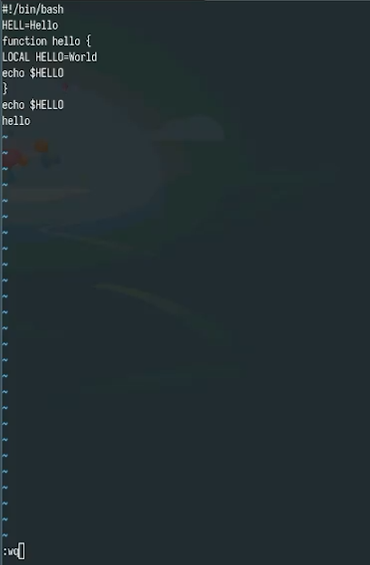
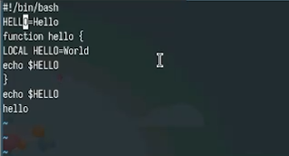
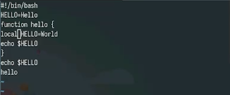
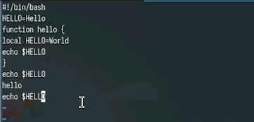
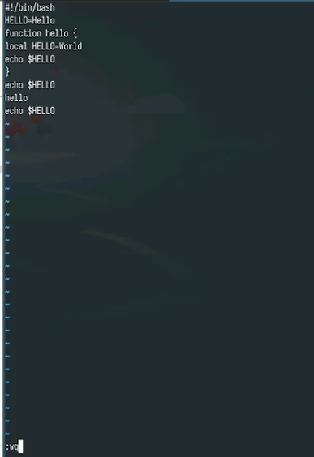

---
## Front matter
lang: ru-RU
title: Лабораторная работа №10
subtitle: Текстовой редактор vi
author:
  - Юсупова К. Р.
institute:
  - Российский университет дружбы народов, Москва, Россия

## i18n babel
babel-lang: russian
babel-otherlangs: english

## Formatting pdf
toc: false
toc-title: Содержание
slide_level: 2
aspectratio: 169
section-titles: true
theme: metropolis
header-includes:
 - \metroset{progressbar=frametitle,sectionpage=progressbar,numbering=fraction}
---

# Информация

## Докладчик

:::::::::::::: {.columns align=center}
::: {.column width="70%"}

  * Юсупова Ксения Равилевна
  * Российский университет дружбы народов
  * Номер студенческого билета- 1132247531
  * [1132247531@pfur.ru]

:::
::::::::::::::

# Вводная часть

## Цель работы

Познакомиться с операционной системой Linux. Получить практические навыки работы с редактором vi, установленным по умолчанию практически во всех дистрибутивах.

# Выполнение лабораторной работы

Создали каталог с именем ~/work/os/lab06 и перешли во вновь созданный каталог.Далее вызвали vi и создали файл hello.sh.

{#fig:001 width=70%}

## Выполнение лабораторной работы

Вели в файл текст из листинга, затем нажали w (записать) и q (выйти), а затем нажали клавишу Enter для сохранения
нашего текста и завершения работы.

{#fig:002 width=70%}

## Выполнение лабораторной работы

Сделали файл исполняемым

{#fig:003 width=70%}

## Выполнение лабораторной работы

Вызвали vi на редактирование файла

{#fig:004 width=70%}

## Выполнение лабораторной работы

Установили курсор в конец слова HELL второй строки и перещли в режим вставки, заменили на HELLO. Нажали Esc для возврата в командный режим.

{#fig:005 width=70%}

## Выполнение лабораторной работы

Установили курсор на четвертую строку и сотрите слово LOCAL. Перешли в режим вставки и набрали следующий текст: local, затем нажали Esc для возврата в командный режим.

{#fig:006 width=70%}

## Выполнение лабораторной работы

Установили курсор на последней строке файла. Вставили после неё строку, содержащую следующий текст: echo $HELLO.

{#fig:007 width=70%}

## Выполнение лабораторной работы

Нажали Esc для перехода в командный режим. Удалили последнюю строку.

{#fig:008 width=70%}

## Выполнение лабораторной работы

Ввели команду отмены изменений u для отмены последней команды.Далее ввели символ : для перехода в режим последней строки. Записали произведённые изменения и выйдите из vi.

{#fig:009 width=70%}

# Выводы

В ходе лабораторной работы мы познакомились с операционной системой Linux. Получили практические навыки работы с редактором vi, установленным по умолчанию практически во всех дистрибутивах.

