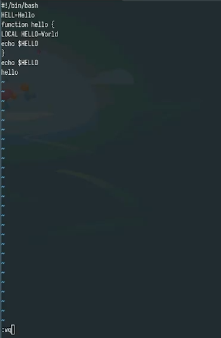
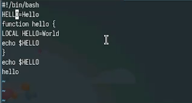
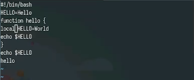
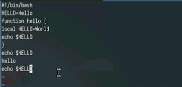
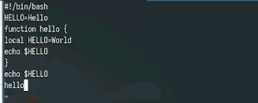
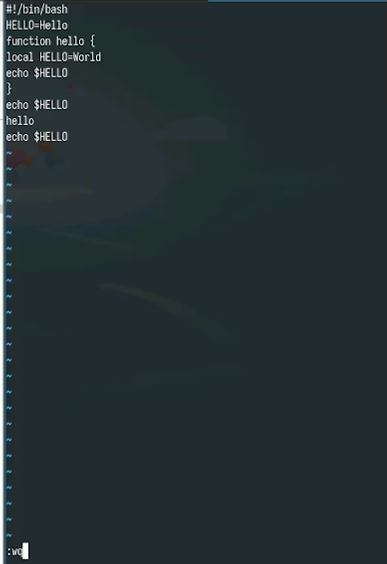

---
## Front matter
title: "Лабораторная работа № 10"
subtitle: "Текстовой редактор vi"
author: "Юсупова Ксения Равилевна"

## Generic otions
lang: ru-RU
toc-title: "Содержание"

## Bibliography
bibliography: bib/cite.bib
csl: pandoc/csl/gost-r-7-0-5-2008-numeric.csl

## Pdf output format
toc: true # Table of contents
toc-depth: 2
lof: true # List of figures
lot: true # List of tables
fontsize: 12pt
linestretch: 1.5
papersize: a4
documentclass: scrreprt
## I18n polyglossia
polyglossia-lang:
  name: russian
  options:
	- spelling=modern
	- babelshorthands=true
polyglossia-otherlangs:
  name: english
## I18n babel
babel-lang: russian
babel-otherlangs: english
## Fonts
mainfont: IBM Plex Serif
romanfont: IBM Plex Serif
sansfont: IBM Plex Sans
monofont: IBM Plex Mono
mathfont: STIX Two Math
mainfontoptions: Ligatures=Common,Ligatures=TeX,Scale=0.94
romanfontoptions: Ligatures=Common,Ligatures=TeX,Scale=0.94
sansfontoptions: Ligatures=Common,Ligatures=TeX,Scale=MatchLowercase,Scale=0.94
monofontoptions: Scale=MatchLowercase,Scale=0.94,FakeStretch=0.9
mathfontoptions:
## Biblatex
biblatex: true
biblio-style: "gost-numeric"
biblatexoptions:
  - parentracker=true
  - backend=biber
  - hyperref=auto
  - language=auto
  - autolang=other*
  - citestyle=gost-numeric
## Pandoc-crossref LaTeX customization
figureTitle: "Рис."
tableTitle: "Таблица"
listingTitle: "Листинг"
lofTitle: "Список иллюстраций"
lotTitle: "Список таблиц"
lolTitle: "Листинги"
## Misc options
indent: true
header-includes:
  - \usepackage{indentfirst}
  - \usepackage{float} # keep figures where there are in the text
  - \floatplacement{figure}{H} # keep figures where there are in the text
---

# Цель работы

Познакомиться с операционной системой Linux. Получить практические навыки работы с редактором vi, установленным по умолчанию практически во всех дистрибутивах.

# Выполнение лабораторной работы

Создали каталог с именем ~/work/os/lab06 и перешли во вновь созданный каталог.Далее вызвали vi и создали файл hello.sh(рис. [-@fig:001]).

{#fig:001 width=70%}

Вели в файл текст из листинга, затем нажали w (записать) и q (выйти), а затем нажали клавишу Enter для сохранения
нашего текста и завершения работы.(рис. [-@fig:002]).

{#fig:002 width=70%}

Сделали файл исполняемым(рис. [-@fig:003]).

{#fig:003 width=70%}

Вызвали vi на редактирование файла(рис. [-@fig:004]).

{#fig:004 width=70%}

Установили курсор в конец слова HELL второй строки и перещли в режим вставки, заменили на HELLO. Нажали Esc для возврата в командный режим.(рис. [-@fig:005]).

{#fig:005 width=70%}

Установили курсор на четвертую строку и сотрите слово LOCAL. Перешли в режим вставки и набрали следующий текст: local, затем нажали Esc для возврата в командный режим.(рис. [-@fig:006]).

{#fig:006 width=70%}

Установили курсор на последней строке файла. Вставили после неё строку, содержащую следующий текст: echo $HELLO.(рис. [-@fig:007]).

{#fig:007 width=70%}

Нажали Esc для перехода в командный режим. Удалили последнюю строку.(рис. [-@fig:008]).

{#fig:008 width=70%}

Ввели команду отмены изменений u для отмены последней команды.Далее ввели символ : для перехода в режим последней строки. Записали произведённые изменения и выйдите из vi.(рис. [-@fig:009]).

{#fig:009 width=70%}

# Ответы на контрольные вопросы

1. Режим команд - служит для ввода команд редактирования и перемещения по редактируемому файлу.
Режим вставки - предназначен для добавления текста в редактируемый файл.
Режим командной строки (или последней строки) - используется для сохранения внесенных изменений в файл и выхода из редактора.

2. Если вам нужно выйти из редактора без сохранения, вы можете просто нажать клавишу "q" (или "q!").

3. "0" (ноль) — перемещение к началу текущей строки
"$" — перемещение к концу текущей строки
"G" — перемещение к концу файла
"n G" — перемещение к строке с номером n

4. Редактор vi определяет слово как последовательность символов, состоящую из букв, цифр и символов подчеркивания.

5. С помощью команды "G" вы перемещаетесь в конец файла в редакторе vi.

6. Вставка текста:

"а" - вставить текст после текущего курсора;

"А" - вставить текст в конец текущей строки;

"i" - вставить текст перед текущим курсором;

"n i" - вставить текст n раз;

"I" - вставить текст в начало текущей строки.

Вставка строки:

"о" - вставить строку под текущим курсором;

"О" - вставить строку над текущим курсором.

Удаление текста:

"x" - удалить один символ и поместить его в буфер обмена;

"d w" - удалить одно слово и поместить его в буфер 
обмена;

"d $" - удалить текст от текущего курсора до конца строки и поместить его в буфер обмена;

"d 0" - удалить текст от начала строки до текущего курсора и поместить его в буфер обмена;

"d d" - удалить текущую строку и поместить её в буфер обмена;

"n d d" - удалить n строк и поместить их в буфер обмена. Отмена и повтор изменений:

"u" - отменить последнее изменение;

"." - повторить последнее изменение.

Копирование текста в буфер обмена:

"Y" - скопировать текущую строку в буфер обмена;

"n Y" - скопировать n строк в буфер обмена;

"y w" - скопировать текущее слово в буфер обмена.

Вставка текста из буфера обмена:

"p" - вставить текст из буфера обмена после текущего курсора;

"P" - вставить текст из буфера обмена перед текущим курсором.

Замена текста:

"c w" - заменить текущее слово;

"n c w" - заменить n слов;

"c $" - заменить текст от текущего курсора до конца строки;

"r" - заменить текущий символ;

"R" - перейти в режим замены текста.

Поиск текста:

"/ текст" - выполнить поиск вперёд по указанному тексту;

"? текст" - выполнить поиск назад по указанному тексту.

7. Для вставки символов "$" в редакторе vi следует перейти в режим вставки, нажав клавишу "i", а затем ввести нужное количество символов "$". После завершения вставки символов следует вернуться в командный режим, нажав клавишу "Esc".

8. Используя команду "u" в редакторе vi, можно отменить последнее совершенное изменение.

9. В редакторе vi режим последней строки используется для сохранения изменений в файле и выхода из редактора.

10. Символ "$" в редакторе vi обозначает команду перехода в конец текущей строки.

11. Опции редактора vi позволяют настраивать рабочую среду. Для установки опций используется команда "set" в режиме последней строки:
": set all" - выводит полный список опций;
": set nu" - отображает номера строк;
": set list" - отображает невидимые символы;
": set ic" - при поиске не учитывает регистр символов.

12. В редакторе vi существуют два основных режима: командный режим и режим вставки. По умолчанию работа начинается в командном режиме. В режиме вставки клавиатура используется для ввода текста. Для перехода обратно в командный режим используется клавиша Esc или комбинация клавиш Ctrl + c.

13. Режим последней строки <> командный режим <> режим ввода

# Выводы

В ходе лабораторной работы мы познакомились с операционной системой Linux. Получили практические навыки работы с редактором vi, установленным по умолчанию практически во всех дистрибутивах.

