---
## Front matter
lang: ru-RU
title: Лабораторная работа №11
subtitle: Текстовой редактор emacs
author:
  - Юсупова Ксения Равилевна
institute:
  - Российский университет дружбы народов, Москва, Россия

## i18n babel
babel-lang: russian
babel-otherlangs: english

## Formatting pdf
toc: false
toc-title: Содержание
slide_level: 2
aspectratio: 169
section-titles: true
theme: metropolis
header-includes:
 - \metroset{progressbar=frametitle,sectionpage=progressbar,numbering=fraction}
---

# Информация

## Докладчик

:::::::::::::: {.columns align=center}
::: {.column width="70%"}

  * Юсупова Ксения Равилевна
  * Российский университет дружбы народов
  * Номер студенческого билета- 1132247531
  * [1132247531@pfur.ru]

:::
::::::::::::::

# Вводная часть

## Цель работы

Познакомиться с операционной системой Linux. Получить практические навыки работы с редактором Emacs.

# Выполнение лабораторной работы

Открыли emacs

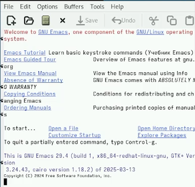{#fig:001 width=70%}

## Выполнение лабораторной работы

Создали файл lab07.sh с помощью комбинации Ctrl-x Ctrl-f и набрали текст

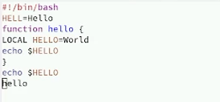{#fig:002 width=70%}

## Выполнение лабораторной работы

Вырезали одной командой целую строку (С-k) и вставили эту строку в конец файла (C-y)

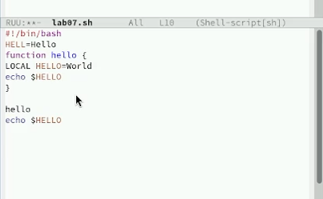{#fig:003 width=70%}

## Выполнение лабораторной работы

Выделили область текста (C-space) и скопировали область в буфер обмена (M-w).

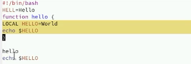{#fig:004 width=70%}

## Выполнение лабораторной работы

Вставили область текста в конец файла

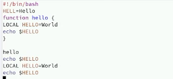{#fig:005 width=70%}

## Выполнение лабораторной работы

Вновь выделили эту область и на этот раз вырезали её (C-w)

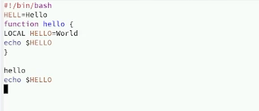{#fig:006 width=70%}

## Выполнение лабораторной работы

Отменили последнее действие (C-/).

{#fig:007 width=70%}

## Выполнение лабораторной работы

Научились использовать команды по перемещению курсора.
Переместили курсор в начало строки, в конец строки, в начало буфера, в конец буфера.

Вывели список активных буферов на экран (C-x C-b).

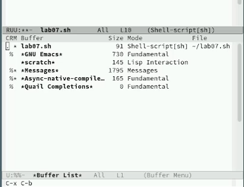{#fig:008 width=70%}

## Выполнение лабораторной работы

Переместились во вновь открытое окно (C-x) o со списком открытых буферов и переключились на другой буфер.

{#fig:009 width=70%}

## Выполнение лабораторной работы

Теперь вновь переключилсь между буферами, но уже без вывода их списка на экран (C-x b)

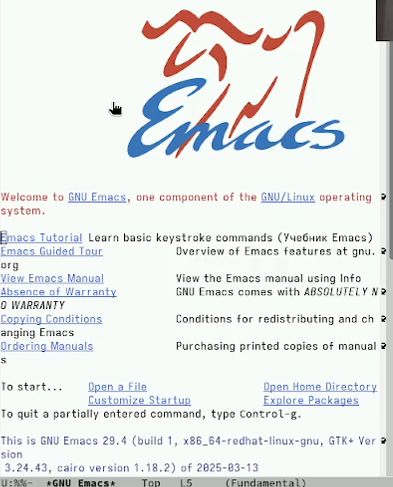{#fig:010 width=70%}

## Выполнение лабораторной работы

Поделили фрейм на 4 части: разделили фрейм на два окна по вертикали (C-x 3), а затем каждое из этих окон на две части по горизонтали (C-x 2). В каждом из четырёх созданных окон открыли новый буфер (файл) и ввели несколько строк текста

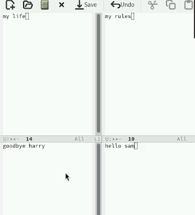{#fig:011 width=70%}

## Выполнение лабораторной работы

Перешли в режим поиска и замены (M-%), ввели текст, который следует найти

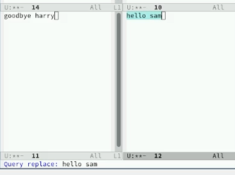{#fig:012 width=70%}

## Выполнение лабораторной работы

Заменили текст

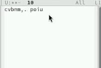{#fig:013 width=70%}

## Выполнение лабораторной работы

Испробовали другой режим поиска, нажав M-s

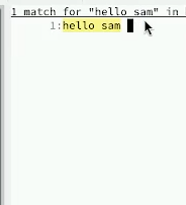{#fig:014 width=70%} 

# Выводы

В ходе лабораторной работы больше познакомились с операционной системой Linux. Получили практические навыки работы с редактором Emacs.
