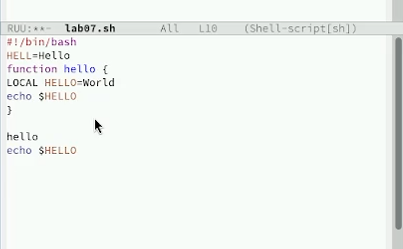

---
## Front matter
title: "Лабораторная работа №11"
subtitle: "Текстовой редактор emacs"
author: "Юсупова Ксения Равилевна"

## Generic otions
lang: ru-RU
toc-title: "Содержание"

## Bibliography
bibliography: bib/cite.bib
csl: pandoc/csl/gost-r-7-0-5-2008-numeric.csl

## Pdf output format
toc: true # Table of contents
toc-depth: 2
lof: true # List of figures
lot: true # List of tables
fontsize: 12pt
linestretch: 1.5
papersize: a4
documentclass: scrreprt
## I18n polyglossia
polyglossia-lang:
  name: russian
  options:
	- spelling=modern
	- babelshorthands=true
polyglossia-otherlangs:
  name: english
## I18n babel
babel-lang: russian
babel-otherlangs: english
## Fonts
mainfont: IBM Plex Serif
romanfont: IBM Plex Serif
sansfont: IBM Plex Sans
monofont: IBM Plex Mono
mathfont: STIX Two Math
mainfontoptions: Ligatures=Common,Ligatures=TeX,Scale=0.94
romanfontoptions: Ligatures=Common,Ligatures=TeX,Scale=0.94
sansfontoptions: Ligatures=Common,Ligatures=TeX,Scale=MatchLowercase,Scale=0.94
monofontoptions: Scale=MatchLowercase,Scale=0.94,FakeStretch=0.9
mathfontoptions:
## Biblatex
biblatex: true
biblio-style: "gost-numeric"
biblatexoptions:
  - parentracker=true
  - backend=biber
  - hyperref=auto
  - language=auto
  - autolang=other*
  - citestyle=gost-numeric
## Pandoc-crossref LaTeX customization
figureTitle: "Рис."
tableTitle: "Таблица"
listingTitle: "Листинг"
lofTitle: "Список иллюстраций"
lotTitle: "Список таблиц"
lolTitle: "Листинги"
## Misc options
indent: true
header-includes:
  - \usepackage{indentfirst}
  - \usepackage{float} # keep figures where there are in the text
  - \floatplacement{figure}{H} # keep figures where there are in the text
---

# Цель работы

Познакомиться с операционной системой Linux. Получить практические навыки работы с редактором Emacs.

# Выполнение лабораторной работы

Открыли emacs(рис. [-@fig:001]).

{#fig:001 width=70%}

Создали файл lab07.sh с помощью комбинации Ctrl-x Ctrl-f и набрали текст(рис. [-@fig:002]).

{#fig:002 width=70%}

Вырезали одной командой целую строку (С-k) и вставили эту строку в конец файла (C-y)(рис. [-@fig:003]).

{#fig:003 width=70%}

Выделили область текста (C-space) и скопировали область в буфер обмена (M-w).(рис. [-@fig:004]).

{#fig:004 width=70%}

Вставили область текста в конец файла(рис. [-@fig:005]).

{#fig:005 width=70%}

Вновь выделили эту область и на этот раз вырезали её (C-w)(рис. [-@fig:006]).

{#fig:006 width=70%}

Отменили последнее действие (C-/).(рис. [-@fig:007]).

{#fig:007 width=70%}

Научились использовать команды по перемещению курсора.
Переместили курсор в начало строки, в конец строки, в начало буфера, в конец буфера.

Вывели список активных буферов на экран (C-x C-b).(рис. [-@fig:008]).

{#fig:008 width=70%}

Переместились во вновь открытое окно (C-x) o со списком открытых буферов и переключились на другой буфер.(рис. [-@fig:009]).

{#fig:009 width=70%}

Теперь вновь переключилсь между буферами, но уже без вывода их списка на экран (C-x b)(рис. [-@fig:010]).

{#fig:010 width=70%}

Поделили фрейм на 4 части: разделили фрейм на два окна по вертикали (C-x 3), а затем каждое из этих окон на две части по горизонтали (C-x 2). В каждом из четырёх созданных окон открыли новый буфер (файл) и ввели несколько строк текста(рис. [-@fig:011]).

{#fig:011 width=70%}

Перешли в режим поиска и замены (M-%), ввели текст, который следует найти (рис. [-@fig:012]).

{#fig:012 width=70%}

Заменили текст(рис. [-@fig:013]).

{#fig:013 width=70%}

Испробовали другой режим поиска, нажав M-s (рис. [-@fig:014]).

{#fig:014 width=70%} 

# Выводы

В ходе лабораторной работы больше познакомились с операционной системой Linux. Получили практические навыки работы с редактором Emacs.

# Ответы на контрольные вопросы

1. Краткая характеристика редактора Emacs

Emacs — расширяемый кроссплатформенный текстовый редактор, работающий в терминале и графическом режиме. В Fedora устанавливается пакетом `emacs` или `emacs-nox` (консольная версия). Поддерживает:

- Гибкую работу в терминале под Sway/Wayland

- Полную интеграцию с shell-окружением

- Управление через клавиатуру (важно для tiling WM)

2. Особенности, осложняющие освоение в Sway

- Комбинации клавиш могут конфликтовать с хоткеями Sway (например, `Mod+C`)

- Отсутствие графического меню по умолчанию

- Сложность переключения между буферами без мыши

3. Буфер и окно в терминологии Emacs

- **Буфер** - аналог вкладки (файл, процесс, лог)

- **Окно** - область отображения (в терминале - разделённые `tmux`-подобные области)

 4. Можно ли открыть 10 буферов в одном окне?

Да, ограничений нет.

5. Стандартные буферы при запуске:
  
   - `*scratch*`
  
   - `*Messages*`
  
   - `*GNU Emacs*`

6. Ввод комбинаций:
  
   - `C-c |`: Ctrl+c, затем Shift+\
  
   - `C-c C-|`: Ctrl+c, затем (с зажатым Ctrl) Shift+\

7. Разделение окна:
  
   - Горизонтально: `C-x 2`
  
   - Вертикально: `C-x 3`

8. Файлы настроек:
  
   - `~/.emacs.d/init.el`
  
   - `~/.config/emacs/early-init.el`

9. Клавиша Esc:
  
   - Выполняет функцию Meta-клавиши
  
   - Можно переназначить через `(global-set-key)`

10. **Vi** предпочтительнее в Linux Fedora со Sway, потому что:
   
   - Имеет более эргономичные сочетания клавиш, не конфликтующие с хоткеями Sway
   
   - Быстрее запускается и работает в терминальном режиме
   
   - Лучше интегрируется с tiling window manager (нативное разделение окон)
   
   - Требует меньше ресурсов для базового использования
   
   - Более стандартизированная навигация (hjkl)
   
   - Удобнее для администрирования системы и быстрого редактирования конфигов
   
   - Имеет предустановленную версию (vi) во всех дистрибутивах Linux
   
   - Лучше подходит для работы через SSH
   
