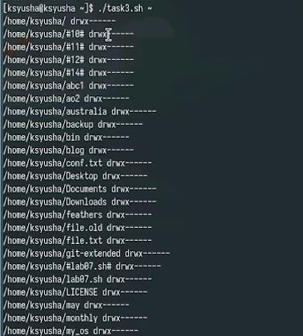

---
## Front matter
lang: ru-RU
title: Лабораторная работа №12
subtitle: Программирование в командном процессоре ОС UNIX. Командные файлы
author:
  - Юсупова Ксения Равилевна
institute:
  - Российский университет дружбы народов, Москва, Россия

## i18n babel
babel-lang: russian
babel-otherlangs: english

## Formatting pdf
toc: false
toc-title: Содержание
slide_level: 2
aspectratio: 169
section-titles: true
theme: metropolis
header-includes:
 - \metroset{progressbar=frametitle,sectionpage=progressbar,numbering=fraction}
---

# Информация

## Докладчик

:::::::::::::: {.columns align=center}
::: {.column width="70%"}

  * Юсупова Ксения Равилевна
  * Российский университет дружбы народов
  * Номер студенческого билета- 1132247531
  * [1132247531@pfur.ru]

:::
::::::::::::::

# Вводная часть

## Цель работы

Изучить основы программирования в оболочке ОС UNIX/Linux. Научиться писать небольшие командные файлы. 

## Задание

1. Написать скрипт, который при запуске будет делать резервную копию самого себя (то есть файла, в котором содержится его исходный код) в другую директорию backup в вашем домашнем каталоге. При этом файл должен архивироваться одним из архиваторов на выбор zip, bzip2 или tar.

2. Написать пример командного файла, обрабатывающего любое произвольное число аргументов командной строки, в том числе превышающее десять. 

3. Написать командный файл — аналог команды ls (без использования самой этой команды и команды dir). Требуется, чтобы он выдавал информацию о нужном каталоге и выводил информацию о возможностях доступа к файлам этого каталога.

4. Написать командный файл, который получает в качестве аргумента командной строки формат файла (.txt, .doc, .jpg, .pdf и т.д.) и вычисляет количество таких файлов в указанной директории. Путь к директории также передаётся в виде аргумента командной строки.

# Выполнение лабораторной работы

Напишем код для первой программы (Написать скрипт, который при запуске будет делать резервную копию самого себя  в другую директорию backup в вашем домашнем каталоге)

{#fig:001 width=70%}

## Выполнение лабораторной работы

Проверили код на работу 

{#fig:002 width=70%}

## Выполнение лабораторной работы

Напишем код для второй программы (пример командного файла, обрабатывающего любое произвольное число аргументов командной строки, в том числе превышающее десять)

{#fig:003 width=70%}

## Выполнение лабораторной работы

Проверили код на работу

{#fig:004 width=70%}

## Выполнение лабораторной работы

Написали код для третьей программы (Написать командный файл — аналог команды ls (без использования самой этой команды и команды dir).)

{#fig:005 width=70%}

## Выполнение лабораторной работы

Проверили код на работу

{#fig:006 width=70%}

## Выполнение лабораторной работы

Написали код для четвертой программы (Написать командный файл, который получает в качестве аргумента командной строки формат файла (.txt, .doc, .jpg, .pdf и т.д.) и вычисляет количество таких файлов в указанной директории) 

{#fig:007 width=70%}

## Выполнение лабораторной работы

Проверили код на работу 

{#fig:008 width=70%} 

# Вывод  

В ходе лабораторной работы мы изучили основы программирования в оболочке ОС UNIX/Linux и научились писать небольшие командные файлы
