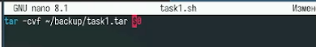
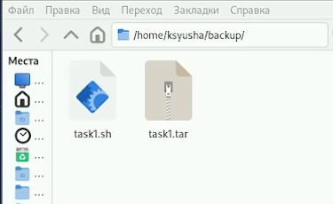
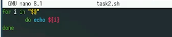
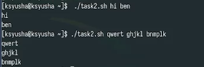
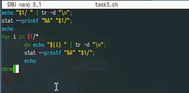
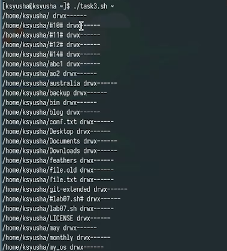
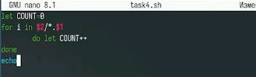

---
## Front matter
title: "Лабораторная работа № 12"
subtitle: "Программирование в командном процессоре ОС UNIX. Командные файлы"
author: "Юсупова Ксения Равилевна"

## Generic otions
lang: ru-RU
toc-title: "Содержание"

## Bibliography
bibliography: bib/cite.bib
csl: pandoc/csl/gost-r-7-0-5-2008-numeric.csl

## Pdf output format
toc: true # Table of contents
toc-depth: 2
lof: true # List of figures
lot: true # List of tables
fontsize: 12pt
linestretch: 1.5
papersize: a4
documentclass: scrreprt
## I18n polyglossia
polyglossia-lang:
  name: russian
  options:
	- spelling=modern
	- babelshorthands=true
polyglossia-otherlangs:
  name: english
## I18n babel
babel-lang: russian
babel-otherlangs: english
## Fonts
mainfont: IBM Plex Serif
romanfont: IBM Plex Serif
sansfont: IBM Plex Sans
monofont: IBM Plex Mono
mathfont: STIX Two Math
mainfontoptions: Ligatures=Common,Ligatures=TeX,Scale=0.94
romanfontoptions: Ligatures=Common,Ligatures=TeX,Scale=0.94
sansfontoptions: Ligatures=Common,Ligatures=TeX,Scale=MatchLowercase,Scale=0.94
monofontoptions: Scale=MatchLowercase,Scale=0.94,FakeStretch=0.9
mathfontoptions:
## Biblatex
biblatex: true
biblio-style: "gost-numeric"
biblatexoptions:
  - parentracker=true
  - backend=biber
  - hyperref=auto
  - language=auto
  - autolang=other*
  - citestyle=gost-numeric
## Pandoc-crossref LaTeX customization
figureTitle: "Рис."
tableTitle: "Таблица"
listingTitle: "Листинг"
lofTitle: "Список иллюстраций"
lotTitle: "Список таблиц"
lolTitle: "Листинги"
## Misc options
indent: true
header-includes:
  - \usepackage{indentfirst}
  - \usepackage{float} # keep figures where there are in the text
  - \floatplacement{figure}{H} # keep figures where there are in the text
---

# Цель работы

Изучить основы программирования в оболочке ОС UNIX/Linux. Научиться писать небольшие командные файлы. 

# Задание

1. Написать скрипт, который при запуске будет делать резервную копию самого себя (то есть файла, в котором содержится его исходный код) в другую директорию backup в вашем домашнем каталоге. При этом файл должен архивироваться одним из архиваторов на выбор zip, bzip2 или tar. Способ использования команд архивации необходимо узнать, изучив справку.

2. Написать пример командного файла, обрабатывающего любое произвольное число аргументов командной строки, в том числе превышающее десять. Например, скрипт может последовательно распечатывать значения всех переданных аргументов.

3. Написать командный файл — аналог команды ls (без использования самой этой команды и команды dir). Требуется, чтобы он выдавал информацию о нужном каталоге и выводил информацию о возможностях доступа к файлам этого каталога.

4. Написать командный файл, который получает в качестве аргумента командной строки формат файла (.txt, .doc, .jpg, .pdf и т.д.) и вычисляет количество таких файлов в указанной директории. Путь к директории также передаётся в виде аргумента командной строки.

# Выполнение лабораторной работы

Напишем код для первой программы (Написать скрипт, который при запуске будет делать резервную копию самого себя  в другую директорию backup в вашем домашнем каталоге)(рис. [-@fig:001]).

{#fig:001 width=70%}

Проверили код на работу (рис. [-@fig:002]).

{#fig:002 width=70%}

Напишем код для второй программы (пример командного файла, обрабатывающего любое произвольное число аргументов командной строки, в том числе превышающее десять)(рис. [-@fig:003]).

{#fig:003 width=70%}

Проверили код на работу (рис. [-@fig:004]).

{#fig:004 width=70%}

Написали код для третьей программы (Написать командный файл — аналог команды ls (без использования самой этой команды и команды dir).)(рис. [-@fig:005]).

{#fig:005 width=70%}

Проверили код на работу (рис. [-@fig:006]).

{#fig:006 width=70%}

Написали код для четвертой программы (Написать командный файл, который получает в качестве аргумента командной строки формат файла (.txt, .doc, .jpg, .pdf и т.д.) и вычисляет количество таких файлов в указанной директории) (рис. [-@fig:007]).

{#fig:007 width=70%}

Проверили код на работу (рис. [-@fig:008]).

{#fig:008 width=70%}

# Ответы на контрольные вопросы

1. Командная оболочка (shell) - программа-интерпретатор для взаимодействия пользователя с ядром ОС. Примеры: bash (стандартная), zsh (с автодополнением), fish (интерактивная), dash (легковесная). Отличаются синтаксисом, функционалом и скоростью работы.  

2. POSIX - стандарт для совместимости UNIX-систем, унификации API и командных интерфейсов.  

3. В bash переменные: var="значение". Массивы: arr=("эл1" "эл2") - индексированный, declare -A dict=(["кл"]="зн") - ассоциативный.  

4. let - для арифметики: let "sum=5+5". read - чтение ввода: read -p "Имя: " name.  

5. Арифметические операции: + - * / % (остаток), сравнения == != > <, битовые & | ^ << >>.  

6. (( )) - для арифметики: res=$((x+y)) и сравнений: if ((x>y)). 

7. Стандартные переменные: $HOME (домашний каталог), $PATH (пути программ), $USER (пользователь), $SHELL (оболочка). 

8. Метасимволы - спецсимволы: * (любые символы), ? (один символ), > (перенаправление). 

9. Экранирование: \* (обратный слэш), '*' (полное), "*" (частичное). 

10. Создать файл script.sh с #!/bin/bash, дать права chmod +x script.sh, запустить ./script.sh. 

11. Функции: func(){ команды; return; }. Вызов: func. 

12. Проверка типа: [ -f file ] - файл, [ -d dir ] - каталог. 

13. set - управление shell, typeset - тип переменной, unset - удаление. 

14. Параметры передаются при вызове ./script.sh p1 p2. В скрипте: $1, $2 - параметры, $@ - все, $# - количество. 

15. Спецпеременные: $0 - имя скрипта, $? - код возврата, $$ - PID, $! - PID фонового. 

# Вывод  

В ходе лабораторной работы мы изучили основы программирования в оболочке ОС UNIX/Linux и научились писать небольшие командные файлы
