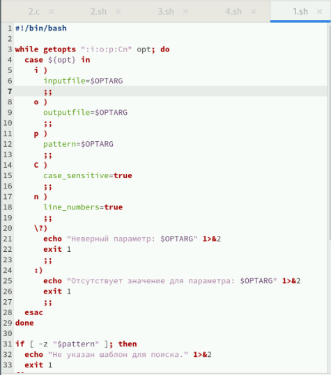
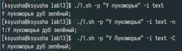
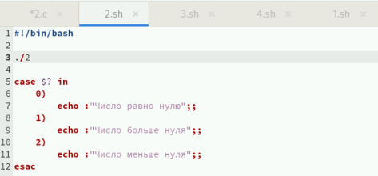
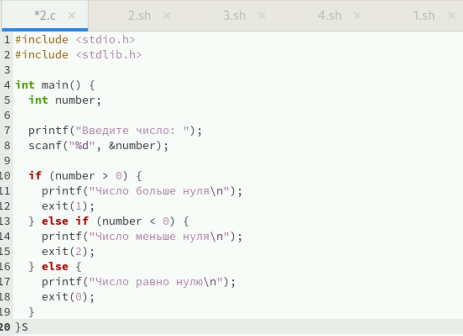
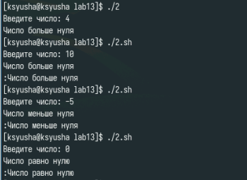
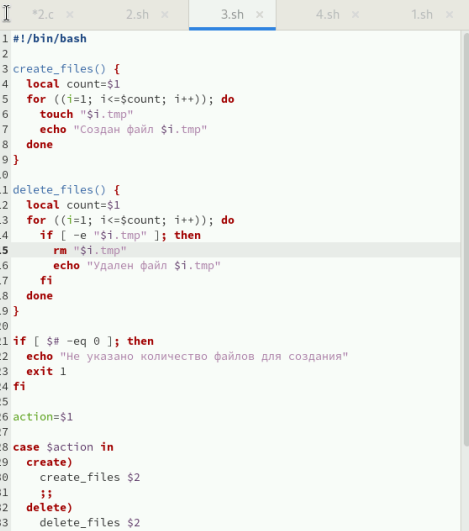
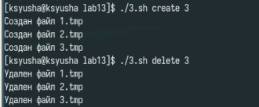
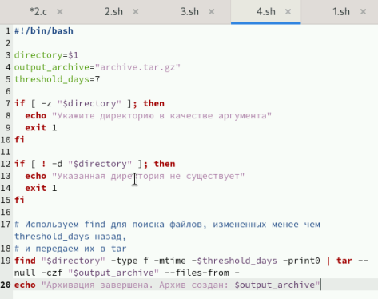

---
## Front matter
title: "Лабораторная работа №13"
subtitle: "Программирование в командном процессоре ОС UNIX. Ветвления и циклы"
author: "Юсупова Ксения Равилевна"

## Generic otions
lang: ru-RU
toc-title: "Содержание"

## Bibliography
bibliography: bib/cite.bib
csl: pandoc/csl/gost-r-7-0-5-2008-numeric.csl

## Pdf output format
toc: true # Table of contents
toc-depth: 2
lof: true # List of figures
lot: true # List of tables
fontsize: 12pt
linestretch: 1.5
papersize: a4
documentclass: scrreprt
## I18n polyglossia
polyglossia-lang:
  name: russian
  options:
	- spelling=modern
	- babelshorthands=true
polyglossia-otherlangs:
  name: english
## I18n babel
babel-lang: russian
babel-otherlangs: english
## Fonts
mainfont: IBM Plex Serif
romanfont: IBM Plex Serif
sansfont: IBM Plex Sans
monofont: IBM Plex Mono
mathfont: STIX Two Math
mainfontoptions: Ligatures=Common,Ligatures=TeX,Scale=0.94
romanfontoptions: Ligatures=Common,Ligatures=TeX,Scale=0.94
sansfontoptions: Ligatures=Common,Ligatures=TeX,Scale=MatchLowercase,Scale=0.94
monofontoptions: Scale=MatchLowercase,Scale=0.94,FakeStretch=0.9
mathfontoptions:
## Biblatex
biblatex: true
biblio-style: "gost-numeric"
biblatexoptions:
  - parentracker=true
  - backend=biber
  - hyperref=auto
  - language=auto
  - autolang=other*
  - citestyle=gost-numeric
## Pandoc-crossref LaTeX customization
figureTitle: "Рис."
tableTitle: "Таблица"
listingTitle: "Листинг"
lofTitle: "Список иллюстраций"
lotTitle: "Список таблиц"
lolTitle: "Листинги"
## Misc options
indent: true
header-includes:
  - \usepackage{indentfirst}
  - \usepackage{float} # keep figures where there are in the text
  - \floatplacement{figure}{H} # keep figures where there are in the text
---

# Цель работы

Изучить основы программирования в оболочке ОС UNIX. Научится писать более сложные командные файлы с использованием логических управляющих конструкций и циклов.

# Задание

1. Используя команды getopts grep, написать командный файл, который анализирует командную строку с ключами:
– -iinputfile — прочитать данные из указанного файла;

– -ooutputfile — вывести данные в указанный файл;

– -pшаблон — указать шаблон для поиска;

– -C — различать большие и малые буквы;

– -n — выдавать номера строк.
а затем ищет в указанном файле нужные строки, определяемые ключом -p.

2. Написать на языке Си программу, которая вводит число и определяет, является ли оно больше нуля, меньше нуля или равно нулю. Затем программа завершается с помощью функции exit(n), передавая информацию в о коде завершения в оболочку. Командный файл должен вызывать эту программу и, проанализировав с помощью команды $?, выдать сообщение о том, какое число было введено.

3. Написать командный файл, создающий указанное число файлов, пронумерованных
последовательно от 1 до 𝑁 (например 1.tmp, 2.tmp, 3.tmp,4.tmp и т.д.). Число файлов,
которые необходимо создать, передаётся в аргументы командной строки. Этот же командный файл должен уметь удалять все созданные им файлы (если они существуют).

4. Написать командный файл, который с помощью команды tar запаковывает в архив
все файлы в указанной директории. Модифицировать его так, чтобы запаковывались
только те файлы, которые были изменены менее недели тому назад (использовать
команду find).

# Выполнение лабораторной работы

Напишем код для первой программы (Используя команды getopts grep, написать командный файл, который анализирует командную строку с необходимыми ключами)(рис. [-@fig:001]).

{#fig:001 width=70%}

Проверили код на работу (рис. [-@fig:002]).

{#fig:002 width=70%}

Напишем код для второй программы (Написать на языке Си программу, которая вводит число и определяет, является ли оно больше нуля, меньше нуля или равно нулю.)(рис. [-@fig:003]).

{#fig:003 width=70%}

Написали второй код для второй программы (рис. [-@fig:004]).

{#fig:004 width=70%}

Проверили код на работу (рис. [-@fig:005]).

{#fig:005 width=70%}

Написали код для третьей программы (Написать командный файл, создающий указанное число файлов, пронумерованных последовательно от 1 до 𝑁 (например 1.tmp, 2.tmp, 3.tmp,4.tmp и т.д.))(рис. [-@fig:006]).

{#fig:006 width=70%}

Проверили код на работу (рис. [-@fig:007]).

{#fig:007 width=70%}

Написали код для четвертой программы (Написать командный файл, который с помощью команды tar запаковывает в архив все файлы в указанной директории.) (рис. [-@fig:008]).

{#fig:008 width=70%}

Проверили код на работу (рис. [-@fig:009]).

{#fig:009 width=70%}

# Ответы на контрольные вопросы
1.  Каково предназначение команды getopts?

    Команда getopts используется в shell-скриптах для обработки опций и аргументов, переданных скрипту через командную строку. Она позволяет скрипту получать опции, а также их соответствующие аргументы, если они предусмотрены.  Это упрощает создание скриптов, которые могут гибко настраиваться в зависимости от переданных параметров.

2.  Какое отношение метасимволы имеют к генерации имён файлов?

    Метасимволы (или подстановочные символы) в shell (например, *, ?, []) используются для генерации списков файлов, соответствующих определённому шаблону.  Например:

    *   * (звёздочка) - соответствует любому количеству символов (включая отсутствие символов).  Например, *.txt выберет все файлы с расширением ".txt".
 
  *   ? (вопросительный знак) - соответствует одному любому символу.  Например, file?.txt выберет file1.txt, fileA.txt и т.д.
 
  *   [] (квадратные скобки) - соответствует одному символу из указанного набора.  Например, file[1-3].txt выберет file1.txt, file2.txt и file3.txt.

    Когда вы используете метасимволы в командах, shell перед выполнением команды разворачивает метасимволы в список соответствующих файлов. Это называется globbing.

3.  Какие операторы управления действиями вы знаете?

    В bash (и других shell) есть следующие операторы управления действиями (или потоком управления):

  *   if...then...elif...else...fi: Условный оператор, позволяющий выполнять различные блоки кода в зависимости от выполнения заданных условий.
  
  *   case...esac:  Оператор выбора, позволяющий выбирать один из нескольких вариантов выполнения кода, основываясь на значении переменной.

  *   for...do...done:  Цикл, позволяющий повторять блок кода для каждого элемента в списке.
 
  *   while...do...done: Цикл, выполняющийся до тех пор, пока заданное условие истинно.
 
  *   until...do...done: Цикл, выполняющийся до тех пор, пока заданное условие ложно.
 
  *   break: Оператор, позволяющий выйти из цикла до его завершения.

  *   continue: Оператор, позволяющий перейти к следующей итерации цикла, пропуская оставшуюся часть текущей итерации.

4.  Какие операторы используются для прерывания цикла?

    Как уже упоминалось выше, для прерывания цикла используются операторы break (для полного выхода из цикла) и continue (для перехода к следующей итерации цикла).

5.  Для чего нужны команды false и true?

    Команды false и true используются для возврата логических значений "ложь" (с кодом выхода 1) и "истина" (с кодом выхода 0), соответственно.  Они часто используются в условных выражениях (например, в операторах if, while, until), где необходимо явное указание логического значения. 

6. Что означает строка if test -f man$/$i.$s, встреченная в командном файле?

  Эта строка означает следующее:

  •  if test -f man$/$i.$s: Проверяет, является ли файл с именем man$/$i.$s обычным существующим файлом. Команда test (или эквивалентная ей [ ]) используется для проверки различных условий. -f - это опция test, которая проверяет, существует ли файл и является ли он обычным файлом (не директорией, символической ссылкой и т.д.).
 
 •  man$: Предположительно, это часть пути к директории.
 
 •  $i: Это переменная, значение которой будет подставлено. Скорее всего, это переменная цикла.

  •  $s: Это другая переменная, значение которой тоже будет подставлено. Обычно используется как расширение файла.

  В итоге, строка проверяет существование файла, имя которого получается путем объединения строки "man$", значения переменной $i, символа ".", и значения переменной $s.

7. Объясните различия между конструкциями while и until.

  •  while: Цикл while выполняет блок кода до тех пор, пока условие истинно. Как только условие становится ложным, цикл прекращается.

  until: Цикл until выполняет блок кода до тех пор, пока условие ложно*. Как только условие становится истинным, цикл прекращается.

Основное отличие: while выполняет, пока условие истинно, а until выполняет, пока условие ложно. Они логически противоположны друг другу.
 
# Выводы

Входе лабораторной работы мы изучили основы программирования в оболочке ОС UNIX. Научились писать более сложные командные файлы с использованием логических управляющих конструкций и циклов.

