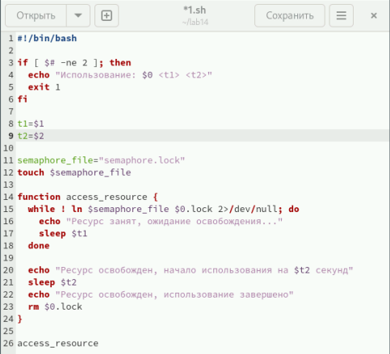
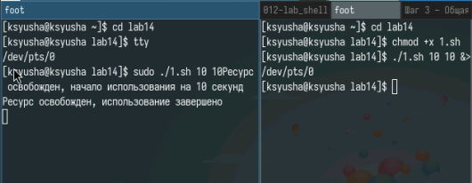
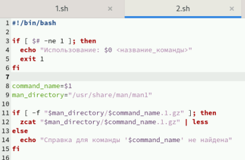
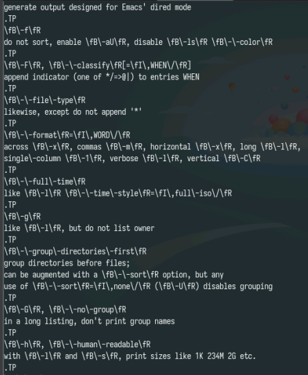
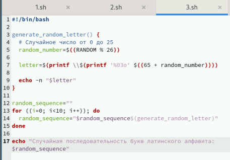
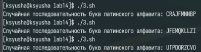

---
## Front matter
title: "Лабораторная работа № 14"
subtitle: "Программирование в командном процессоре ОС UNIX. Расширенное программирование"
author: "Юсупова Ксения Равилевна"

## Generic otions
lang: ru-RU
toc-title: "Содержание"

## Bibliography
bibliography: bib/cite.bib
csl: pandoc/csl/gost-r-7-0-5-2008-numeric.csl

## Pdf output format
toc: true # Table of contents
toc-depth: 2
lof: true # List of figures
lot: true # List of tables
fontsize: 12pt
linestretch: 1.5
papersize: a4
documentclass: scrreprt
## I18n polyglossia
polyglossia-lang:
  name: russian
  options:
	- spelling=modern
	- babelshorthands=true
polyglossia-otherlangs:
  name: english
## I18n babel
babel-lang: russian
babel-otherlangs: english
## Fonts
mainfont: IBM Plex Serif
romanfont: IBM Plex Serif
sansfont: IBM Plex Sans
monofont: IBM Plex Mono
mathfont: STIX Two Math
mainfontoptions: Ligatures=Common,Ligatures=TeX,Scale=0.94
romanfontoptions: Ligatures=Common,Ligatures=TeX,Scale=0.94
sansfontoptions: Ligatures=Common,Ligatures=TeX,Scale=MatchLowercase,Scale=0.94
monofontoptions: Scale=MatchLowercase,Scale=0.94,FakeStretch=0.9
mathfontoptions:
## Biblatex
biblatex: true
biblio-style: "gost-numeric"
biblatexoptions:
  - parentracker=true
  - backend=biber
  - hyperref=auto
  - language=auto
  - autolang=other*
  - citestyle=gost-numeric
## Pandoc-crossref LaTeX customization
figureTitle: "Рис."
tableTitle: "Таблица"
listingTitle: "Листинг"
lofTitle: "Список иллюстраций"
lotTitle: "Список таблиц"
lolTitle: "Листинги"
## Misc options
indent: true
header-includes:
  - \usepackage{indentfirst}
  - \usepackage{float} # keep figures where there are in the text
  - \floatplacement{figure}{H} # keep figures where there are in the text
---

# Цель работы

Изучить основы программирования в оболочке ОС UNIX. Научиться писать более сложные командные файлы с использованием логических управляющих конструкций и циклов.

# Задание

1. Написать командный файл, реализующий упрощённый механизм семафоров. Командный файл должен в течение некоторого времени t1 дожидаться освобождения
ресурса, выдавая об этом сообщение, а дождавшись его освобождения, использовать
его в течение некоторого времени t2<>t1, также выдавая информацию о том, что
ресурс используется соответствующим командным файлом (процессом). Запустить
командный файл в одном виртуальном терминале в фоновом режиме, перенаправив
его вывод в другой (> /dev/tty#, где # — номер терминала куда перенаправляется
вывод), в котором также запущен этот файл, но не фоновом, а в привилегированном
режиме. Доработать программу так, чтобы имелась возможность взаимодействия трёх
и более процессов.

2. Реализовать команду man с помощью командного файла. Изучите содержимое каталога /usr/share/man/man1. В нем находятся архивы текстовых файлов, содержащих
справку по большинству установленных в системе программ и команд. Каждый архив
можно открыть командой less сразу же просмотрев содержимое справки. Командный
файл должен получать в виде аргумента командной строки название команды и в виде
результата выдавать справку об этой команде или сообщение об отсутствии справки,
если соответствующего файла нет в каталоге man1.

3. Используя встроенную переменную $RANDOM, напишите командный файл, генерирующий случайную последовательность букв латинского алфавита. Учтите, что $RANDOM
выдаёт псевдослучайные числа в диапазоне от 0 до 32767.

# Выполнение лабораторной работы

Напишем код для первой программы (рис. [-@fig:001]).

{#fig:001 width=70%}

Проверили код на работу (рис. [-@fig:002]).

{#fig:002 width=70%}

Напишем код для второй программы (Реализовать команду man с помощью командного файла. Изучите содержимое каталога /usr/share/man/man1. В нем находятся архивы текстовых файлов, содержащих справку по большинству установленных в системе программ и команд.)(рис. [-@fig:003]).

{#fig:003 width=70%}

Проверили код на работу (рис. [-@fig:004]).

{#fig:004 width=70%}

Написали код для третьей программы (Используя встроенную переменную $RANDOM, напишите командный файл, генерирующий случайную последовательность букв латинского алфавита)(рис. [-@fig:005]).

{#fig:005 width=70%}

Проверили код на работу (рис. [-@fig:006]).

{#fig:006 width=70%}

# Ответы на контрольные вопросы 

1. Найдите синтаксическую ошибку в следующей строке: while [$1 != "exit"]
 
Синтаксическая ошибка заключается в отсутствии пробелов после открывающей и перед закрывающей квадратными скобками. Правильный вариант:

  bash
  
  while [ "$1" != "exit" ]

  Также рекомендуется заключать переменные в двойные кавычки ("$1"), чтобы избежать проблем, если переменная содержит пробелы или другие специальные символы.

2. Как объединить (конкатенация) несколько строк в одну?
 
В bash конкатенация строк может быть выполнена несколькими способами:
  •  Простое объединение:
    

    bash

    string1="Hello"

    string2="World"

    result="$string1 $string2" # result будет "Hello World"

3. Найдите информацию об утилите seq. Какими иными способами можно реализовать её функционал при программировании на bash?
  Утилита seq генерирует последовательность чисел. Альтернативные способы реализовать функционал seq на bash:
  •  Цикл for (для целочисленных последовательностей):
    
    bash

    for i in $(seq 1 5); do

     echo $i

    done

  •  Арифметический цикл for (наиболее эффективный):
    
      bash

       for ((i=1; i<=5; i++)); do

         echo $i

       done

  •  Цикл while:
     
    bash

    i=1
 
    while [ $i -le 5 ]; do
 
     echo $i

     i=$((i+1))

    done

4. **Какой результат даст вычисление выражения $((10/3))?**
   
Результат вычисления выражения $((10/3)) в bash будет 3. Bash выполняет целочисленное деление, отбрасывая дробную часть.

5. **Укажите кратко основные отличия командной оболочки zsh от bash.**
  
 Краткие основные отличия zsh от bash:
 
 *   **Автодополнение:** Zsh имеет значительно более развитое и настраиваемое автодополнение, чем bash.
  
 *   **Темы и внешний вид:** Zsh более гибок в настройке внешнего вида и поддерживает больше тем оформления.
 
 *   **Плагины:** Zsh имеет систему плагинов, которая позволяет расширять его функциональность.
   
*   **Совместимость:** Bash более широко распространен и совместим с большим количеством систем.
 
 *   **Поведение по умолчанию:** Некоторые аспекты поведения по умолчанию в zsh могут отличаться от bash, что может потребовать адаптации скриптов.

   *   **История команд:** Zsh имеет более мощную систему истории команд.

6. **Проверьте, верен ли синтаксис данной конструкции for ((a=1; a <= LIMIT; a++))**
  
 Синтаксис данной конструкции верен, но для корректной работы необходимо, чтобы переменная LIMIT была определена и содержала числовое значение.

7. **Сравните язык bash с какими-либо языками программирования. Какие преимущества у bash по сравнению с ними? Какие недостатки?**
  
 Сравнение bash с другими языками программирования (например, Python, C++, Java):

   *   **Преимущества bash:**
   
   *   **Удобство для системного администрирования:** Bash идеально подходит для автоматизации задач системного администрирования.

   *   **Простота и скорость для простых задач:** Bash позволяет быстро решать  простые задачи без необходимости написания сложного кода.
     
 *   **Встроенная интеграция с системой:** Bash тесно интегрирован с операционной системой Linux.

   *   **Недостатки bash:**
    
   *   **Ограниченные возможности для сложных алгоритмов:** Bash не предназначен для разработки сложных алгоритмов.
    
   *   **Сложность отладки:** Отладка bash-скриптов может быть сложной.
  
   *   **Низкая производительность:** Bash имеет более низкую производительность по сравнению с компилируемыми языками.
  
   *   **Ограниченные возможности работы со строками:** Bash имеет ограниченные возможности для обработки строк.

   В целом, bash - это мощный инструмент для автоматизации задач системного администрирования, но он не подходит для разработки сложных приложений.

# Выводы

В ходе лабораторной работы мы изучили основы программирования в оболочке ОС UNIX. Научились писать более сложные командные файлы с использованием логических управляющих конструкций и циклов.
