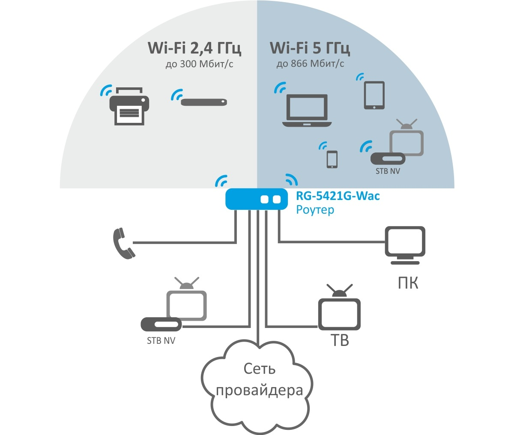
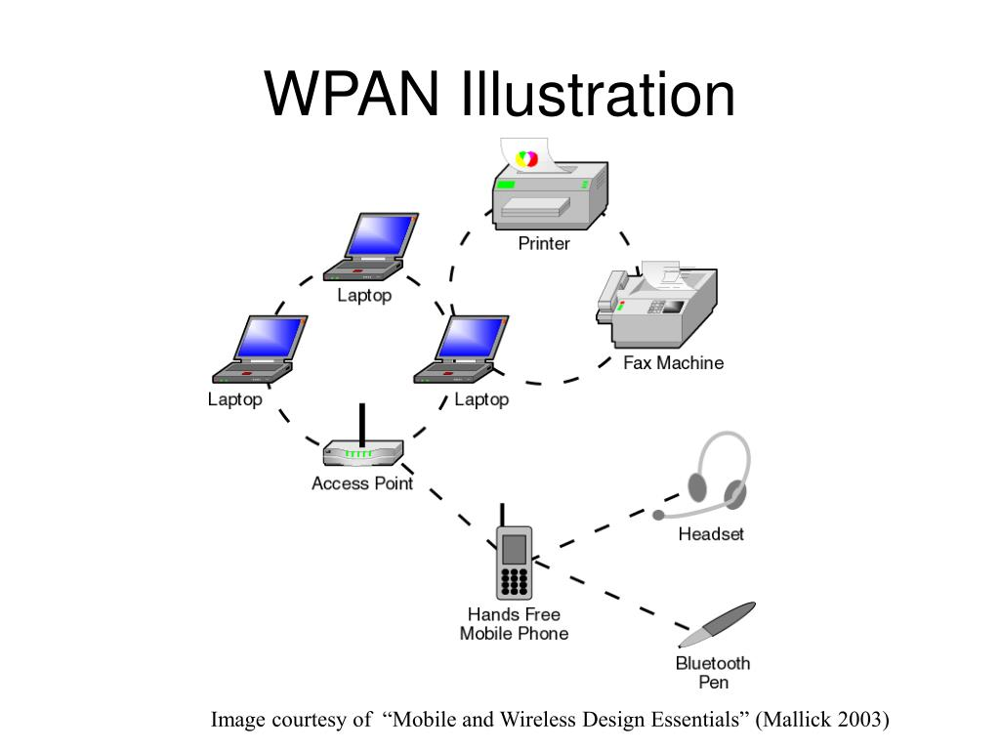
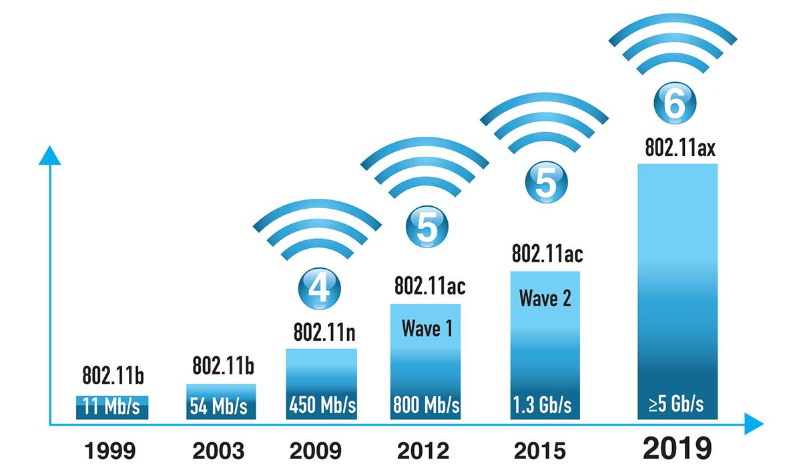
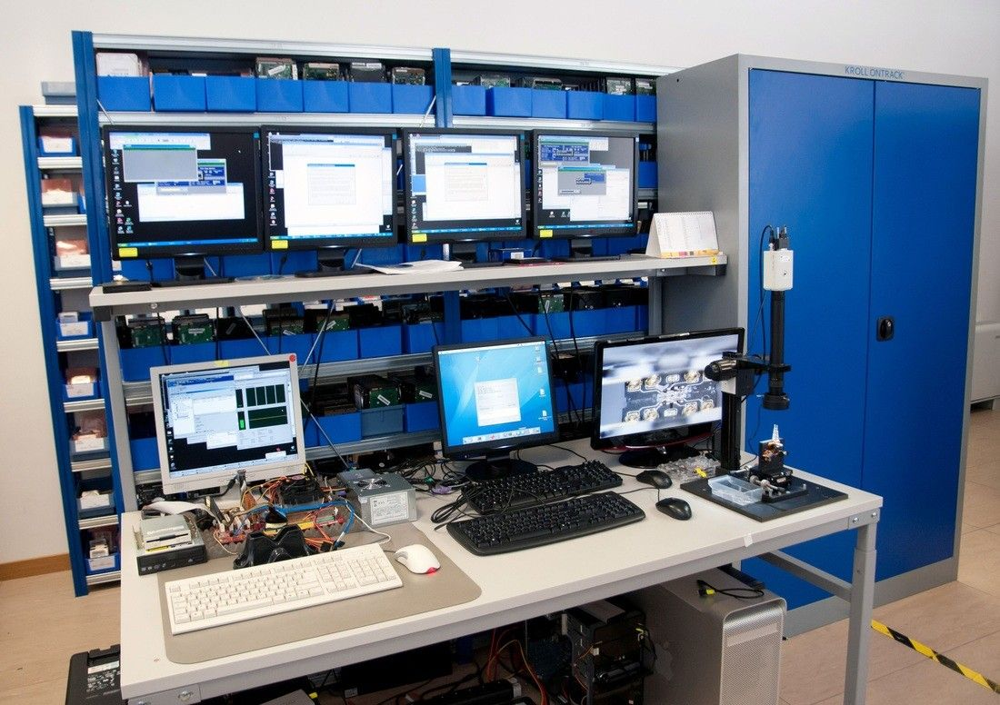

---
## Front matter
lang: ru-RU
title: Архитектура, параметры и организация беспроводных сетей
subtitle: Доклад
author:
  - Юсупова К. Р.
date:
  - 15 апреля 2025 год
institute:
  - Российский университет дружбы народов, Москва, Россия

## i18n babel
babel-lang: russian
babel-otherlangs: english

## Formatting pdf
toc: false
toc-title: Содержание
slide_level: 2
aspectratio: 169
section-titles: true
theme: metropolis
header-includes:
 - \metroset{progressbar=frametitle,sectionpage=progressbar,numbering=fraction}
---

# Информация

## Докладчик

  * Юсупова Ксения Равилевна
  * Студент группы НПИбд-01-24
  * Российский университет дружбы народов
  * Номер студенческого билета- 1132247531
  
## Содержание

:::::::::::::: {.columns align=center}
::: {.column width="60%"}

1. Вводная часть

1.1 Актуальность

1.2 Объект и предмет исследования | Научная новизна

1.3 Практическая значимость работы.

1.4 Цель, гипотеза, задачи исследования 

2. Содержание исследование

2.1 Архитектура беспроводных сетей 

2.2 Параметры беспроводных сетей

2.3 Организация беспроводных сетей

2.4 Предлагаемое решение задач исследования с обоснованием и основные этапы работы

3. Анализ и практическая значимость достигнутых результатов.

4. Общее заключение и выводы.

:::
::::::::::::::

# Вводная часть

## Актуальность

Экспоненциальный рост беспроводных устройств:

* 55.7 млрд IoT-устройств к 2025 году (IDC)

* 70% интернет-трафика через беспроводные каналы

Критическая инфраструктура для:

* Медицинских систем (телемедицина, мониторинг)

* Транспортных систем (умные города, беспилотники)

* Промышленных предприятий (IIoT, автоматизация)

Технологическая эволюция: переход на Wi-Fi 6/7 и 5G Advanced, появление квантовых методов защиты

## Объект и предмет исследования | Научная новизна

Объект исследования - cовременные системы беспроводной передачи данных

Предмет исследования: принципы организации сетей, взаимодействие уровней передачи, методы оптимизации и безопасности

### Научная новизна 

Методика сравнения сетевых поколений:

* Многокритериальная оценка QoS

* Моделирование каналов

Новые принципы безопасности:

* Адаптивная защита

* Динамическое управление ключами

## Практическая значимость | Материалы и методы

### Практическая значимость

Телекоммуникации:

- Повышение QoS на 40% (задержки <10 мс)

- Оптимизация спектра 5G (экономия 22%)

Промышленность: Uptime 99.98% на нефтезаводах и снижение затрат на обслуживание Mesh-сетей на 25%

###  Материалы и методы

Оборудование: Cisco Catalyst, Huawei AirEngine

ПО: NS-3, Ekahau Pro

Методы: Моделирование, нагрузочное тестирование

## Цели, задачи и гипотеза

:::::::::::::: {.columns align=center}
::: {.column width="70%"}

Цель: Создать методбазу для проектирования сетей

Гипотеза:  Конвергенция Wi-Fi/5G повышает эффективность,  ИИ улучшает управление ресурсами

Задачи: Анализ архитектурных решений, классификация параметров сетей, разработка механизмов безопасности и практические рекомендации для отраслей.

:::
::: {.column width="30%"}

:::
::::::::::::::

# Содержание исследования

## Архитектура беспроводных сетей

:::::::::::::: {.columns align=center}
::: {.column width="60%"}

Архитектура беспроводных сетей - это способ организации устройств, обеспечивающий: передачу данных без проводов, управление трафиком, масштабируемость

Основные типы:

- Инфраструктурный режим (централизованное управление через точку доступа).

- Ad-hoc (прямое соединение устройств).

- Mesh-сети (ячеистая топология, высокая отказоустойчивость).

- WPAN (Bluetooth, Zigbee для малых расстояний).

:::
::: {.column width="40%"}

:::
::::::::::::::

## Параметры беспроводных сетей

:::::::::::::: {.columns align=center}
::: {.column width="60%"}

Ключевые характеристики:

- Частотные диапазоны: 2.4 ГГц, 5 ГГц, 6 ГГц (Wi-Fi 6E).

Стандарты: Wi-Fi 4 (802.11n), Wi-Fi 6 (802.11ax).

Технологии: MIMO, OFDMA, TWT (энергосбережение).

Безопасность: WPA3, 802.1X, защита от атак.

Метрики:

- Пропускная способность (до 1.2 Гбит/c для Wi-Fi 6).

- Задержки (<10 мс для 5G).

:::
::: {.column width="40%"}

:::
::::::::::::::

## Организация беспроводных сетей

Организация беспроводных сетей включает три ключевых этапа: планирование (анализ покрытия и нагрузок), развертывание (установка оборудования и настройка параметров) и управление (мониторинг и оптимизация работы). Современные подходы используют программно-определяемые сети (SDWN) для автоматизации процессов и поддержки новых технологий, таких как Wi-Fi 6/7 и 5G.

{#fig:004 width=70%}

## Предлагаемое решение задач

:::::::::::::: {.columns align=center}
::: {.column width="60%"}

1. Для архитектурных задач - Гибридная модель Wi-Fi 6 + 5G

Преимущества:

- Совместимость с legacy-устройствами

-  Баланс скорости (до 3.5 Гбит/с) и покрытия

2. Для оптимизации параметров - Алгоритм динамического выбора канала (на основе ML):

- Снижение интерференции на 35%

- Автоматическая адаптация к нагрузке

3. Для безопасности- Двухуровневая аутентификация: WPA3 + 802.1X

:::
::: {.column width="40%"}

:::
::::::::::::::

## Основные этапы работы

:::::::::::::: {.columns align=center}
::: {.column width="60%"}
 
1. Подготовительный этап :

- Анализ 20+ кейсов (телеком, заводы, вузы)

- Разработка ТЗ для тестового стенда

2. Лабораторные испытания :

Серия тестов:

- Устойчивость к помехам 

- Stress-тесты безопасности

:::
::::::::::::::

# Выводы

## Анализ результатов  и практическая значимость

Внедрение в отраслях:

- Телекоммуникации: снижение затрат на 15-20%.

- Промышленность: uptime 99.98% (пример НПЗ).

- Образование: новые учебные программы.

Экономический эффект:

- До 3 млн долларов в год.

Пример экономического эффекта для оператора "МТС":

- Снижение затрат на обслуживание на 22%

- ROI внедрения — 8 месяцев

## Выводы

Гибридные сети (Wi-Fi 6 + 5G) — оптимальны для 83% сценариев

Методика дает:

* +15-40% к производительности

* 99.98% uptime в промышленности

Безопасность: снижение рисков на 90%

Перспективы:

- ИИ для управления ресурсами (пилот в 2025)

- Исследование THz-диапазона (>100 ГГц)

