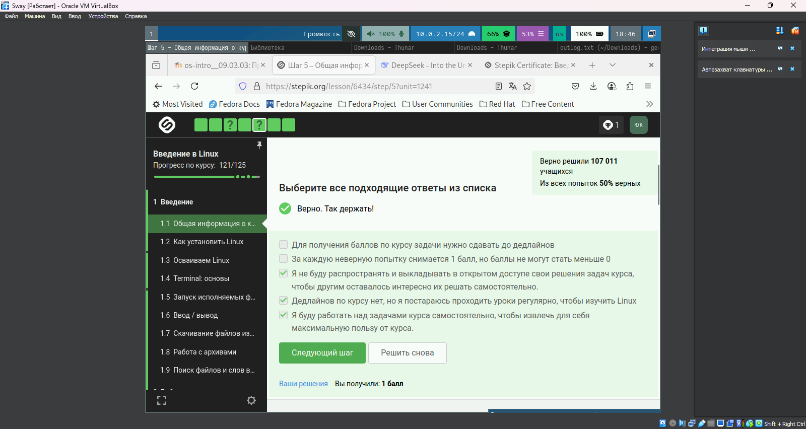
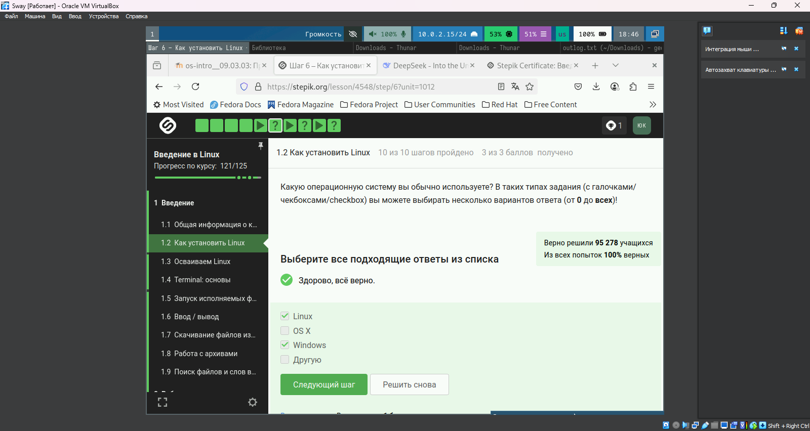
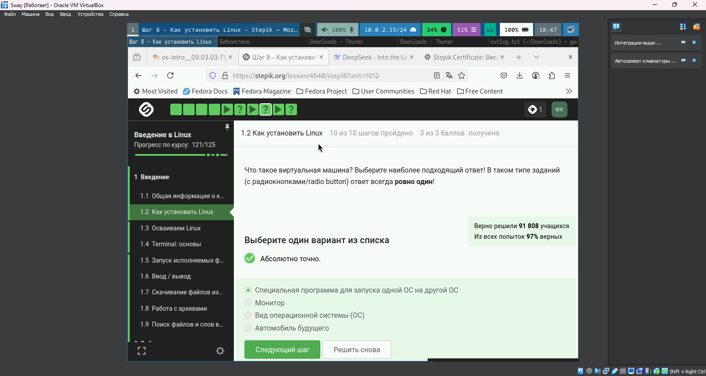
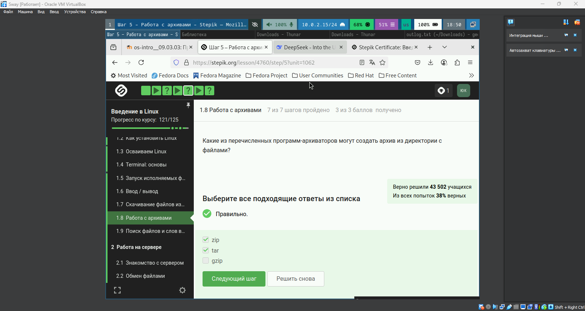
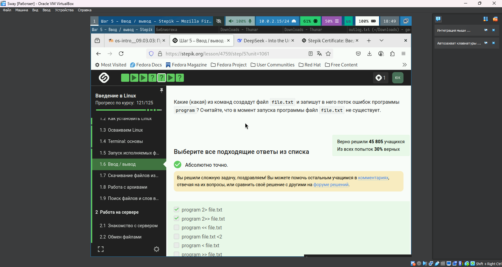
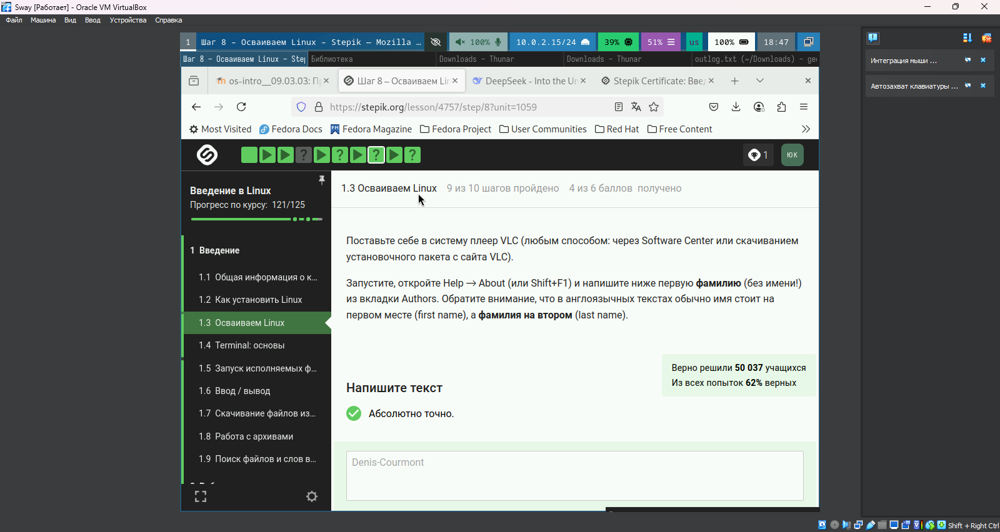
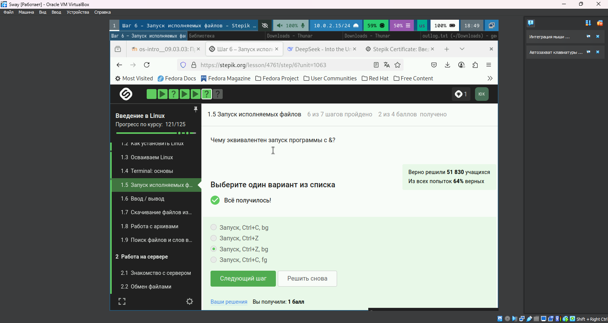
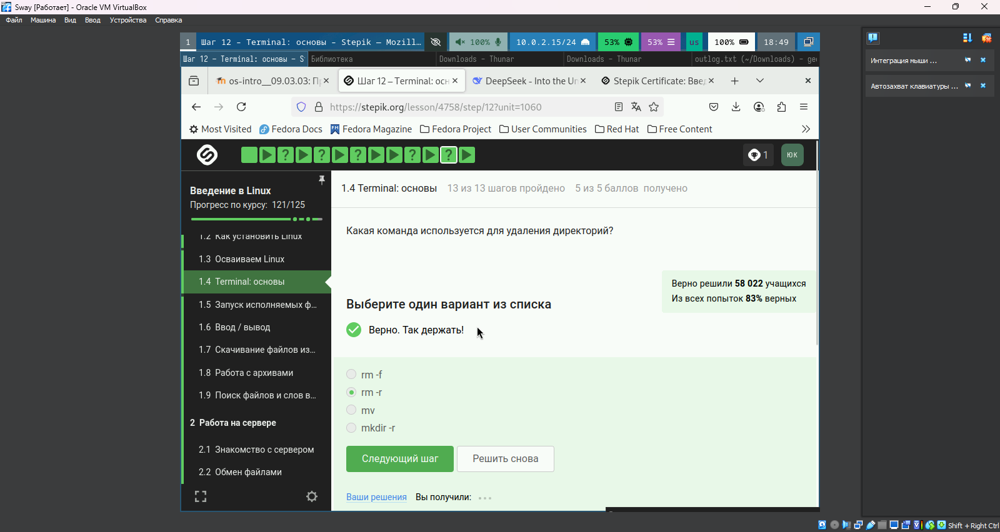

---
## Front matter
lang: ru-RU
title: Презентация внешнего курса 
subtitle: Часть 1
author:
  - Юсупова К. Р.
institute:
  - Российский университет дружбы народов, Москва, Россия

## i18n babel
babel-lang: russian
babel-otherlangs: english

## Formatting pdf
toc: false
toc-title: Содержание
slide_level: 2
aspectratio: 169
section-titles: true
theme: metropolis
header-includes:
 - \metroset{progressbar=frametitle,sectionpage=progressbar,numbering=fraction}
---

# Информация

## Докладчик

:::::::::::::: {.columns align=center}
::: {.column width="70%"}

  * Юсупова Ксения Равилевна
  * Российский университет дружбы народов
  * Номер студенческого билета- 1132247531
  * [1132247531@pfur.ru]

:::
::::::::::::::

# Вводная часть

## Цель работы

Выолнить первую часть внешнего курса

# Выполнение лабораторной работы

## Политика курса 

**Правильные ответы:**
- За каждую неверную попытку снимается 1 балл
- Не распространять решения задач
- Работать над задачами самостоятельно

**Обоснование:**  
Политика курса требует самостоятельного обучения. Штрафные баллы мотивируют к внимательному решению, а запрет на публикацию решений сохраняет учебную ценность задач.

{#fig:001 width=50%}

## Выбор ОС 

**Правильные ответы:**  
- Linux
- Windows  
- Другую

**Обоснование:**  
Курс рассматривает кроссплатформенные технологии, поэтому важен опыт работы с разными ОС. Вариант "Другую" включает мобильные и специализированные системы.

{#fig:002 width=50%}

## Виртуализация 

**Правильный ответ:**  
"Специальная программа для запуска одной ОС на другой ОС"

**Обоснование:**  
Виртуальные машины (VirtualBox) эмулируют компьютерное оборудование, позволяя запускать гостевые ОС внутри основной системы.

{#fig:003 width=50%}

## Параметры wget 

**Правильный ответ:**  
`-q` или `-quiet`

**Обоснование:**  
Флаг `-q` активирует "тихий режим", подавляя все служебные сообщения (DNS-разрешение, прогресс загрузки и т.д.), что подтверждается man-страницей wget.

{#fig:004 width=50%}

## Архиваторы 

**Правильные ответы:**  
- zip  
- tar

**Обоснование:**  
Только `zip` и `tar` поддерживают упаковку директорий. `gzip` работает с отдельными файлами, требуя предварительной архивации tar.

{#fig:005 width=50%}

## Перенаправление stderr 

**Правильный ответ:**  
`program 2> file.txt`

**Обоснование:**  
В Linux:
- `2>` перенаправляет stderr (поток ошибок)
- Синтаксис `2>>` также корректен для дописывания
- Варианты с `<` ошибочны - это операции ввода

{#fig:006 width=5%}

## Осваивание Linux

**Правильный ответ:**  
Denis-Courmont

{#fig:007 width=50%}

## Управление процессами 

**Правильный ответ:**  
"Запуск, Ctrl+Z, bg"

**Обоснование:**  
Последовательность:
1. Запуск программы (передний план)
2. Ctrl+Z - остановка с сохранением состояния
3. bg - продолжение выполнения в фоне

{#fig:008 width=50%}

## Терминал: основы

**Правильный ответ:**  

rm -r

{#fig:009 width=50%}

# Выводы

В ходе лабораторной работы мы выполнили первую часть внешнего курса.

