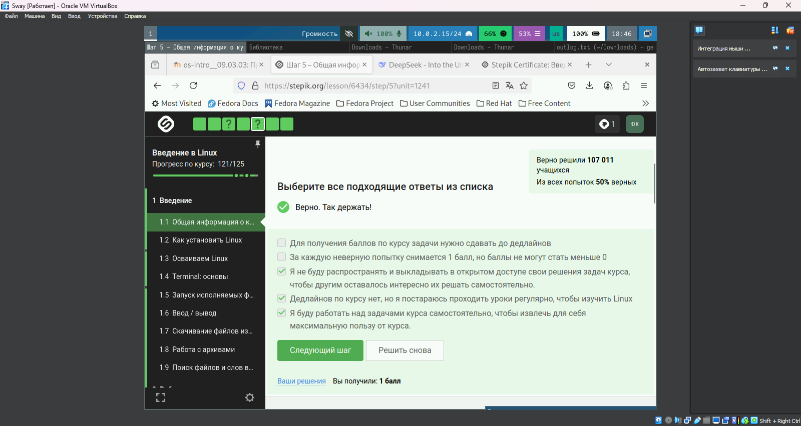
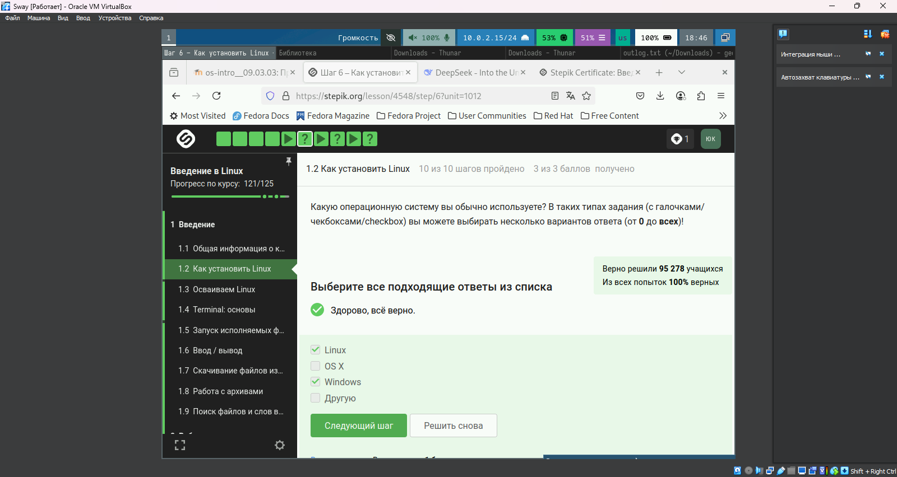
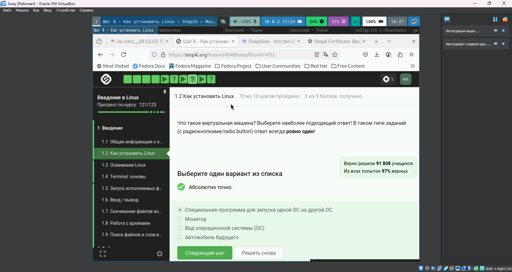
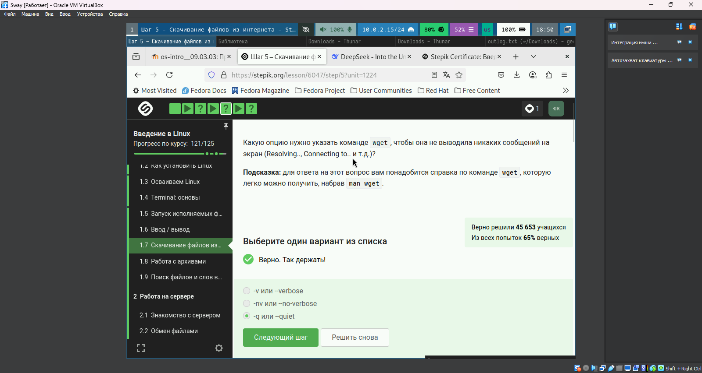
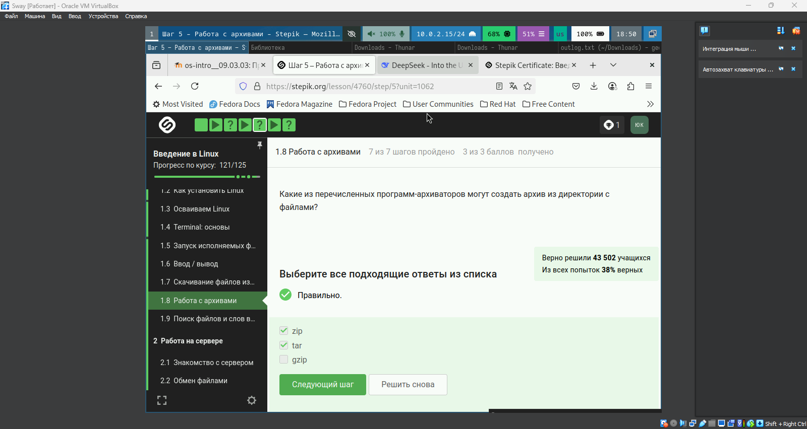
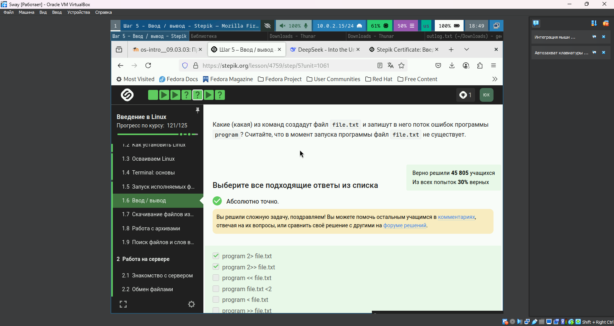
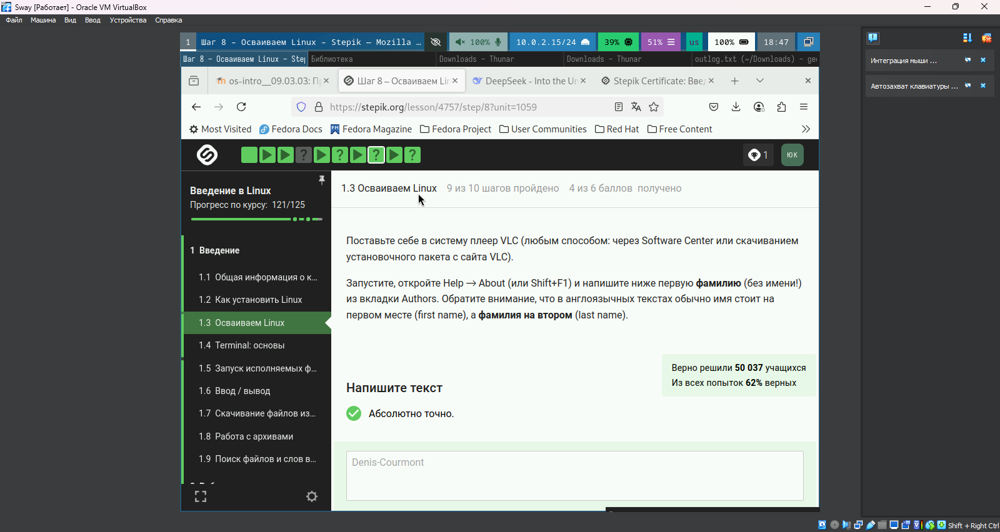
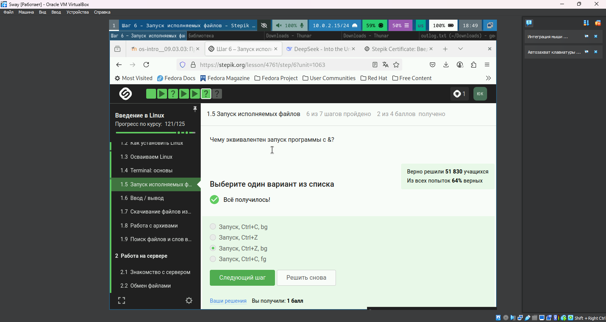
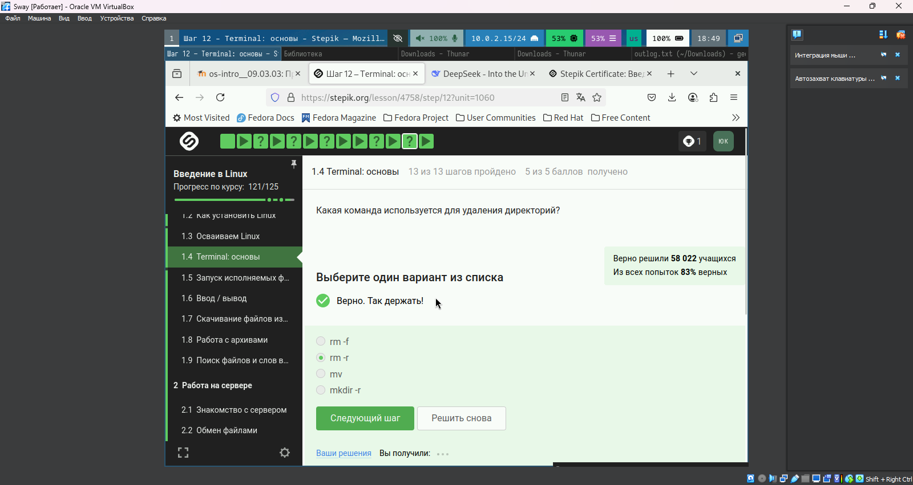

---
## Front matter
title: "Отчет по по внешнему курсу"
subtitle: "Часть 1"
author: "Юсупова Ксения Равилевна"

## Generic otions
lang: ru-RU
toc-title: "Содержание"

## Bibliography
bibliography: bib/cite.bib
csl: pandoc/csl/gost-r-7-0-5-2008-numeric.csl

## Pdf output format
toc: true # Table of contents
toc-depth: 2
lof: true # List of figures
lot: true # List of tables
fontsize: 12pt
linestretch: 1.5
papersize: a4
documentclass: scrreprt
## I18n polyglossia
polyglossia-lang:
  name: russian
  options:
	- spelling=modern
	- babelshorthands=true
polyglossia-otherlangs:
  name: english
## I18n babel
babel-lang: russian
babel-otherlangs: english
## Fonts
mainfont: IBM Plex Serif
romanfont: IBM Plex Serif
sansfont: IBM Plex Sans
monofont: IBM Plex Mono
mathfont: STIX Two Math
mainfontoptions: Ligatures=Common,Ligatures=TeX,Scale=0.94
romanfontoptions: Ligatures=Common,Ligatures=TeX,Scale=0.94
sansfontoptions: Ligatures=Common,Ligatures=TeX,Scale=MatchLowercase,Scale=0.94
monofontoptions: Scale=MatchLowercase,Scale=0.94,FakeStretch=0.9
mathfontoptions:
## Biblatex
biblatex: true
biblio-style: "gost-numeric"
biblatexoptions:
  - parentracker=true
  - backend=biber
  - hyperref=auto
  - language=auto
  - autolang=other*
  - citestyle=gost-numeric
## Pandoc-crossref LaTeX customization
figureTitle: "Рис."
tableTitle: "Таблица"
listingTitle: "Листинг"
lofTitle: "Список иллюстраций"
lotTitle: "Список таблиц"
lolTitle: "Листинги"
## Misc options
indent: true
header-includes:
  - \usepackage{indentfirst}
  - \usepackage{float} # keep figures where there are in the text
  - \floatplacement{figure}{H} # keep figures where there are in the text
---

# Цель работы

Выолнить первую часть внешнего курса

# Выполнение лабораторной работы

##  Политика курса (рис. [-@fig:001])
{#fig:001 width=70%}

**Правильные ответы:**
- За каждую неверную попытку снимается 1 балл
- Не распространять решения задач
- Работать над задачами самостоятельно

**Обоснование:**  
Политика курса требует самостоятельного обучения. Штрафные баллы мотивируют к внимательному решению, а запрет на публикацию решений сохраняет учебную ценность задач.

## Выбор ОС (рис. [-@fig:002])
{#fig:002 width=70%}

**Правильные ответы:**  
- Linux
- Windows  
- Другую

**Обоснование:**  
Курс рассматривает кроссплатформенные технологии, поэтому важен опыт работы с разными ОС. Вариант "Другую" включает мобильные и специализированные системы.

## Виртуализация (рис. [-@fig:003])
{#fig:003 width=70%}

**Правильный ответ:**  
"Специальная программа для запуска одной ОС на другой ОС"

**Обоснование:**  
Виртуальные машины (VirtualBox) эмулируют компьютерное оборудование, позволяя запускать гостевые ОС внутри основной системы.

## Параметры wget (рис. [-@fig:004])
{#fig:004 width=70%}

**Правильный ответ:**  
`-q` или `-quiet`

**Обоснование:**  
Флаг `-q` активирует "тихий режим", подавляя все служебные сообщения (DNS-разрешение, прогресс загрузки и т.д.), что подтверждается man-страницей wget.

## Архиваторы (рис. [-@fig:005])
{#fig:005 width=70%}

**Правильные ответы:**  
- zip  
- tar

**Обоснование:**  
Только `zip` и `tar` поддерживают упаковку директорий. `gzip` работает с отдельными файлами, требуя предварительной архивации tar.

## Перенаправление stderr (рис. [-@fig:006])
{#fig:006 width=70%}

**Правильный ответ:**  
`program 2> file.txt`

**Обоснование:**  
В Linux:
- `2>` перенаправляет stderr (поток ошибок)
- Синтаксис `2>>` также корректен для дописывания
- Варианты с `<` ошибочны - это операции ввода

## Осваивание Linux(рис. [-@fig:007])
{#fig:007 width=70%}

**Правильный ответ:**  
Denis-Courmont

## Управление процессами (рис. [-@fig:008])
{#fig:008 width=70%}

**Правильный ответ:**  
"Запуск, Ctrl+Z, bg"

**Обоснование:**  
Последовательность:
1. Запуск программы (передний план)
2. Ctrl+Z - остановка с сохранением состояния
3. bg - продолжение выполнения в фоне

##Терминал: основы (рис. [-@fig:009])

**Правильный ответ:**  

rm -r

{#fig:009 width=50%}
# Выводы

В ходе лабораторной работы мы выполнили первую часть внешнего курса.

