---
## Front matter
lang: ru-RU
title: Презентация для внешнего курса
subtitle: Часть 2
author:
  - Юсупова К. Р.
institute:
  - Российский университет дружбы народов, Москва, Россия

## i18n babel
babel-lang: russian
babel-otherlangs: english

## Formatting pdf
toc: false
toc-title: Содержание
slide_level: 2
aspectratio: 169
section-titles: true
theme: metropolis
header-includes:
 - \metroset{progressbar=frametitle,sectionpage=progressbar,numbering=fraction}
---

# Информация

## Докладчик

:::::::::::::: {.columns align=center}
::: {.column width="70%"}

  * Юсупова Ксения Равилевна
  * Российский университет дружбы народов
  * Номер студенческого билета- 1132247531
  * [1132247531@pfur.ru]

:::
::::::::::::::

# Вводная часть

## Цель работы

Выполнить вторую часть внешнего курса для ознакомления с работой ОС Linux.

# Выполнение лабораторной работы

## Знакомство с сервером 

**Правильный ответ:**  
Удаленный сервер можно использовать для:  
- Хранения больших объемов данных  
- Хранения конфиденциальных данных  
- Выполнения сложных вычислений  

**Обоснование:**  
Сервер предоставляет ресурсы для ресурсоемких задач и обеспечивает контроль доступа к информации.  

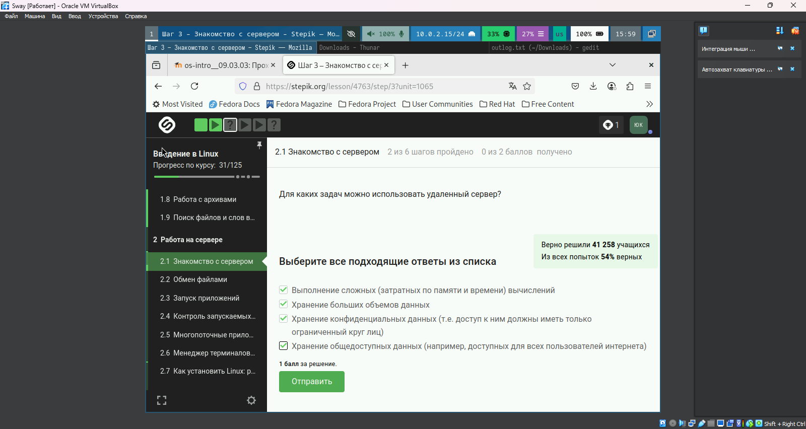{#fig:001 width=70%}

## Управление терминалом и процессами 

**Правильный ответ:**  
При вводе `fg` во второй вкладке:  
"Терминал сообщит, что нет процесса для запуска в fg"  

**Обоснование:**  
Команда `fg` работает только с процессами текущей сессии.  

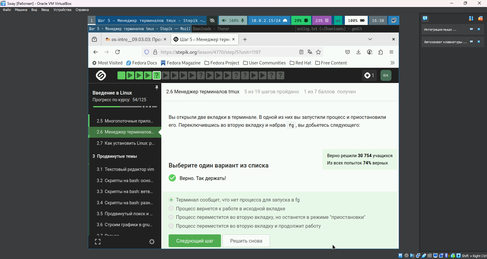{#fig:002 width=70%}

## Многопоточные приложения 
**Правильный ответ:** 
При остановке процесса: 
"Столько, сколько оно потребляло в момент остановки" 

**Обоснование:** 
Процесс сохраняет состояние, включая использование ресурсов, при остановке. 

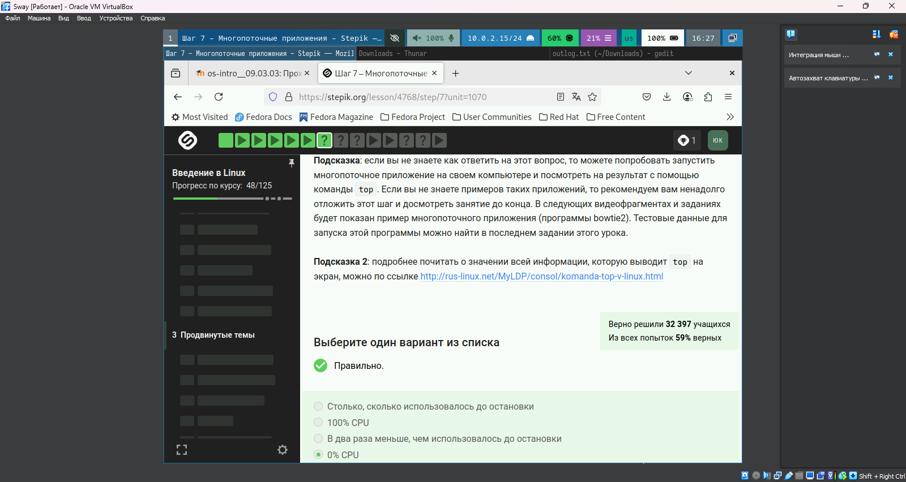{#fig:003 width=70%}

## Завершение процессов 
**Правильный ответ:** 
При отправке SIGTERM: 
"Процесс приступит к завершению, как только будет продолжен" 

**Обоснование:** 
SIGTERM инициирует корректное завершение, но процесс может завершиться не мгновенно. 

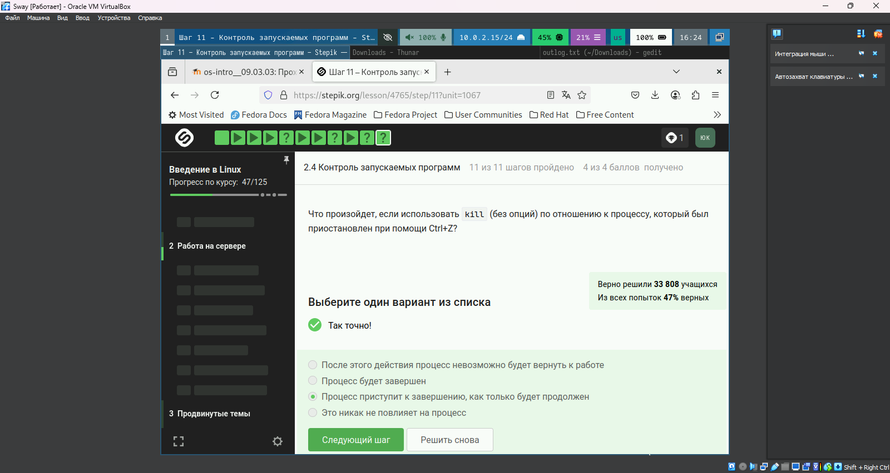{#fig:004 width=70%}

## Контроль процессов 
**Правильный ответ:** 
"У всех разные" (PID процессов) 

**Обоснование:** 
Каждый процесс в системе получает уникальный идентификатор (PID), включая `ps`, `top` и `jobs`. 

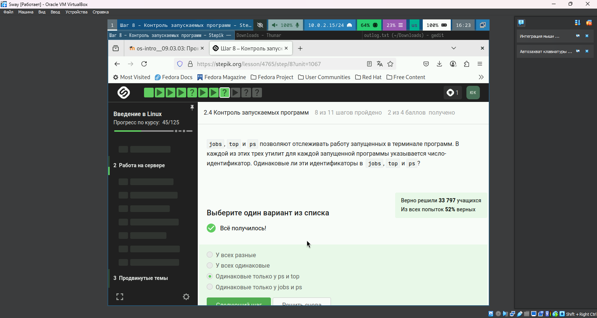{#fig:006 width=70%}

## Сигналы завершения

**Правильный ответ:** 
`kill -9` (SIGKILL) 

**Обоснование:**  
SIGKILL принудительно завершает процесс без возможности обработки сигнала.  

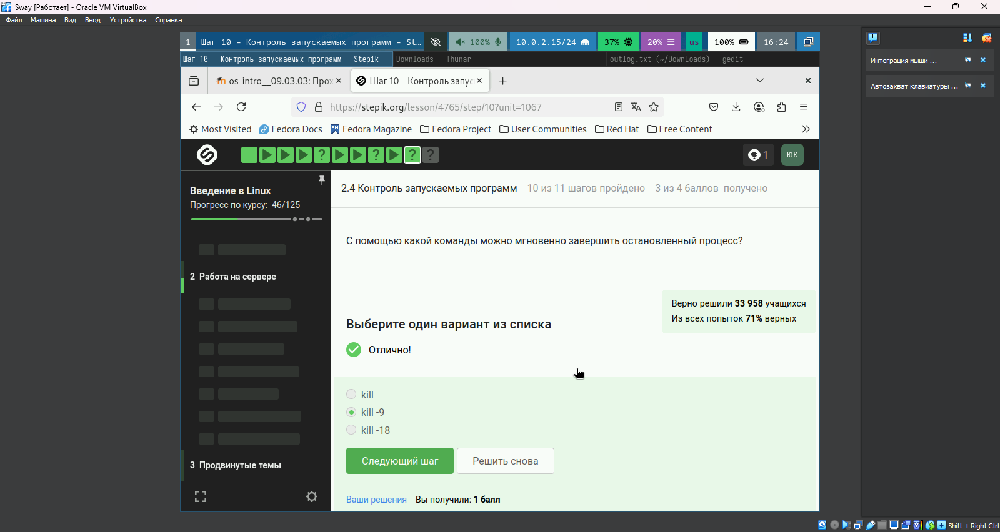{#fig:007 width=70%}

## Графические приложения на сервере

**Правильные ответы:**  
- Настроить сервер для поддержки вывода на экран  
- Проверить терминальную версию программы  

**Обоснование:**  
Сервер без GUI требует дополнительной настройки или альтернативных версий программ.  

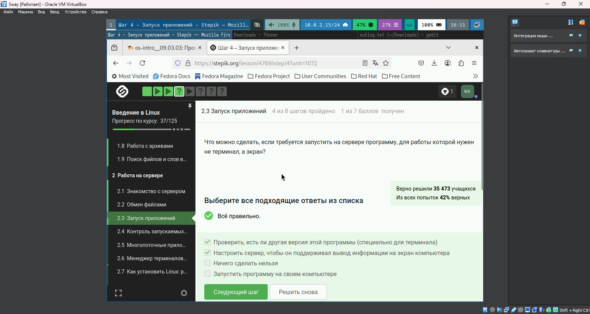{#fig:008 width=70%}

## Многопоточность в bowtie2 

**Правильный ответ:**  
"Только bowtie2"  

**Обоснование:**  
`bowtie2-build` не поддерживает многопоточность, в отличие от основной программы.  

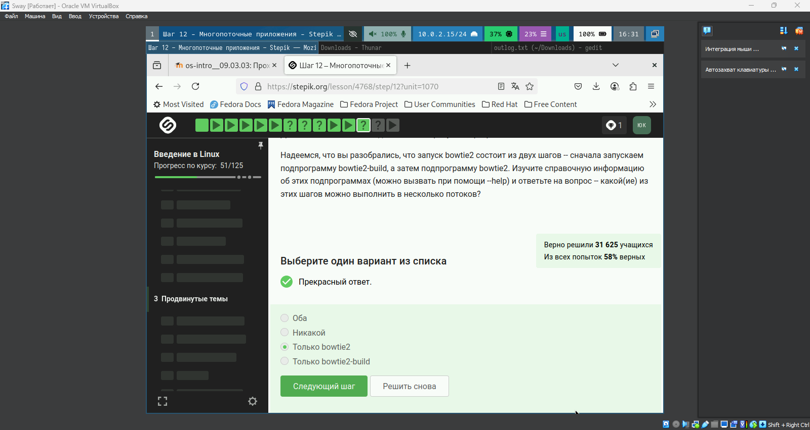{#fig:009 width=70%}

## Установка программ 

**Правильный ответ:**  
Проверка интернет-соединения  

**Обоснование:**  
Ошибка "не может найти пакет" чаще всего связана с отсутствием подключения к репозиториям.  

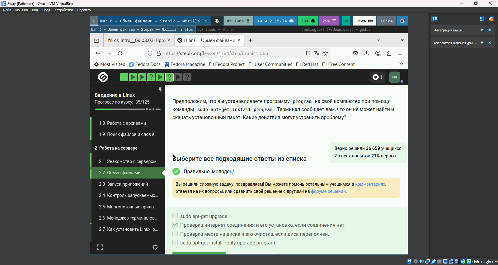{#fig:010 width=70%}

## Фоновые процессы 

**Правильный ответ:**  
"Только о program2 и program3"  

**Обоснование:**  
`Ctrl+C` завершает program1, а `jobs` показывает только активные/приостановленные процессы.  

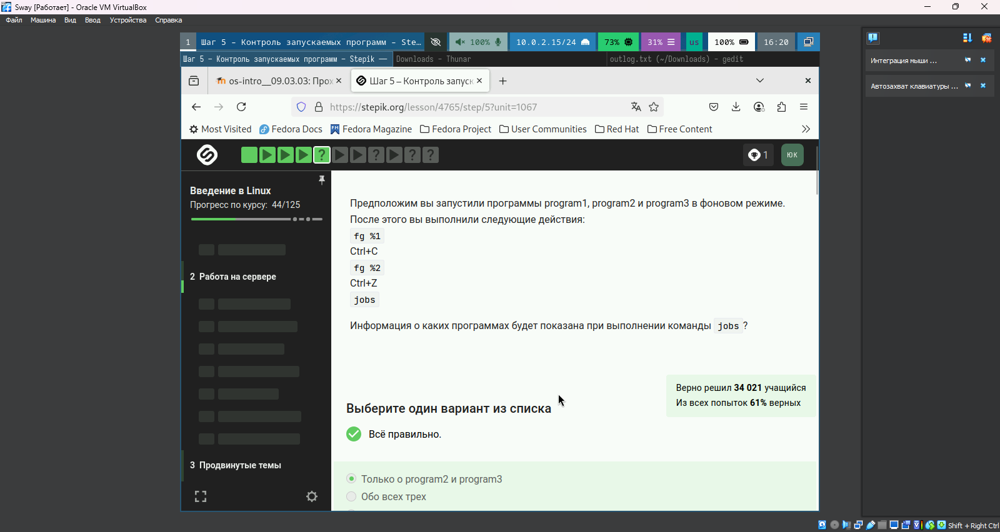{#fig:011 width=70%}

## Управление терминалом tmux 
**Правильный ответ:**  
`Ctrl+B` и `,` (запятая)  

**Обоснование:**  
Эта комбинация позволяет переименовать текущую вкладку в tmux.  

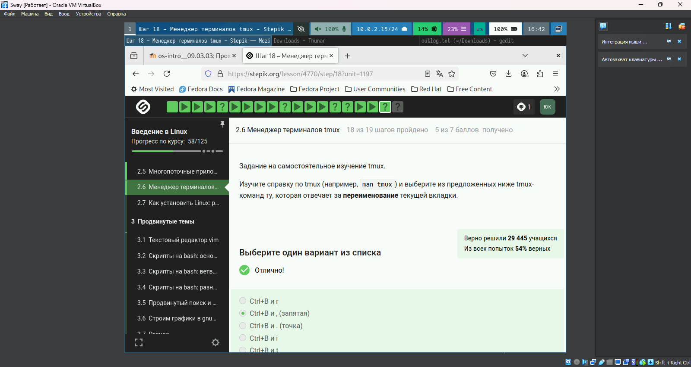{#fig:012 width=70%}

## Использование FileZilla 

**Правильные ответы:**  
- Копирование файлов на сервер/с сервера  
- Просмотр директорий на локальном компьютере  

**Обоснование:**  
FileZilla — FTP-клиент для передачи файлов, не предназначен для запуска программ.  

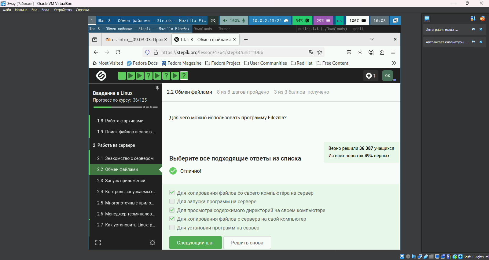{#fig:013 width=70%}

## Мониторинг процессов через top 

**Правильный ответ:**  
"Столько, сколько оно потребляло в момент остановки" 

**Обоснование:** 
При остановке процесса (Ctrl+Z) его состояние, включая потребление ресурсов, фиксируется до возобновления работы. 

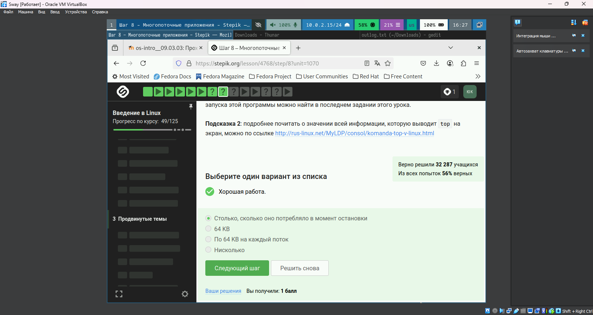{#fig:014 width=70%}

## Практика с многопоточными приложениями 

**Ключевая информация:** 
- Рекомендация использовать bowtie2 для изучения многопоточности 
- Тестовые данные доступны в финальном задании 

**Применение:** 
bowtie2 позволяет на практике оценить разницу между однопоточным и многопоточным выполнением задач. 

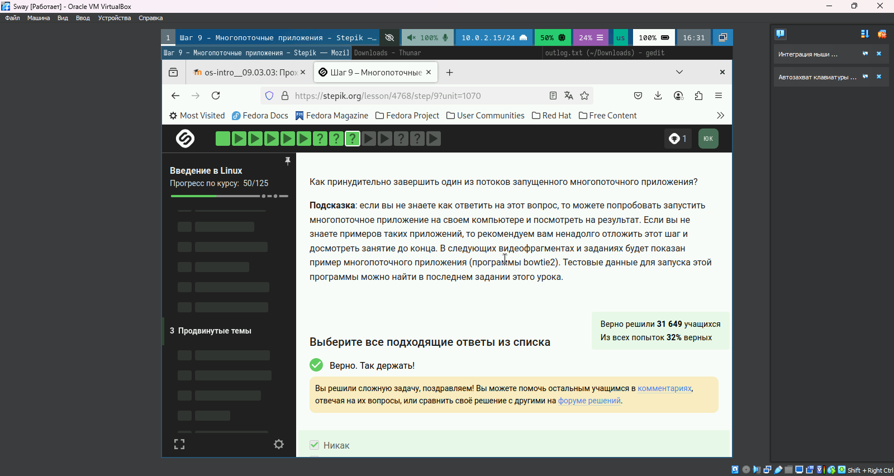{#fig:015 width=70%}

## Управление терминалом tmux 
**Наблюдения:** 
- Использование вкладок с индикацией нагрузки (CPU: 55%, RAM: 25%) 
- Работа с файлами (pricing.txt) через терминал 

**Вывод:** 
tmux обеспечивает эффективное управление множеством задач в одной сессии. 

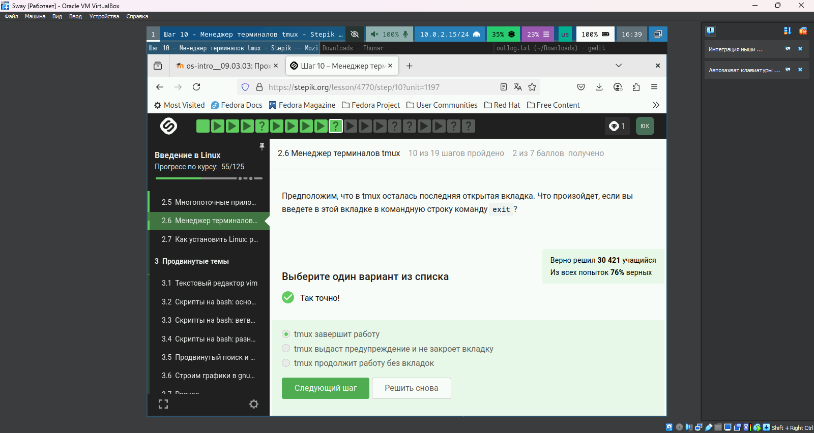{#fig:016 width=70%}

# Выводы

В ходе работы мы выполнили вторую часть внешнего курса для ознакомления с работой ОС Linux.

