---
## Front matter
title: "Отчет для внешнего курса"
subtitle: "2 часть"
author: "Юсупова Ксения Равилевна"

## Generic otions
lang: ru-RU
toc-title: "Содержание"

## Bibliography
bibliography: bib/cite.bib
csl: pandoc/csl/gost-r-7-0-5-2008-numeric.csl

## Pdf output format
toc: true # Table of contents
toc-depth: 2
lof: true # List of figures
lot: true # List of tables
fontsize: 12pt
linestretch: 1.5
papersize: a4
documentclass: scrreprt
## I18n polyglossia
polyglossia-lang:
  name: russian
  options:
	- spelling=modern
	- babelshorthands=true
polyglossia-otherlangs:
  name: english
## I18n babel
babel-lang: russian
babel-otherlangs: english
## Fonts
mainfont: IBM Plex Serif
romanfont: IBM Plex Serif
sansfont: IBM Plex Sans
monofont: IBM Plex Mono
mathfont: STIX Two Math
mainfontoptions: Ligatures=Common,Ligatures=TeX,Scale=0.94
romanfontoptions: Ligatures=Common,Ligatures=TeX,Scale=0.94
sansfontoptions: Ligatures=Common,Ligatures=TeX,Scale=MatchLowercase,Scale=0.94
monofontoptions: Scale=MatchLowercase,Scale=0.94,FakeStretch=0.9
mathfontoptions:
## Biblatex
biblatex: true
biblio-style: "gost-numeric"
biblatexoptions:
  - parentracker=true
  - backend=biber
  - hyperref=auto
  - language=auto
  - autolang=other*
  - citestyle=gost-numeric
## Pandoc-crossref LaTeX customization
figureTitle: "Рис."
tableTitle: "Таблица"
listingTitle: "Листинг"
lofTitle: "Список иллюстраций"
lotTitle: "Список таблиц"
lolTitle: "Листинги"
## Misc options
indent: true
header-includes:
  - \usepackage{indentfirst}
  - \usepackage{float} # keep figures where there are in the text
  - \floatplacement{figure}{H} # keep figures where there are in the text
---

# Цель работы

Выполнить вторую часть внешнего курса для ознакомления с работой ОС Linux.

# Выполнение лабораторной работы

## Знакомство с сервером (рис. [-@fig:001])
**Правильный ответ:**  
Удаленный сервер можно использовать для:  
- Хранения больших объемов данных  
- Хранения конфиденциальных данных  
- Выполнения сложных вычислений  

**Обоснование:**  
Сервер предоставляет ресурсы для ресурсоемких задач и обеспечивает контроль доступа к информации.  

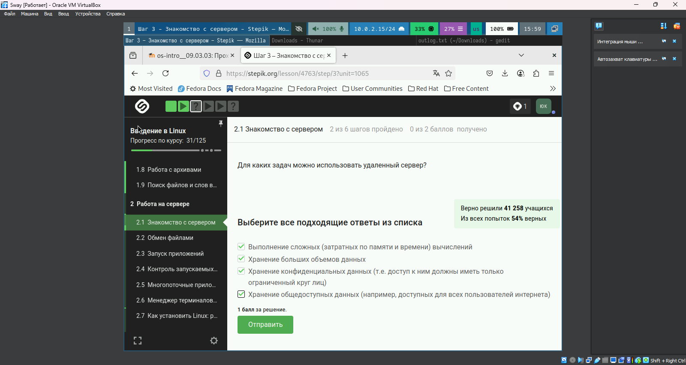{#fig:001 width=70%}

---

## Управление терминалом и процессами (рис. [-@fig:002])
**Правильный ответ:**  
При вводе `fg` во второй вкладке:  
"Терминал сообщит, что нет процесса для запуска в fg"  

**Обоснование:**  
Команда `fg` работает только с процессами текущей сессии.  

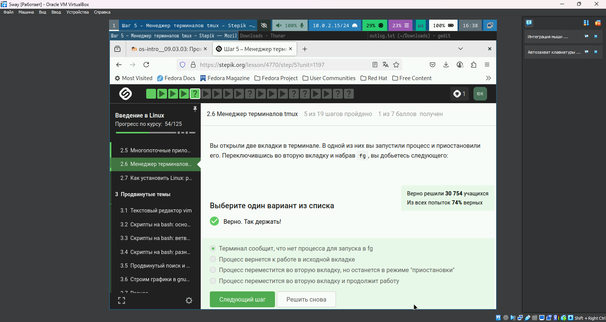{#fig:002 width=70%}

---

## Многопоточные приложения (рис. [-@fig:003])
**Правильный ответ:** 
При остановке процесса: 
"Столько, сколько оно потребляло в момент остановки" 

**Обоснование:** 
Процесс сохраняет состояние, включая использование ресурсов, при остановке. 

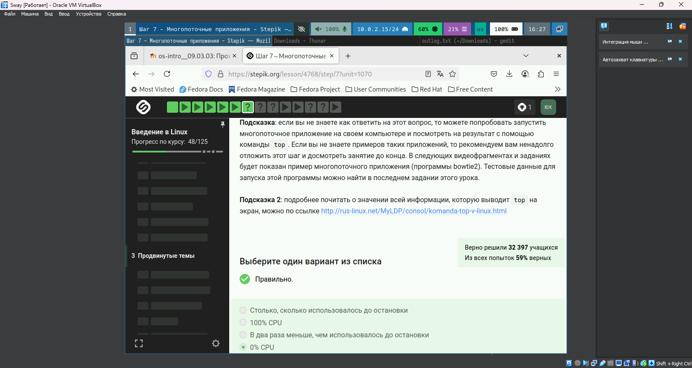{#fig:003 width=70%}

---

## Завершение процессов (рис. [-@fig:004])
**Правильный ответ:** 
При отправке SIGTERM: 
"Процесс приступит к завершению, как только будет продолжен" 

**Обоснование:** 
SIGTERM инициирует корректное завершение, но процесс может завершиться не мгновенно. 

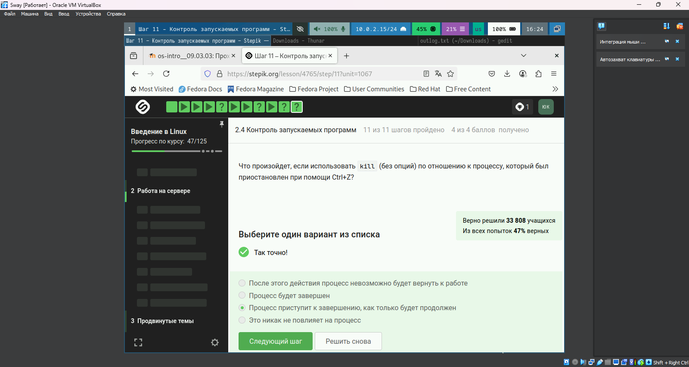{#fig:004 width=70%}

---

## Работа с bowtie2 (рис. [-@fig:005])
**Выполненное действие:** 
```bash
echo "306174 reads; of these..." > bowtie.log


## Контроль процессов (рис. [-@fig:006])
**Правильный ответ:** 
"У всех разные" (PID процессов) 

**Обоснование:** 
Каждый процесс в системе получает уникальный идентификатор (PID), включая `ps`, `top` и `jobs`. 

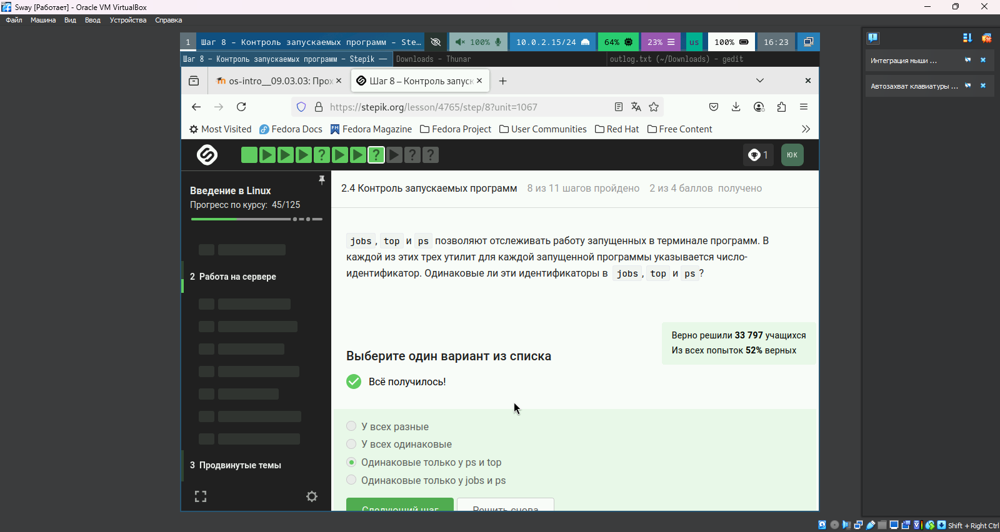{#fig:006 width=70%}

---

## Сигналы завершения (рис. [-@fig:007])
**Правильный ответ:** 
`kill -9` (SIGKILL) 

**Обоснование:**  
SIGKILL принудительно завершает процесс без возможности обработки сигнала.  

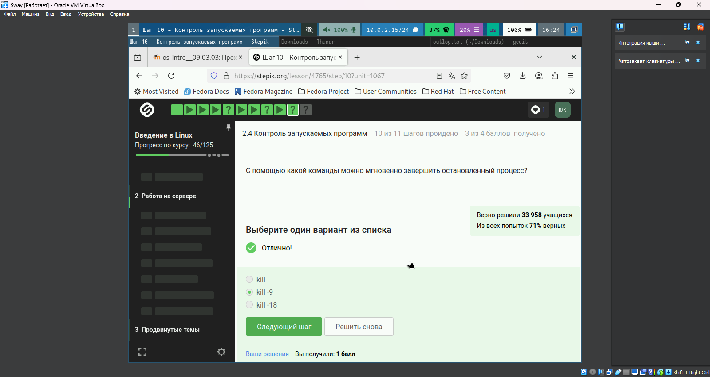{#fig:007 width=70%}

---

## Графические приложения на сервере (рис. [-@fig:008])
**Правильные ответы:**  
- Настроить сервер для поддержки вывода на экран  
- Проверить терминальную версию программы  

**Обоснование:**  
Сервер без GUI требует дополнительной настройки или альтернативных версий программ.  

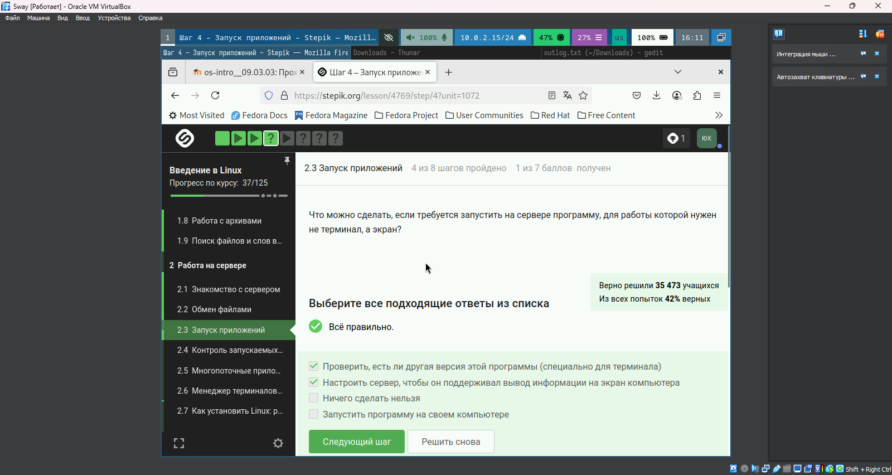{#fig:008 width=70%}

---

## Многопоточность в bowtie2 (рис. [-@fig:009])
**Правильный ответ:**  
"Только bowtie2"  

**Обоснование:**  
`bowtie2-build` не поддерживает многопоточность, в отличие от основной программы.  

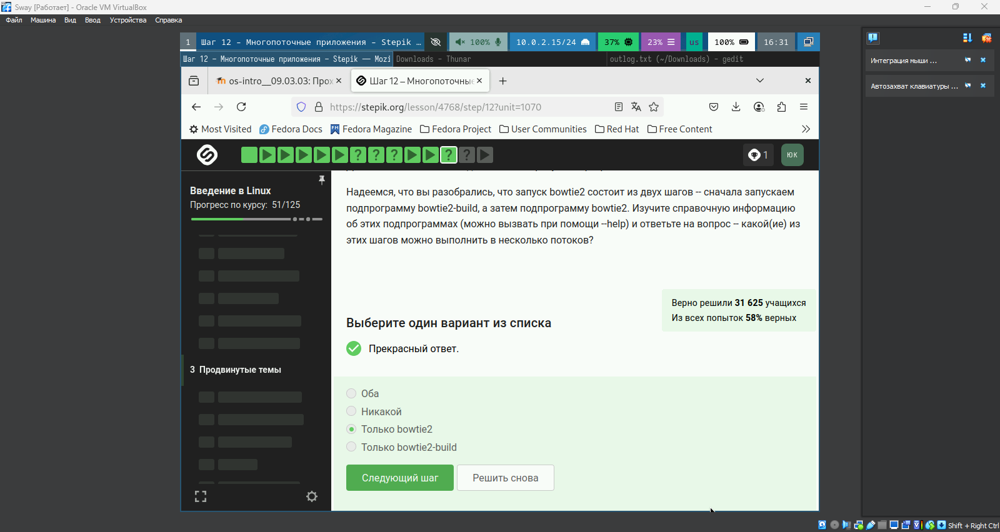{#fig:009 width=70%}

---

## Установка программ (рис. [-@fig:010])
**Правильный ответ:**  
Проверка интернет-соединения  

**Обоснование:**  
Ошибка "не может найти пакет" чаще всего связана с отсутствием подключения к репозиториям.  

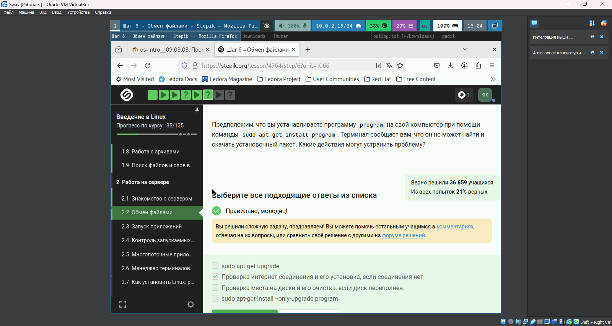{#fig:010 width=70%}

---

## Фоновые процессы (рис. [-@fig:011])
**Правильный ответ:**  
"Только о program2 и program3"  

**Обоснование:**  
`Ctrl+C` завершает program1, а `jobs` показывает только активные/приостановленные процессы.  

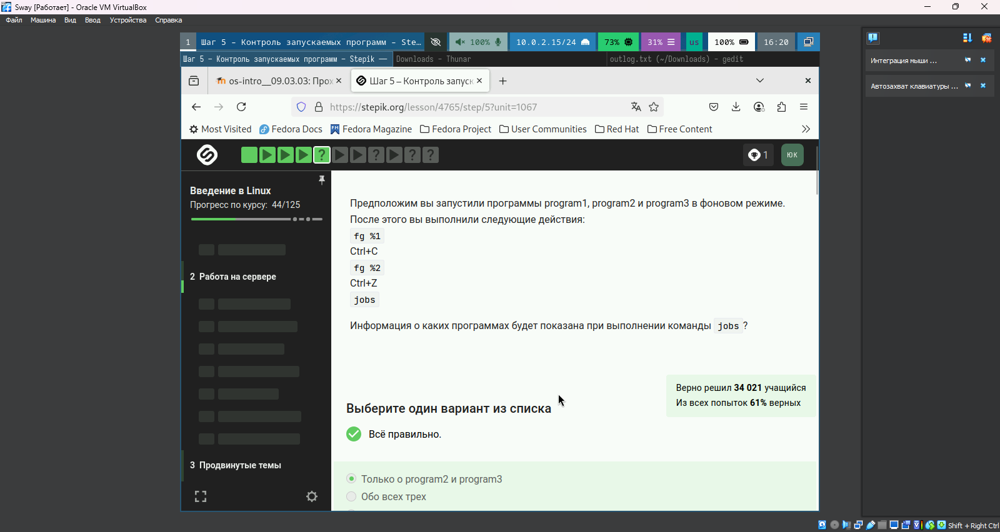{#fig:011 width=70%}

---

## Управление терминалом tmux (рис. [-@fig:012])
**Правильный ответ:**  
`Ctrl+B` и `,` (запятая)  

**Обоснование:**  
Эта комбинация позволяет переименовать текущую вкладку в tmux.  

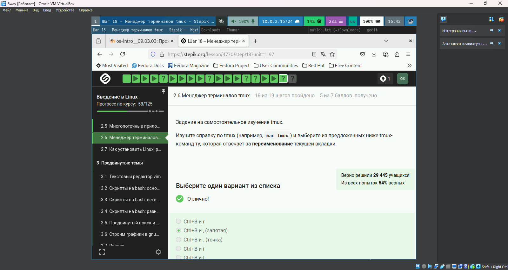{#fig:012 width=70%}

---

## Использование FileZilla (рис. [-@fig:013])
**Правильные ответы:**  
- Копирование файлов на сервер/с сервера  
- Просмотр директорий на локальном компьютере  

**Обоснование:**  
FileZilla — FTP-клиент для передачи файлов, не предназначен для запуска программ.  

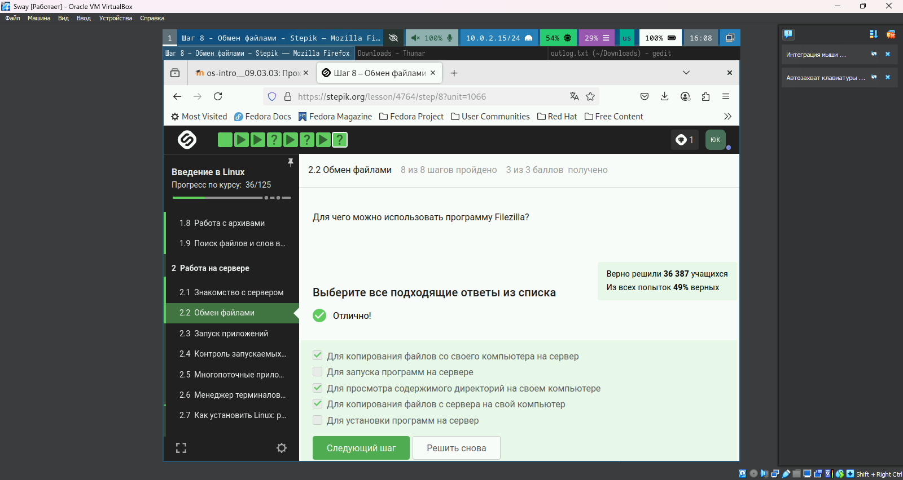{#fig:013 width=70%}

## Мониторинг процессов через top (рис. [-@fig:014])
**Правильный ответ:**  
"Столько, сколько оно потребляло в момент остановки" 

**Обоснование:** 
При остановке процесса (Ctrl+Z) его состояние, включая потребление ресурсов, фиксируется до возобновления работы. 

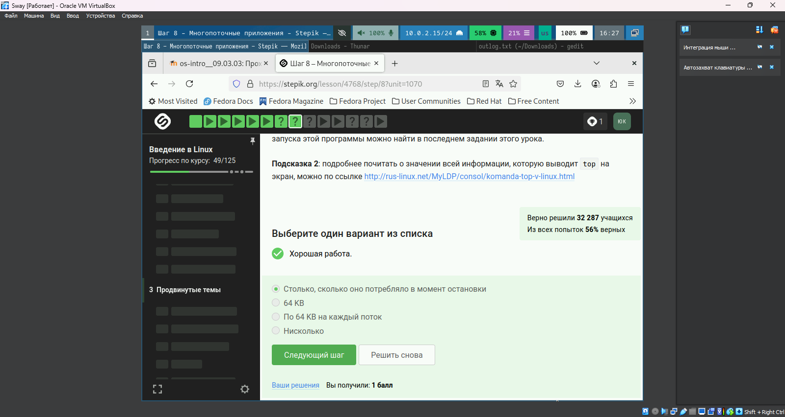{#fig:014 width=70%}

---

## Практика с многопоточными приложениями (рис. [-@fig:015])
**Ключевая информация:** 
- Рекомендация использовать bowtie2 для изучения многопоточности 
- Тестовые данные доступны в финальном задании 

**Применение:** 
bowtie2 позволяет на практике оценить разницу между однопоточным и многопоточным выполнением задач. 

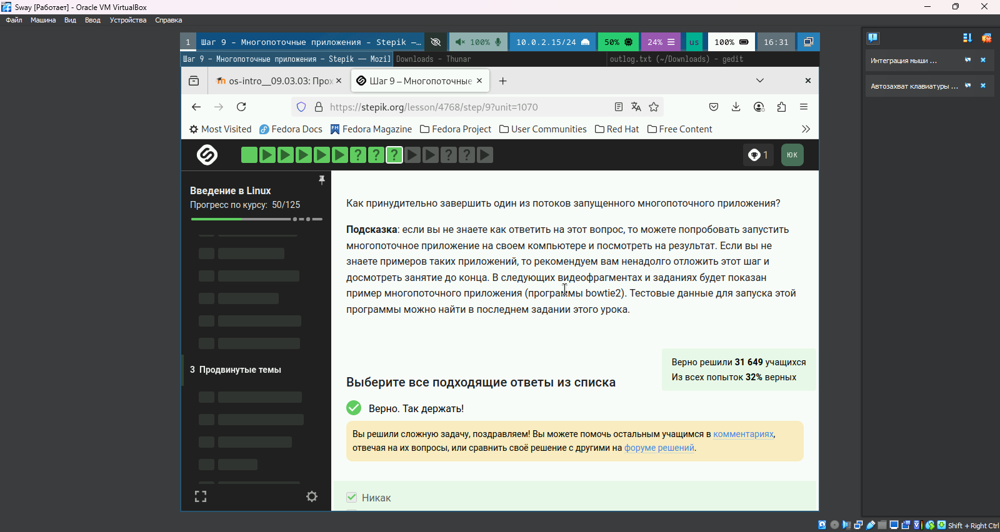{#fig:015 width=70%}

---

## Управление терминалом tmux (рис. [-@fig:016])
**Наблюдения:** 
- Использование вкладок с индикацией нагрузки (CPU: 55%, RAM: 25%) 
- Работа с файлами (pricing.txt) через терминал 

**Вывод:** 
tmux обеспечивает эффективное управление множеством задач в одной сессии. 

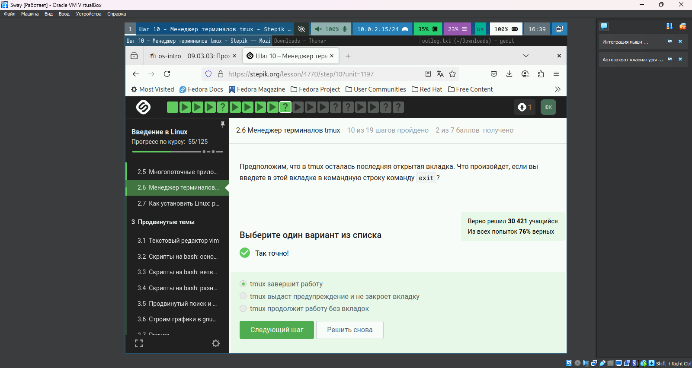{#fig:016 width=70%}


# Выводы

В ходе работы мы выполнили вторую часть внешнего курса для ознакомления с работой ОС Linux.

