---
## Front matter
lang: ru-RU
title: Презентация для индивидуального проекта
subtitle: Часть 1
author:
  - Юсупова К. Р.
institute:
  - Российский университет дружбы народов, Москва, Россия

## i18n babel
babel-lang: russian
babel-otherlangs: english

## Formatting pdf
toc: false
toc-title: Содержание
slide_level: 2
aspectratio: 169
section-titles: true
theme: metropolis
header-includes:
 - \metroset{progressbar=frametitle,sectionpage=progressbar,numbering=fraction}
---

# Информация

## Докладчик

:::::::::::::: {.columns align=center}
::: {.column width="70%"}

  * Юсупова Ксения Равилевна
  * Российский университет дружбы народов
  * Номер студенческого билета- 1132247531
  * [1132247531@pfur.ru]

:::
::::::::::::::

# Вводная часть

## Актуальность

Создание персонального сайта на GitHub Pages становится популярным благодаря доступности и простоте использования. Платформа предлагает бесплатный хостинг для статических сайтов, что привлекает студентов и фрилансеров. Использование Git позволяет отслеживать изменения в коде и упрощает управление проектом. Личный сайт — отличная возможность продемонстрировать навыки и достижения, что полезно при поиске работы. Кроме того, GitHub имеет большое сообщество, что облегчает получение поддержки и решений для возникающих проблем.

## Цель работы

Научиться создавать сайты и размещать на Github pages заготовки для персонального сайта.

# Основная часть 

## Выполнение лабораторной работы

Для начала необходимо скачать последнюю версию Hugo для ОС Linux.

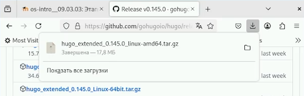{#fig:001 width=70%}

## Выполнение лабораторной работы

С помощью утилиты tar распакуем архив с Hugo .

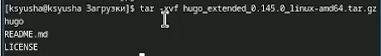{#fig:002 width=70%}

## Выполнение лабораторной работы

Установим Hugo, переместив исполняемый файл в директорию /usr/local/bin .

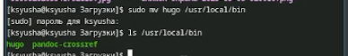{#fig:003 width=70%}
 
## Выполнение лабораторной работы
 
Зайдём на страницу шаблона и создадим из неё репозиторий github. Назовём наш репозиторий blog. .

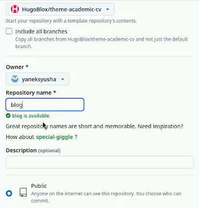{#fig:004 width=70%}

## Выполнение лабораторной работы

Клонируем созданный репозиторий к себе на компьютер.

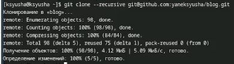{#fig:005 width=70%}

## Выполнение лабораторной работы

Запустим Hugo. В момент запуска он подготовит папку с сайтом, создав дополнительные каталоги .

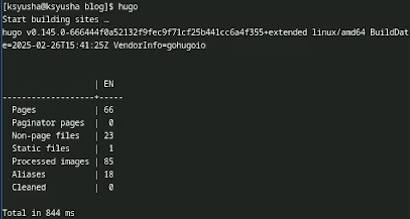{#fig:006 width=70%}

## Выполнение лабораторной работы

Запустим Hugo с опцией server, которая позволит нам запустить наш сайт.

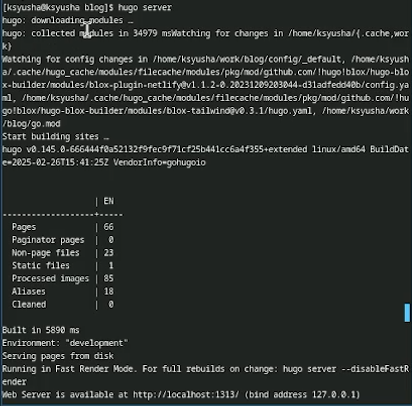{#fig:007 width=70%}

## Выполнение лабораторной работы

Перейдя по адресу localhost:1313, мы увидим наш сайт .

{#fig:008 width=70%}

## Выполнение лабораторной работы

Теперь создадим второй репозиторий, на котором будет висеть наш сайт. Его нужно назвать в формате "Имя аккаунта на гитхаб + .github.io" .

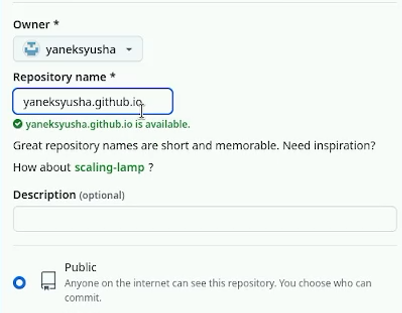{#fig:009 width=70%}

## Выполнение лабораторной работы

Обновляем репозиторий, делая коммит и выкладывая изменения на гитхаб .

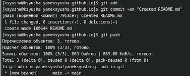{#fig:010 width=70%}

## Выполнение лабораторной работы

Теперь добавим второй репозиторий как сабмодуль первого.

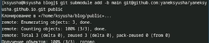{#fig:011 width=70%}

## Выполнение лабораторной работы

Выгрузим изменения на гитхаб.

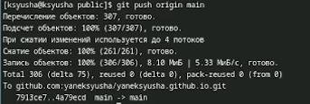{#fig:012 width=70%}

## Выполнение лабораторной работы

Теперь посмотрим, как выглядит наш сайт.

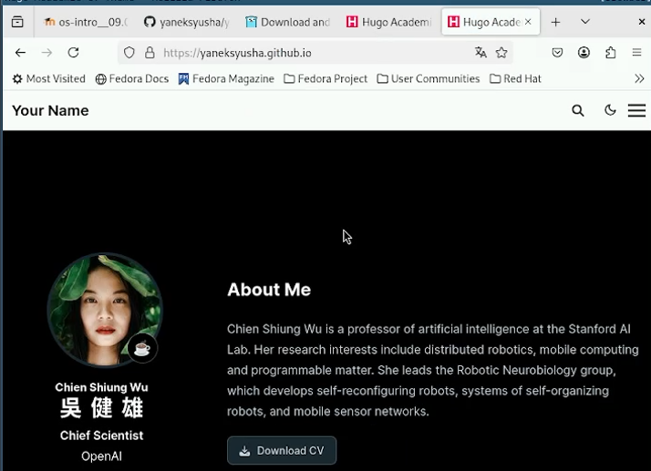{#fig:013 width=70%}

# Выводы

В ходе лабораторной работы мы научились создавать сайты и размещать на Github pages заготовки для персонального сайта.

