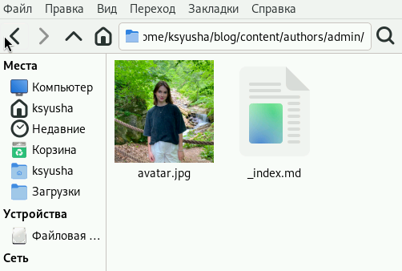
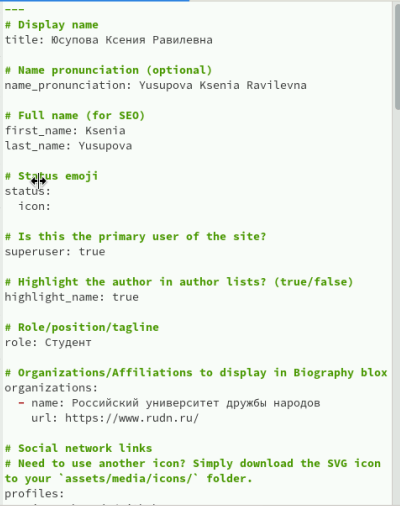
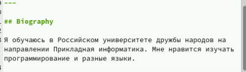
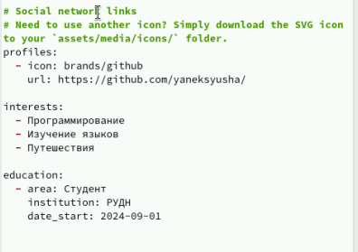
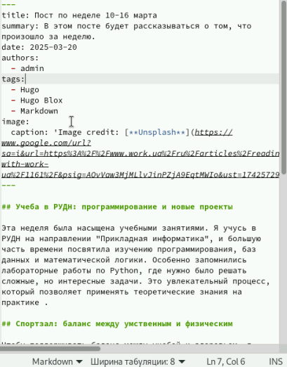
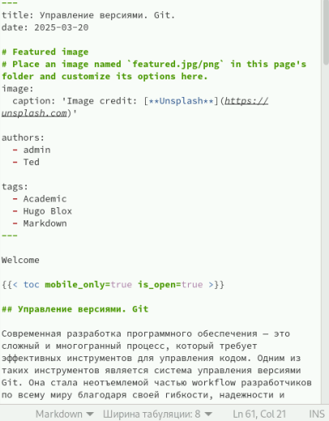
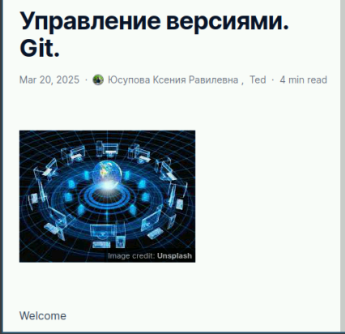

---
## Front matter
lang: ru-RU
title: Презентация для индивидуального проекта
subtitle: Часть 2
author:
  - Юсупова К. Р.
institute:
  - Российский университет дружбы народов, Москва, Россия

## i18n babel
babel-lang: russian
babel-otherlangs: english

## Formatting pdf
toc: false
toc-title: Содержание
slide_level: 2
aspectratio: 169
section-titles: true
theme: metropolis
header-includes:
 - \metroset{progressbar=frametitle,sectionpage=progressbar,numbering=fraction}
---

# Информация

## Докладчик

:::::::::::::: {.columns align=center}
::: {.column width="70%"}

  * Юсупова Ксения Равилевна
  * Российский университет дружбы народов
  * Номер студенческого билета- 1132247531
  * [1132247531@pfur.ru]

:::
::::::::::::::

# Вводная часть

## Цель работы

Частично заполнить индивидуальный сайт.

# Выполнение лабораторной работы

Обновляем фотографию, добавляя ее в папку /work/blog/content/authors/.

{#fig:001 width=70%}

## Выполнение лабораторной работы

Теперь добавляем информаию о себе в файл _index.md .

{#fig:002 width=70%}

## Выполнение лабораторной работы

Размещаем краткое описание владельца сайта (Biography).

{#fig:003 width=70%}

## Выполнение лабораторной работы

Добавляем информацию об интересах (Interests) и образовании (Education).

{#fig:004 width=70%}

## Выполнение лабораторной работы

Сделаем пост по прошедшей неделе.

{#fig:005 width=70%}

## Выполнение лабораторной работы

Добавляем пост на тему по выборую "Управление версиями. Git" .

{#fig:006 width=70%}

## Выполнение лабораторной работы

Проверили, что пост по прошедшей неделе был успешно выгружен .

{#fig:007 width=70%}

## Выполнение лабораторной работы

Проверили, что пост на тему по выборую "Управление версиями. Git" успешно выгружен .

{#fig:008 width=70%}

# Выводы

В ходе лабораторной работы мы научились заполнять индивидуальный сайт. 

