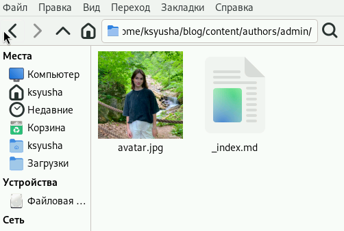
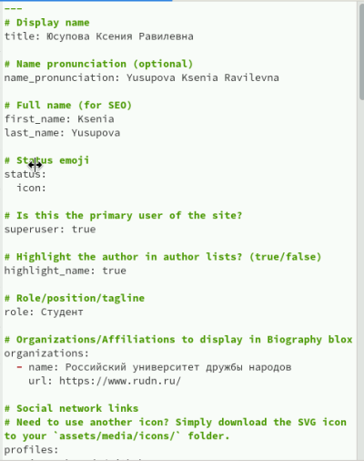
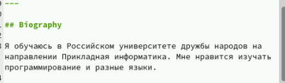
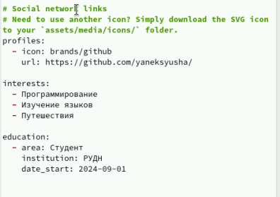
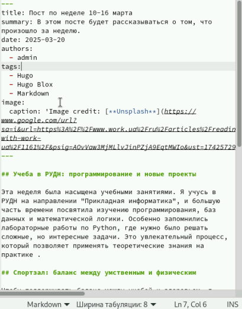
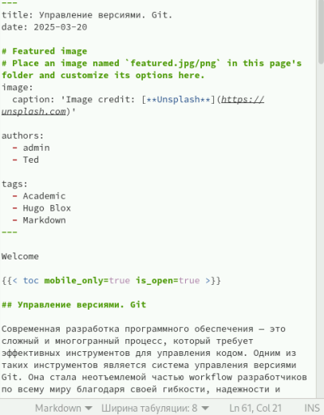
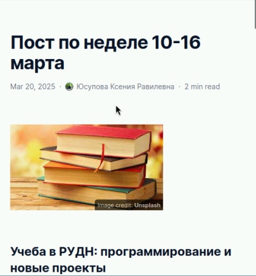
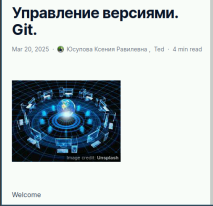

---
## Front matter
title: "Отчет для индивидуального проекта"
subtitle: "2 часть"
author: "Юсупова Ксения Равилевна"

## Generic otions
lang: ru-RU
toc-title: "Содержание"

## Bibliography
bibliography: bib/cite.bib
csl: pandoc/csl/gost-r-7-0-5-2008-numeric.csl

## Pdf output format
toc: true # Table of contents
toc-depth: 2
lof: true # List of figures
lot: true # List of tables
fontsize: 12pt
linestretch: 1.5
papersize: a4
documentclass: scrreprt
## I18n polyglossia
polyglossia-lang:
  name: russian
  options:
	- spelling=modern
	- babelshorthands=true
polyglossia-otherlangs:
  name: english
## I18n babel
babel-lang: russian
babel-otherlangs: english
## Fonts
mainfont: IBM Plex Serif
romanfont: IBM Plex Serif
sansfont: IBM Plex Sans
monofont: IBM Plex Mono
mathfont: STIX Two Math
mainfontoptions: Ligatures=Common,Ligatures=TeX,Scale=0.94
romanfontoptions: Ligatures=Common,Ligatures=TeX,Scale=0.94
sansfontoptions: Ligatures=Common,Ligatures=TeX,Scale=MatchLowercase,Scale=0.94
monofontoptions: Scale=MatchLowercase,Scale=0.94,FakeStretch=0.9
mathfontoptions:
## Biblatex
biblatex: true
biblio-style: "gost-numeric"
biblatexoptions:
  - parentracker=true
  - backend=biber
  - hyperref=auto
  - language=auto
  - autolang=other*
  - citestyle=gost-numeric
## Pandoc-crossref LaTeX customization
figureTitle: "Рис."
tableTitle: "Таблица"
listingTitle: "Листинг"
lofTitle: "Список иллюстраций"
lotTitle: "Список таблиц"
lolTitle: "Листинги"
## Misc options
indent: true
header-includes:
  - \usepackage{indentfirst}
  - \usepackage{float} # keep figures where there are in the text
  - \floatplacement{figure}{H} # keep figures where there are in the text
---

# Цель работы

Частично заполнить индивидуальный сайт.

# Выполнение лабораторной работы

Обновляем фотографию, добавляя ее в папку /work/blog/content/authors/(рис. [-@fig:001]).

{#fig:001 width=70%}

Теперь добавляем информаию о себе в файл _index.md (рис. [-@fig:002]).

{#fig:002 width=70%}

Размещаем краткое описание владельца сайта (Biography).(рис. [-@fig:003]).

{#fig:003 width=70%}

Добавляем информацию об интересах (Interests) и образовании (Education).(рис. [-@fig:004]).

{#fig:004 width=70%}

Сделаем пост по прошедшей неделе.(рис. [-@fig:005]).

{#fig:005 width=70%}

Добавляем пост на тему по выборую "Управление версиями. Git" (рис. [-@fig:006]).

{#fig:006 width=70%}

Проверили, что пост по прошедшей неделе был успешно выгружен (рис. [-@fig:007]).

{#fig:007 width=70%}

Проверили, что пост на тему по выборую "Управление версиями. Git" успешно выгружен (рис. [-@fig:008]).

{#fig:008 width=70%}

# Выводы

В ходе лабораторной работы мы научились заполнять индивидуальный сайт. 

