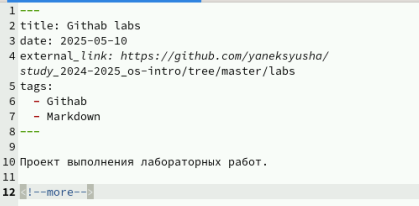
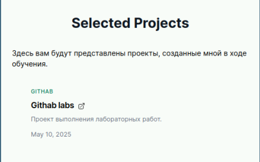
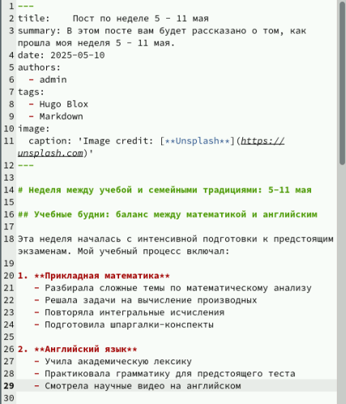
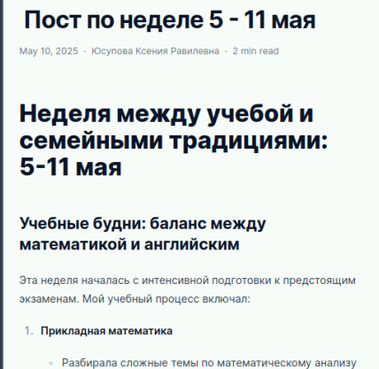
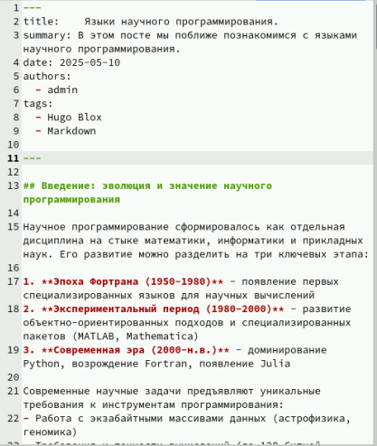
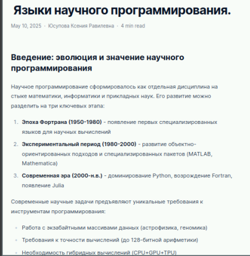

---
## Front matter
lang: ru-RU
title: Презентация для индивидуального проекта
subtitle: Часть 5
author:
  - Юсупова К. Р.
institute:
  - Российский университет дружбы народов, Москва, Россия

## i18n babel
babel-lang: russian
babel-otherlangs: english

## Formatting pdf
toc: false
toc-title: Содержание
slide_level: 2
aspectratio: 169
section-titles: true
theme: metropolis
header-includes:
 - \metroset{progressbar=frametitle,sectionpage=progressbar,numbering=fraction}
---

# Информация

## Докладчик

:::::::::::::: {.columns align=center}
::: {.column width="70%"}

  * Юсупова Ксения Равилевна
  * Российский университет дружбы народов
  * Номер студенческого билета- 1132247531
  * [1132247531@pfur.ru]

:::
::::::::::::::

# Вводная часть

## Цель работы

Научиться добавлять к сайту все необходимые элементы для добавления проектов и постов.

# Выполнение лабораторной работы

Для начала необходимо сделать записи для персональных проектов

{#fig:001 width=70%}

## Выполнение лабораторной работы

Проверили как обновления отображаются на сайте

{#fig:002 width=70%}

## Выполнение лабораторной работы

Сделали пост по прошедшей неделе.

{#fig:003 width=70%}
 
## Выполнение лабораторной работы
 
Проверили как обновления отображаются на сайте

{#fig:004 width=70%}

## Выполнение лабораторной работы

Добавить пост на тему по выбору: Языки научного программирования.

{#fig:005 width=70%}

## Выполнение лабораторной работы

Проверили как обновления отображаются на сайте

{#fig:006 width=70%}

# Выводы

В ходе выполнения четвертой части проекта мы научились добавлять к сайту информацию о проектах и посты.

