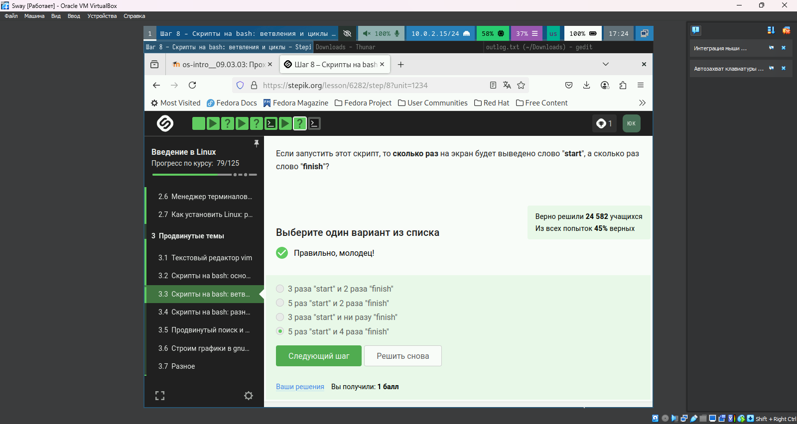

---
## Front matter
lang: ru-RU
title: Презентация для внешнего курса
subtitle: Часть 3
author:
  - Юсупова К. Р.
institute:
  - Российский университет дружбы народов, Москва, Россия

## i18n babel
babel-lang: russian
babel-otherlangs: english

## Formatting pdf
toc: false
toc-title: Содержание
slide_level: 2
aspectratio: 169
section-titles: true
theme: metropolis
header-includes:
 - \metroset{progressbar=frametitle,sectionpage=progressbar,numbering=fraction}
---

# Информация

## Докладчик

:::::::::::::: {.columns align=center}
::: {.column width="70%"}

  * Юсупова Ксения Равилевна
  * Российский университет дружбы народов
  * Номер студенческого билета- 1132247531
  * [1132247531@pfur.ru]

:::
::::::::::::::

# Вводная часть

## Цель работы

Закончить выполнение внешнего курса

# Выполнение лабораторной работы

## Замена текста в Vim 
**Решение:**
```vim
:%s/Windows/Linux/
```

**Объяснение:**
Команда производит замену первого вхождения "Windows" на "Linux" в каждой строке файла. Символ `%` указывает на применение ко всему файлу, а отсутствие флага `g` обеспечивает замену только первого совпадения в строке.

{#fig:001 width=50%}

## Конструкция case в bash 

**Разбор:**
Конструкция `case` обеспечивает ветвление по значению переменной `$1`. Символ `*` обрабатывает все случаи, не указанные явно. Вертикальные черты `;;` обозначают конец каждого блока условий.

{#fig:002 width=70%}

## Работа с аргументами 
**Правильное решение:**
```bash
echo "Arguments: \$1=$1 \$2=$2"
```

**Ключевые моменты:**
Экранирование символа `$` позволяет вывести его как текст, а не как начало переменной. Позиционные аргументы `$1` и `$2` содержат первый и второй параметры скрипта соответственно.

{#fig:003 width=50%}

## Проверка условий 
**Верный синтаксис:**
```bash
if [ $? -eq 0 ]; then
   echo "Success"
fi
```

**Типичные ошибки:**
1. Отсутствие пробелов внутри квадратных скобок

2. Неправильное сравнение (`=` вместо `-eq` для чисел)

3. Использование двойных скобок без пробелов

{#fig:004 width=40%}

## Подстановка команд 
**Особенности:**
- `$(pwd)` подставляет вывод команды

- `$?` содержит код возврата последней команды

- Для вывода текущего каталога нужен `echo $(pwd)`

{#fig:005 width=70%}

## Анализ ветвления 
**Правильные варианты:**
- "four → four"

**Обоснование:**
Порядок вывода зависит от значения переменной `$var` и структуры условий в скрипте. Разные входные данные могут давать разную последовательность.

{#fig:006 width=70%}

## Работа с циклами 
**Ответ:**
3 вывода "start" и 2 вывода "finish"

**Логика:**
Цикл выполняется 3 раза, выводя "start" на каждой итерации. "finish" выводится после первых двух итераций, но не после последней.

{#fig:007 width=70%}

## Отладка скриптов 
**Рекомендации:**

1. Использовать `set -x` для отладки

2. Проверять коды возврата

3. Тестировать на разных входных данных

{#fig:008 width=70%}


## Работа с gnuplot 
**Особенности:**
- Система проверки анализирует только команды скрипта
- Для успешной проверки требуется максимально упрощенный синтаксис

**Типичные проблемы:**
- Слишком сложные графики
- Использование нестандартных модулей

{#fig:017 width=70%}

## Поиск файлов 
**Различия команд find:**
```bash
find -name "star*"   # Чувствителен к регистру
find -iname "star*"  # Игнорирует регистр
```

**Правильные ответы:**

- Star_Wars.avi (учет регистра)

- STARS.txt (разный шаблон поиска)


{#fig:018 width=70%}

## Навигация в Vim 
**Ключевые команды:**

- `w` - перемещение по словам (word)

- `W` - перемещение по WORD (игнорирует пунктуацию)

- `$` - конец строки

{#fig:019 width=70%}

## Ввод данных в bash 
**Скрипт:**
```bash
#!/bin/bash
while true; do
  read -p "Enter name: " name
  [[ -z $name ]] && { echo "bye"; break; }
  read -p "Enter age: " age
  echo "Name: $name, Age: $age"
done
```

{#fig:020 width=70%}

## Особенности синтаксиса 
**Критические моменты:**
```bash
[ $var = "value" ]  # Требует пробелы
[[ $var == value ]] # Допускает без кавычек
```

{#fig:021 width=70%}

# Выводы

В ходе работы мы закончили выполнение внешнего курса
