---
## Front matter
title: "Отчёт для внешнего курса"
subtitle: "Часть 3"
author: "Юсупова Ксения Равилевна"

## Generic otions
lang: ru-RU
toc-title: "Содержание"

## Bibliography
bibliography: bib/cite.bib
csl: pandoc/csl/gost-r-7-0-5-2008-numeric.csl

## Pdf output format
toc: true # Table of contents
toc-depth: 2
lof: true # List of figures
lot: true # List of tables
fontsize: 12pt
linestretch: 1.5
papersize: a4
documentclass: scrreprt
## I18n polyglossia
polyglossia-lang:
  name: russian
  options:
	- spelling=modern
	- babelshorthands=true
polyglossia-otherlangs:
  name: english
## I18n babel
babel-lang: russian
babel-otherlangs: english
## Fonts
mainfont: IBM Plex Serif
romanfont: IBM Plex Serif
sansfont: IBM Plex Sans
monofont: IBM Plex Mono
mathfont: STIX Two Math
mainfontoptions: Ligatures=Common,Ligatures=TeX,Scale=0.94
romanfontoptions: Ligatures=Common,Ligatures=TeX,Scale=0.94
sansfontoptions: Ligatures=Common,Ligatures=TeX,Scale=MatchLowercase,Scale=0.94
monofontoptions: Scale=MatchLowercase,Scale=0.94,FakeStretch=0.9
mathfontoptions:
## Biblatex
biblatex: true
biblio-style: "gost-numeric"
biblatexoptions:
  - parentracker=true
  - backend=biber
  - hyperref=auto
  - language=auto
  - autolang=other*
  - citestyle=gost-numeric
## Pandoc-crossref LaTeX customization
figureTitle: "Рис."
tableTitle: "Таблица"
listingTitle: "Листинг"
lofTitle: "Список иллюстраций"
lotTitle: "Список таблиц"
lolTitle: "Листинги"
## Misc options
indent: true
header-includes:
  - \usepackage{indentfirst}
  - \usepackage{float} # keep figures where there are in the text
  - \floatplacement{figure}{H} # keep figures where there are in the text
---

# Цель работы

Закончить выполнение внешнего курса

# Выполнение лабораторной работы

## Замена текста в Vim (рис. [-@fig:001])
**Решение:**
```vim
:%s/Windows/Linux/
```

**Объяснение:**
Команда производит замену первого вхождения "Windows" на "Linux" в каждой строке файла. Символ `%` указывает на применение ко всему файлу, а отсутствие флага `g` обеспечивает замену только первого совпадения в строке.

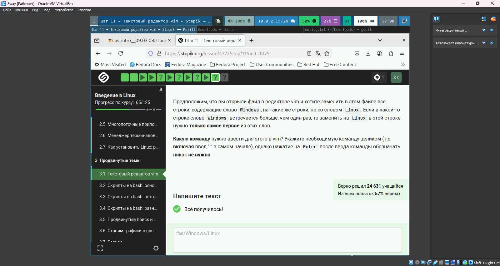{#fig:001 width=70%}

## Конструкция case в bash (рис. [-@fig:002])
**Пример кода:**
```bash
case $1 in
  0) echo "zero";;
  1) echo "one";;
  *) echo "other";; 
esac
```

**Разбор:**
Конструкция `case` обеспечивает ветвление по значению переменной `$1`. Символ `*` обрабатывает все случаи, не указанные явно. Вертикальные черты `;;` обозначают конец каждого блока условий.

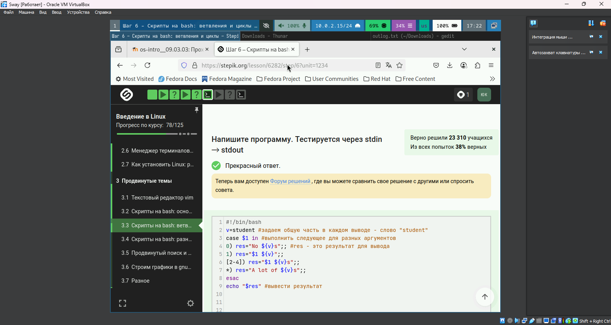{#fig:002 width=70%}

## Работа с аргументами (рис. [-@fig:003])
**Правильное решение:**
```bash
echo "Arguments: \$1=$1 \$2=$2"
```

**Ключевые моменты:**
Экранирование символа `$` позволяет вывести его как текст, а не как начало переменной. Позиционные аргументы `$1` и `$2` содержат первый и второй параметры скрипта соответственно.

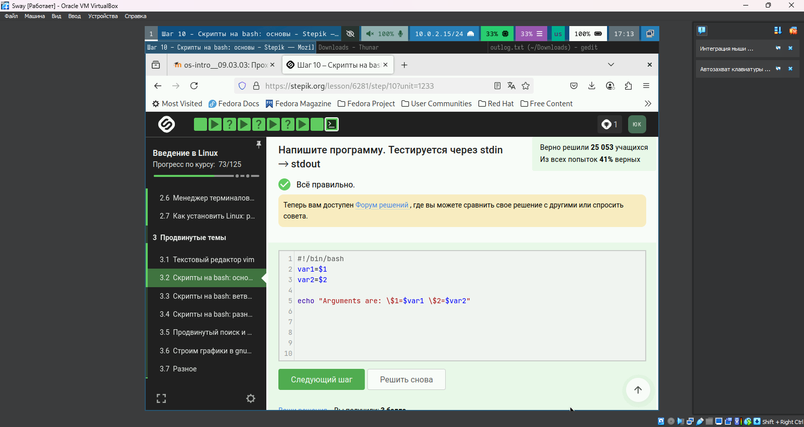{#fig:003 width=70%}

## Проверка условий (рис. [-@fig:004])
**Верный синтаксис:**
```bash
if [ $? -eq 0 ]; then
   echo "Success"
fi
```

**Типичные ошибки:**
1. Отсутствие пробелов внутри квадратных скобок

2. Неправильное сравнение (`=` вместо `-eq` для чисел)

3. Использование двойных скобок без пробелов

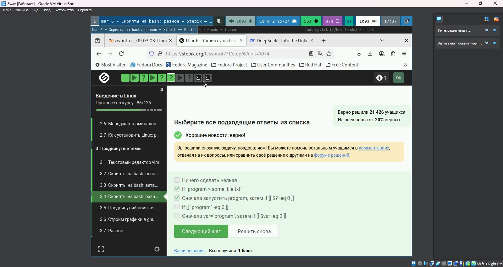{#fig:004 width=70%}

## Подстановка команд (рис. [-@fig:005])
**Особенности:**
- `$(pwd)` подставляет вывод команды

- `$?` содержит код возврата последней команды

- Для вывода текущего каталога нужен `echo $(pwd)`

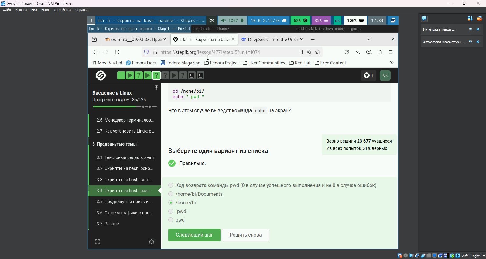{#fig:005 width=70%}

## Анализ ветвления (рис. [-@fig:006])
**Правильные варианты:**
- "two → four"

- "four → four"

**Обоснование:**
Порядок вывода зависит от значения переменной `$var` и структуры условий в скрипте. Разные входные данные могут давать разную последовательность.

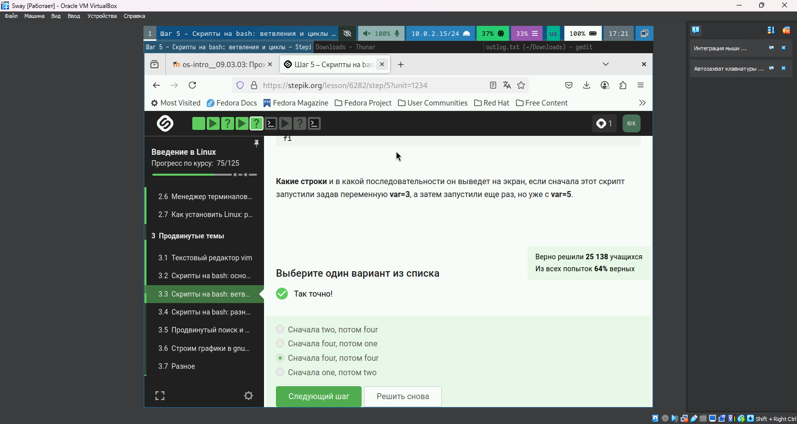{#fig:006 width=70%}

## Работа с циклами (рис. [-@fig:007])
**Ответ:**
3 вывода "start" и 2 вывода "finish"

**Логика:**
Цикл выполняется 3 раза, выводя "start" на каждой итерации. "finish" выводится после первых двух итераций, но не после последней.

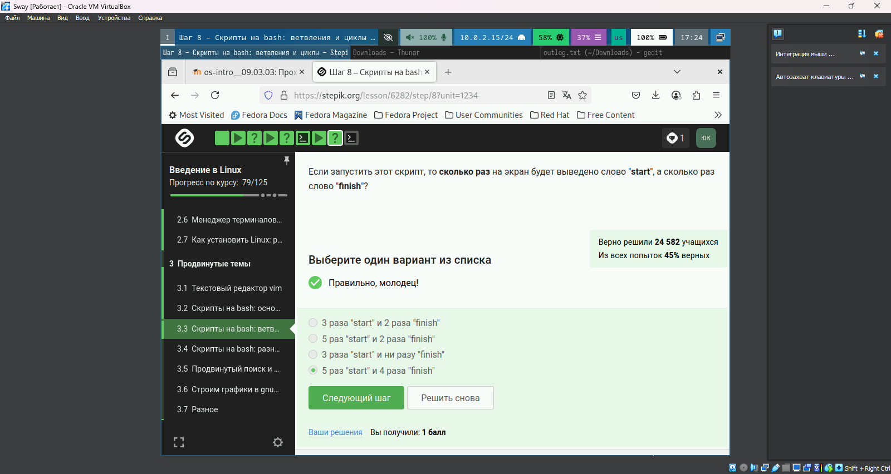{#fig:007 width=70%}

## Отладка скриптов (рис. [-@fig:008])
**Рекомендации:**

1. Использовать `set -x` для отладки

2. Проверять коды возврата

3. Тестировать на разных входных данных

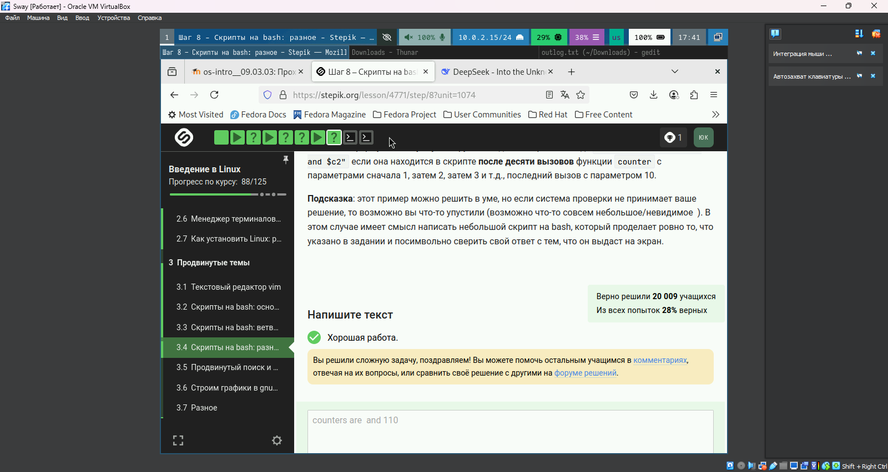{#fig:008 width=70%}


## Работа с gnuplot (рис. [-@fig:017])
**Особенности:**
- Система проверки анализирует только команды скрипта
- Для успешной проверки требуется максимально упрощенный синтаксис

**Типичные проблемы:**
- Слишком сложные графики
- Использование нестандартных модулей

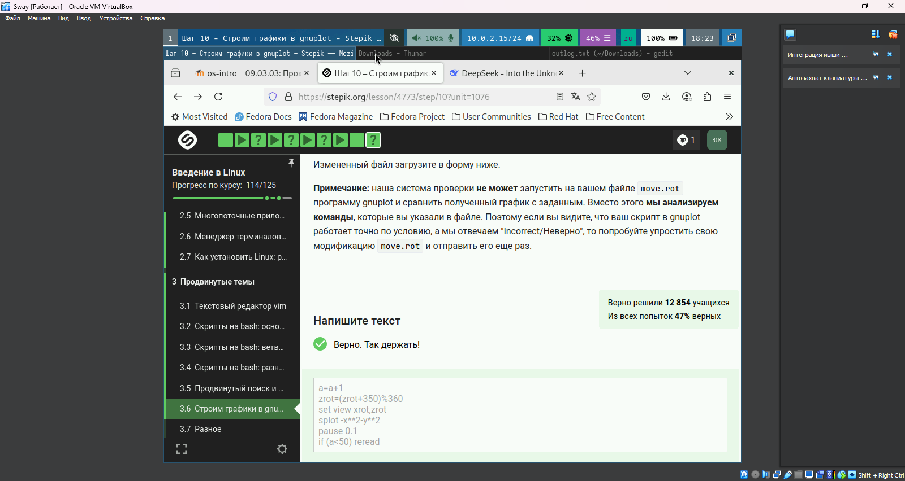{#fig:017 width=70%}

## Поиск файлов (рис. [-@fig:018])
**Различия команд find:**
```bash
find -name "star*"   # Чувствителен к регистру
find -iname "star*"  # Игнорирует регистр
```

**Правильные ответы:**

- Star_Wars.avi (учет регистра)

- STARS.txt (разный шаблон поиска)


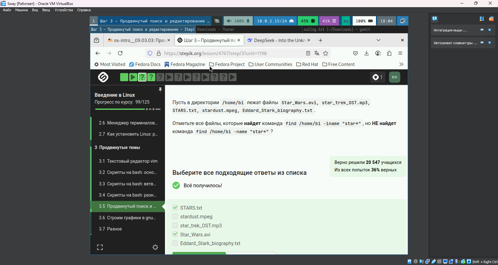{#fig:018 width=70%}

## Навигация в Vim (рис. [-@fig:019])
**Ключевые команды:**

- `w` - перемещение по словам (word)

- `W` - перемещение по WORD (игнорирует пунктуацию)

- `$` - конец строки

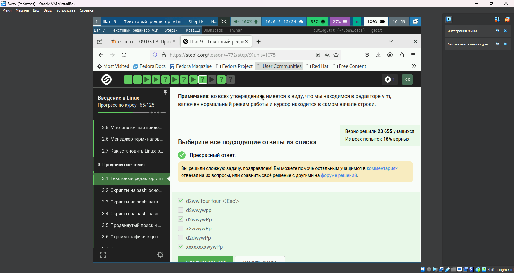{#fig:019 width=70%}

## Ввод данных в bash (рис. [-@fig:020])
**Скрипт:**
```bash
#!/bin/bash
while true; do
  read -p "Enter name: " name
  [[ -z $name ]] && { echo "bye"; break; }
  read -p "Enter age: " age
  echo "Name: $name, Age: $age"
done
```

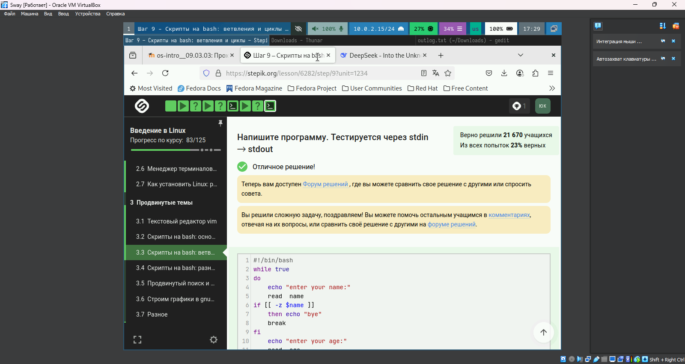{#fig:020 width=70%}

## Особенности синтаксиса (рис. [-@fig:021])
**Критические моменты:**
```bash
[ $var = "value" ]  # Требует пробелы
[[ $var == value ]] # Допускает без кавычек
```

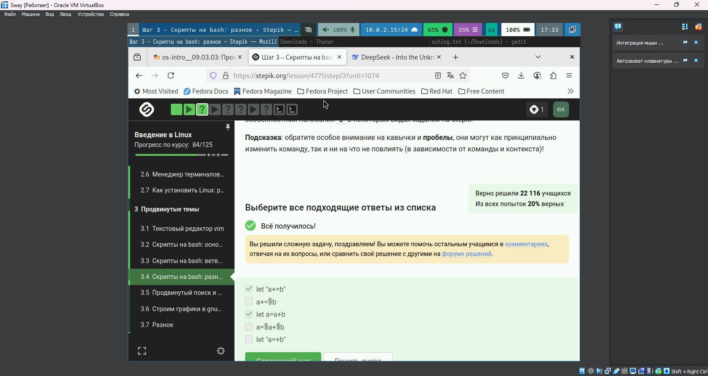{#fig:021 width=70%}

# Выводы

В ходе работы мы закончили выполнение внешнего курса

